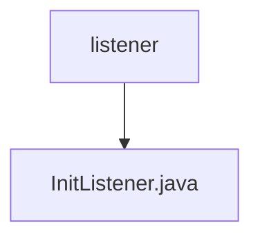

# 基础信息

|      |      |
|------|------|
| 名称 | listener |
| 编码语言 | .java |
| 代码路径 | WeFe/gateway/src/main/java/com/welab/wefe/gateway/listener |
| 包名 | docs.gateway.src.main.java.com.welab.wefe.gateway.listener |
| 概述说明 | InitListener监听应用启动事件，初始化存储服务，加载各类数据到缓存，启动gRPC服务和消息转发任务。失败时系统退出。 |

# 说明

该代码定义了一个Spring组件InitListener，用于监听应用启动事件。在应用启动时，它会执行一系列初始化操作：初始化存储服务，加载会员信息、IP白名单、接收数据、待转发元数据、会员黑名单、合作伙伴配置和CA证书到缓存。同时启动gRPC服务，若失败则系统退出。还会启动转发消息任务。加载系统配置失败时也会强制退出。所有操作均通过日志记录关键状态。

### 包内部结构视图

该流程图展示了WeFe网关项目中监听器模块的简单结构。根节点"listener"下包含一个具体的监听器实现文件"InitListener.java"，表示这是一个初始化监听器的实现类。整个结构清晰地反映了监听器模块中唯一的文件层级关系。

# 文件列表

| 名称   | 类型  | 说明 |
|-------|------|-------------|
| [InitListener.java](InitListener.md) | file | InitListener监听应用启动事件，初始化存储服务，加载各类数据到缓存，启动gRPC服务和消息转发任务。失败时系统退出。 |

