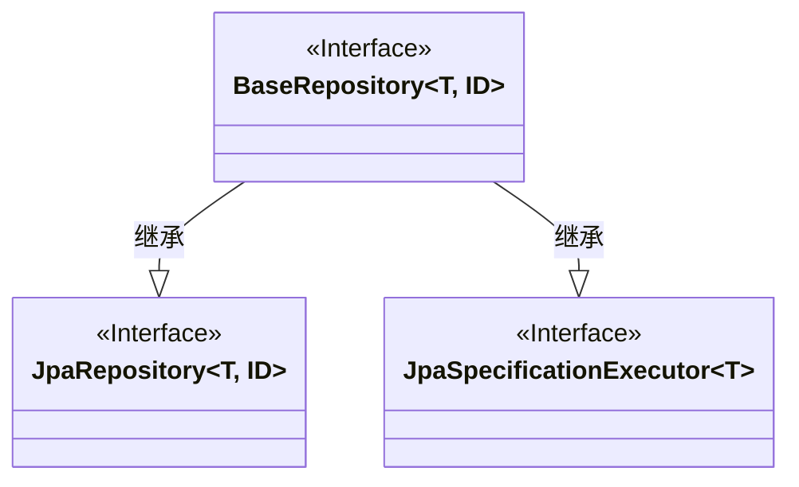
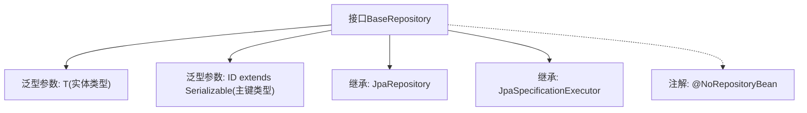

# 基础信息

|      |      |
|------|------|
| 名称 | BaseRepository |
| 编码语言 | .java |
| 代码路径 | WeFe/gateway/src/main/java/com/welab/wefe/gateway/repository/BaseRepository.java |
| 包名 | com.welab.wefe.gateway.repository |
| 依赖项 | ['org.springframework.data.jpa.repository.JpaRepository', 'org.springframework.data.jpa.repository.JpaSpecificationExecutor', 'org.springframework.data.repository.NoRepositoryBean', 'java.io.Serializable'] |
| 概述说明 | 这是一个Spring Data JPA基础仓库接口，扩展了JpaRepository和JpaSpecificationExecutor，支持泛型实体类型T和可序列化ID类型ID，标注为不生成实际仓库Bean。 |

# 说明

该内容定义了一个名为BaseRepository的Java接口，使用@NoRepositoryBean注解标记，表明它不应被实例化为Spring Data仓库。该接口扩展了JpaRepository和JpaSpecificationExecutor两个Spring Data JPA核心接口，提供基础的CRUD操作和动态查询能力。接口采用泛型设计，T代表实体类型，ID代表可序列化的主键类型，使其能适用于多种实体类。这个基础接口通常作为其他具体仓库接口的父接口，用于统一公共操作。

# 类列表 Class Summary

| 名称   | 类型  | 说明 |
|-------|------|-------------|
| BaseRepository | interface | 这是一个Spring Data JPA基础仓库接口，扩展了JpaRepository和JpaSpecificationExecutor，支持泛型实体类型和ID，标记为不生成具体实现。 |

## 类 BaseRepository

|      |      |
|------|------|
| 访问范围 | @NoRepositoryBean;public |
| 类型 | interface |
| 名称 | BaseRepository |
| 说明 | 这是一个Spring Data JPA基础仓库接口，扩展了JpaRepository和JpaSpecificationExecutor，支持泛型实体类型和ID，标记为不生成具体实现。 |

### UML类图

这段类图展示了Spring Data JPA中的基础仓库接口设计。BaseRepository是一个泛型接口（含类型参数T和ID），同时继承自JpaRepository和JpaSpecificationExecutor两个核心接口。通过@NoRepositoryBean标注表明该接口不应被实例化，而是作为其他具体仓库接口的父接口，为子接口提供通用的JPA操作和动态查询能力。这种设计模式实现了接口的多重继承，统一了基础CRUD和复杂查询的接口规范。

### 内部方法调用关系图

该流程图展示了Spring Data JPA中BaseRepository接口的结构设计。作为基础仓库接口，它通过泛型参数T和ID支持任意实体类型及可序列化主键，同时继承JpaRepository提供CRUD功能，并集成JpaSpecificationExecutor实现动态查询能力。@NoRepositoryBean注解表明该接口仅作为其他具体仓库接口的父接口，不会被实例化为Bean。这种设计模式常用于构建可扩展的持久层架构。

### 字段列表 Field List

| 名称  | 类型  | 说明 |
|-------|-------|------|

### 方法列表

| 名称  | 类型  | 说明 |
|-------|-------|------|

