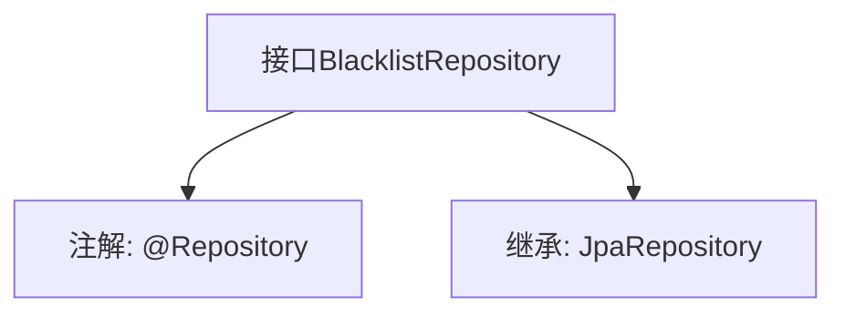

# 基础信息

|      |      |
|------|------|
| 名称 | BlacklistRepository |
| 编码语言 | .java |
| 代码路径 | WeFe/gateway/src/main/java/com/welab/wefe/gateway/repository/BlacklistRepository.java |
| 包名 | com.welab.wefe.gateway.repository |
| 依赖项 | ['com.welab.wefe.gateway.entity.BlacklistEntity', 'org.springframework.data.jpa.repository.JpaRepository', 'org.springframework.stereotype.Repository'] |
| 概述说明 | 黑名单仓库接口，继承JPA仓库，操作黑名单实体，主键类型为字符串。 |

# 说明

该内容定义了一个名为BlacklistRepository的Spring Data JPA仓库接口。该接口使用@Repository注解标注，表明它是一个Spring管理的持久层组件。它继承自JpaRepository泛型接口，指定了实体类型为BlacklistEntity，主键类型为String。通过继承JpaRepository，该接口自动获得了基本的CRUD操作和分页查询等能力，无需手动实现这些方法。这种设计遵循了Spring Data JPA的规范，通过接口声明即可实现数据访问功能。

# 类列表 Class Summary

| 名称   | 类型  | 说明 |
|-------|------|-------------|
| BlacklistRepository | interface | 黑名单仓库接口，继承JPA仓库，操作黑名单实体类，主键类型为字符串。 |


## 类 BlacklistRepository

|      |      |
|------|------|
| 访问范围 | @Repository;public |
| 类型 | interface |
| 名称 | BlacklistRepository |
| 说明 | 黑名单仓库接口，继承JPA仓库，操作黑名单实体类，主键类型为字符串。 |


### UML类图

```mermaid
classDiagram
    class BlacklistRepository {
        <<Interface>>
    }
    class JpaRepository~T, ID~ {
        <<Interface>>
    }
    BlacklistRepository --|> JpaRepository : 继承
    // BlacklistRepository接口继承自JpaRepository泛型接口
    // 泛型参数T为BlacklistEntity，ID为String类型
```

这段类图展示了Spring Data JPA中的仓库接口继承关系。BlacklistRepository作为数据访问接口，通过继承JpaRepository<BlacklistEntity, String>获得了基础的CRUD操作能力，其中泛型参数指定实体类型为BlacklistEntity，主键类型为String。该设计遵循了Spring Data的Repository模式，通过接口继承自动实现持久化操作，减少了样板代码的编写。


### 内部方法调用关系图



该流程图描述了Spring Data JPA中一个Repository接口的定义结构。BlacklistRepository通过@Repository注解标记为Spring管理的仓储组件，并继承JpaRepository接口获得基础的CRUD操作能力，泛型参数指定实体类型为BlacklistEntity、主键类型为String。这种设计模式遵循了Spring Data的"约定优于配置"原则，无需实现方法即可自动生成数据库操作逻辑。

### 字段列表 Field List

| 名称  | 类型  | 说明 |
|-------|-------|------|

### 方法列表

| 名称  | 类型  | 说明 |
|-------|-------|------|


