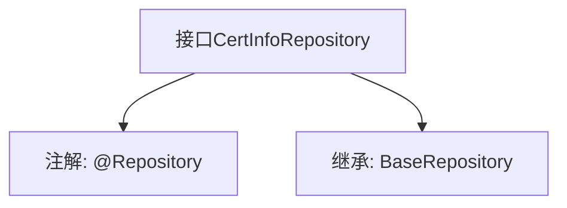

# 基础信息

|      |      |
|------|------|
| 名称 | CertInfoRepository |
| 编码语言 | .java |
| 代码路径 | WeFe/gateway/src/main/java/com/welab/wefe/gateway/repository/CertInfoRepository.java |
| 包名 | com.welab.wefe.gateway.repository |
| 依赖项 | ['com.welab.wefe.gateway.entity.CertInfoEntity', 'org.springframework.stereotype.Repository'] |
| 概述说明 | 这是一个Spring Data JPA仓库接口，继承基础仓库类，用于操作CertInfoEntity实体类，主键类型为String。 |

# 说明

这是一个名为CertInfoRepository的Spring数据仓库接口，使用@Repository注解标记。它继承自BaseRepository泛型基类，指定了CertInfoEntity作为实体类型，String作为主键类型。该接口主要用于对CertInfoEntity实体进行数据库操作，继承了基类提供的通用CRUD方法。

# 类列表 Class Summary

| 名称   | 类型  | 说明 |
|-------|------|-------------|
| CertInfoRepository | interface | 这是一个Spring的仓库接口，继承基础仓库类，用于操作证书信息实体类。 |


## 类 CertInfoRepository

|      |      |
|------|------|
| 访问范围 | @Repository;public |
| 类型 | interface |
| 名称 | CertInfoRepository |
| 说明 | 这是一个Spring的仓库接口，继承基础仓库类，用于操作证书信息实体类。 |


### UML类图

```mermaid
classDiagram
    class CertInfoRepository {
        <<Interface>>
    }
    class BaseRepository~T, ID~ {
        <<Interface>>
    }
    
    CertInfoRepository --|> BaseRepository : 继承
    // BaseRepository是泛型接口，CertInfoRepository继承并指定CertInfoEntity和String作为类型参数
```

这段类图展示了Spring Data JPA中的仓库接口继承关系。CertInfoRepository是一个标记为@Repository的接口，它继承了泛型接口BaseRepository，并指定了CertInfoEntity作为实体类型、String作为ID类型。这种设计遵循了Spring Data的仓库模式，通过继承基础接口自动获得CRUD操作能力，同时保持类型安全性。图中清晰体现了接口间的泛型特化和层级关系。


### 内部方法调用关系图



该流程图展示了CertInfoRepository接口的结构，它是一个带有@Repository注解的Spring数据仓库接口，继承了泛型基类BaseRepository。BaseRepository指定了实体类型CertInfoEntity和主键类型String，表明该接口用于操作CertInfoEntity类型的数据，并通过String类型的主键进行标识。这种设计遵循了Spring Data JPA的规范，简化了数据库访问层的实现。

### 字段列表 Field List

| 名称  | 类型  | 说明 |
|-------|-------|------|

### 方法列表

| 名称  | 类型  | 说明 |
|-------|-------|------|


