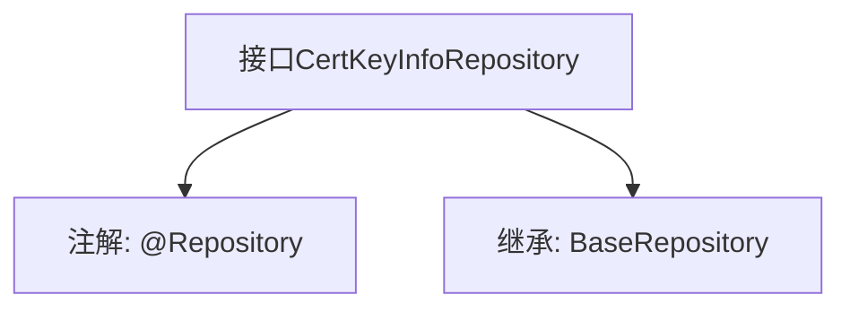

# 基础信息

|      |      |
|------|------|
| 名称 | CertKeyInfoRepository |
| 编码语言 | .java |
| 代码路径 | WeFe/gateway/src/main/java/com/welab/wefe/gateway/repository/CertKeyInfoRepository.java |
| 包名 | com.welab.wefe.gateway.repository |
| 依赖项 | ['com.welab.wefe.gateway.entity.CertKeyInfoEntity', 'org.springframework.data.jpa.repository.JpaRepository', 'org.springframework.stereotype.Repository'] |
| 概述说明 | 这是一个Spring的仓库接口，继承基础仓库类，用于管理证书密钥信息实体。 |

# 说明

该内容定义了一个名为CertKeyInfoRepository的Spring数据仓库接口，继承自BaseRepository基类。该接口使用@Repository注解标识为Spring管理的仓库组件，泛型参数指定了实体类型为CertKeyInfoEntity，主键类型为String。该接口未定义额外方法，仅继承基类的基础CRUD操作功能。

# 类列表 Class Summary

| 名称   | 类型  | 说明 |
|-------|------|-------------|
| CertKeyInfoRepository | interface | 接口CertKeyInfoRepository继承BaseRepository，用于操作CertKeyInfoEntity实体类，主键类型为String。 |


## 类 CertKeyInfoRepository

|      |      |
|------|------|
| 访问范围 | @Repository;public |
| 类型 | interface |
| 名称 | CertKeyInfoRepository |
| 说明 | 接口CertKeyInfoRepository继承BaseRepository，用于操作CertKeyInfoEntity实体类，主键类型为String。 |


### UML类图

```mermaid
classDiagram
    class CertKeyInfoRepository {
        <<Interface>>
    }
    class BaseRepository~T, ID~ {
        <<Interface>>
    }
    CertKeyInfoRepository --|> BaseRepository : 继承
    // CertKeyInfoRepository 是 Spring Data JPA 仓库接口，继承自泛型接口 BaseRepository
    // 泛型参数 T 为 CertKeyInfoEntity 实体类，ID 为主键类型 String
```

该类图展示了一个Spring Data JPA仓库接口CertKeyInfoRepository，它继承自泛型基础接口BaseRepository。BaseRepository采用两个泛型参数：T表示实体类型（此处为CertKeyInfoEntity），ID表示主键类型（此处为String）。通过继承关系，CertKeyInfoRepository获得了基础的CRUD操作方法，同时保持了对特定实体类型的类型安全操作能力。


### 内部方法调用关系图



该流程图展示了Spring Data JPA中一个典型的Repository接口定义结构。CertKeyInfoRepository接口通过@Repository注解标识为数据访问组件，并继承BaseRepository接口获得基础CRUD操作能力。泛型参数表明该Repository管理CertKeyInfoEntity类型对象，主键类型为String。这种设计遵循了Spring Data的Repository模式，通过接口继承自动获得数据库操作实现。

### 字段列表 Field List

| 名称  | 类型  | 说明 |
|-------|-------|------|

### 方法列表

| 名称  | 类型  | 说明 |
|-------|-------|------|


