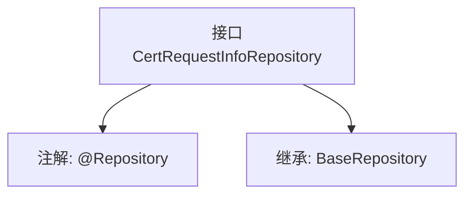

# 基础信息

|      |      |
|------|------|
| 名称 | CertRequestInfoRepository |
| 编码语言 | .java |
| 代码路径 | WeFe/gateway/src/main/java/com/welab/wefe/gateway/repository/CertRequestInfoRepository.java |
| 包名 | com.welab.wefe.gateway.repository |
| 依赖项 | ['com.welab.wefe.gateway.entity.CertRequestInfoEntity', 'org.springframework.data.jpa.repository.JpaRepository', 'org.springframework.stereotype.Repository'] |
| 概述说明 | 接口CertRequestInfoRepository继承BaseRepository，用于操作CertRequestInfoEntity实体类，主键类型为String。 |

# 说明

该内容定义了一个名为CertRequestInfoRepository的Spring数据仓库接口，使用@Repository注解标记为持久层组件。该接口继承自BaseRepository泛型基类，指定了实体类型为CertRequestInfoEntity，主键类型为String。其功能是提供对CertRequestInfoEntity实体的基础CRUD操作支持，无需手动实现方法。

# 类列表 Class Summary

| 名称   | 类型  | 说明 |
|-------|------|-------------|
| CertRequestInfoRepository | interface | 接口CertRequestInfoRepository继承BaseRepository，用于操作CertRequestInfoEntity实体，主键类型为String。 |


## 类 CertRequestInfoRepository

|      |      |
|------|------|
| 访问范围 | @Repository;public |
| 类型 | interface |
| 名称 | CertRequestInfoRepository |
| 说明 | 接口CertRequestInfoRepository继承BaseRepository，用于操作CertRequestInfoEntity实体，主键类型为String。 |


### UML类图

```mermaid
classDiagram
    class CertRequestInfoRepository {
        <<Interface>>
    }
    class BaseRepository~T, ID~ {
        <<Interface>>
    }
    CertRequestInfoRepository --|> BaseRepository~CertRequestInfoEntity, String~ // 继承
```

这段代码展示了一个Spring Data JPA的仓库接口`CertRequestInfoRepository`，它继承了泛型接口`BaseRepository`。类图清晰地表明了继承关系，其中`BaseRepository`是一个泛型接口，接受实体类型`T`和ID类型`ID`作为参数，而`CertRequestInfoRepository`特化为操作`CertRequestInfoEntity`类型实体，使用`String`类型作为主键。这种设计遵循了Spring Data的仓库模式，提供了对数据库操作的基本CRUD功能。


### 内部方法调用关系图



该流程图展示了CertRequestInfoRepository接口的结构，它是一个带有@Repository注解的Spring数据接口，继承了BaseRepository泛型基类。图中清晰呈现了接口的注解标记和继承关系，其中BaseRepository指定了CertRequestInfoEntity作为实体类型，String作为主键类型。这种设计用于实现针对证书请求信息实体的基础数据库操作能力。

### 字段列表 Field List

| 名称  | 类型  | 说明 |
|-------|-------|------|

### 方法列表

| 名称  | 类型  | 说明 |
|-------|-------|------|


