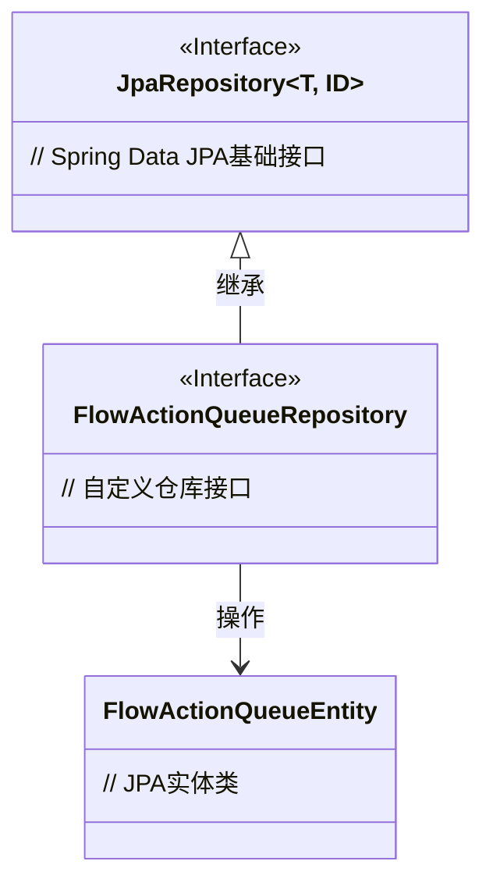
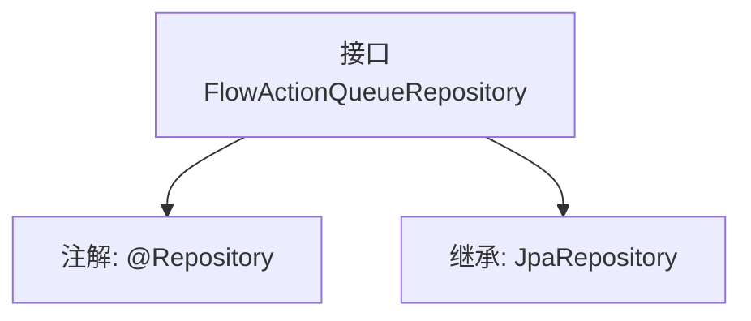

# 基础信息

|      |      |
|------|------|
| 名称 | FlowActionQueueRepository |
| 编码语言 | .java |
| 代码路径 | WeFe/gateway/src/main/java/com/welab/wefe/gateway/repository/FlowActionQueueRepository.java |
| 包名 | com.welab.wefe.gateway.repository |
| 依赖项 | ['com.welab.wefe.gateway.entity.FlowActionQueueEntity', 'org.springframework.data.jpa.repository.JpaRepository', 'org.springframework.stereotype.Repository'] |
| 概述说明 | 这是一个Spring Data JPA仓库接口，用于操作FlowActionQueueEntity实体，继承自JpaRepository提供基础CRUD功能。 |

# 说明

该内容定义了一个名为FlowActionQueueRepository的Spring数据仓库接口，使用@Repository注解标记。该接口继承自JpaRepository泛型接口，指定了实体类型为FlowActionQueueEntity，主键类型为String。这表明该仓库用于对FlowActionQueueEntity类型的数据进行持久化操作，支持基本的CRUD功能。

# 类列表 Class Summary

| 名称   | 类型  | 说明 |
|-------|------|-------------|
| FlowActionQueueRepository | interface | FlowActionQueueRepository是JPA仓库接口，用于操作FlowActionQueueEntity实体，主键类型为String。 |

## 类 FlowActionQueueRepository

|      |      |
|------|------|
| 访问范围 | @Repository;public |
| 类型 | interface |
| 名称 | FlowActionQueueRepository |
| 说明 | FlowActionQueueRepository是JPA仓库接口，用于操作FlowActionQueueEntity实体，主键类型为String。 |

### UML类图

这段类图描述了Spring Data JPA中仓库接口的继承关系。FlowActionQueueRepository接口继承自JpaRepository泛型接口（指定实体类型为FlowActionQueueEntity，主键类型为String），通过该接口可以直接获得CRUD等基础操作能力。图中清晰展示了接口间的层级关系（用<|--表示继承）以及仓库与实体类的关联关系（用-->表示依赖），符合JPA的设计模式。

### 内部方法调用关系图

这段流程图描述了FlowActionQueueRepository接口的结构关系。该接口被标记为@Repository注解，表明它是一个Spring数据访问层组件。同时它继承了JpaRepository泛型接口，指定了实体类型为FlowActionQueueEntity，主键类型为String。这个设计使得该接口自动获得JPA标准CRUD操作方法，无需手动实现基础数据库操作逻辑。

### 字段列表 Field List

| 名称  | 类型  | 说明 |
|-------|-------|------|

### 方法列表

| 名称  | 类型  | 说明 |
|-------|-------|------|

