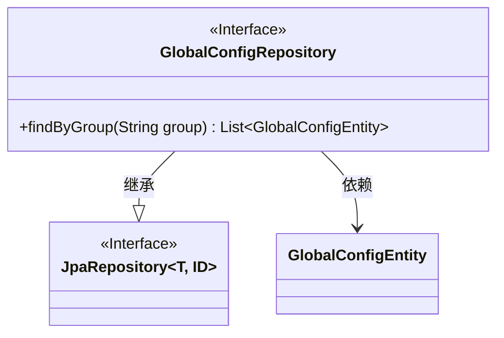
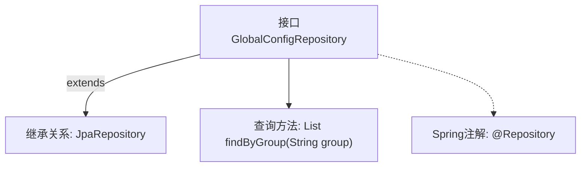

# 基础信息

|      |      |
|------|------|
| 名称 | GlobalConfigRepository |
| 编码语言 | .java |
| 代码路径 | WeFe/gateway/src/main/java/com/welab/wefe/gateway/repository/GlobalConfigRepository.java |
| 包名 | com.welab.wefe.gateway.repository |
| 依赖项 | ['com.welab.wefe.gateway.entity.GlobalConfigEntity', 'org.springframework.data.jpa.repository.JpaRepository', 'org.springframework.stereotype.Repository', 'java.util.List'] |
| 概述说明 | Java接口GlobalConfigRepository继承JpaRepository，用于操作GlobalConfigEntity数据，提供按group字段查询功能。 |

# 说明

这是一个名为GlobalConfigRepository的Spring Data JPA仓库接口，它继承自JpaRepository，用于操作GlobalConfigEntity类型的数据实体，主键类型为String。该接口定义了一个查询方法findByGroup，通过传入group参数来查询并返回匹配该分组的所有GlobalConfigEntity记录列表。@Repository注解表明这是一个Spring管理的持久层组件。

# 类列表 Class Summary

| 名称   | 类型  | 说明 |
|-------|------|-------------|
| GlobalConfigRepository | interface | 这是一个Spring Data JPA仓库接口，用于操作GlobalConfigEntity数据，包含按组查询方法。 |

## 类 GlobalConfigRepository

|      |      |
|------|------|
| 访问范围 | @Repository;public |
| 类型 | interface |
| 名称 | GlobalConfigRepository |
| 说明 | 这是一个Spring Data JPA仓库接口，用于操作GlobalConfigEntity数据，包含按组查询方法。 |

### UML类图

这段类图展示了Spring Data JPA中的仓库接口设计。GlobalConfigRepository接口继承自JpaRepository泛型接口（参数化为GlobalConfigEntity和String类型），并添加了自定义查询方法findByGroup。该设计遵循了Spring Data的仓库模式，通过继承基础JPA接口获得CRUD能力，同时扩展特定业务查询。GlobalConfigEntity作为实体类被仓库接口操作，体现了领域驱动设计中仓库与实体的关系。

### 内部方法调用关系图

该流程图展示了Spring Data JPA中GlobalConfigRepository接口的结构。该接口通过@Repository注解标记为Spring组件，并继承JpaRepository获得基础CRUD功能。自定义方法findByGroup遵循JPA命名规范，实现按group字段查询的功能。整个设计体现了Spring Data JPA的"接口即实现"特性，通过方法签名自动生成查询逻辑。

### 字段列表 Field List

| 名称  | 类型  | 说明 |
|-------|-------|------|

### 方法列表

| 名称  | 类型  | 说明 |
|-------|-------|------|
| findByGroup | List<GlobalConfigEntity> | 根据分组查询全局配置实体列表。 |

