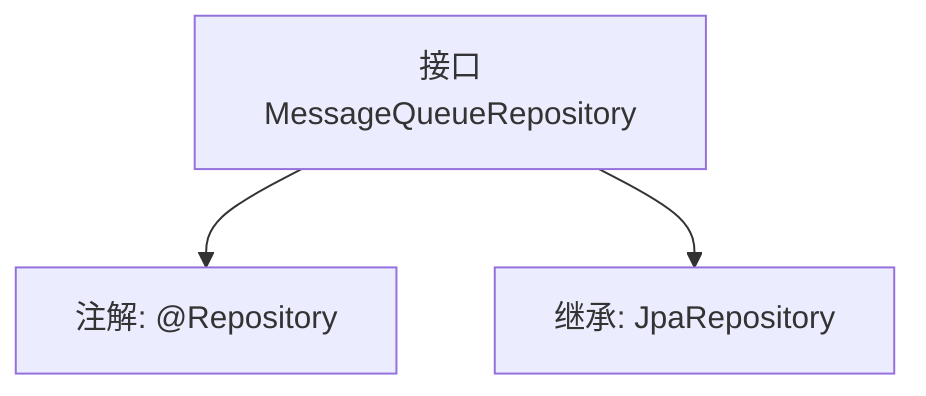

# 基础信息

|      |      |
|------|------|
| 名称 | MessageQueueRepository |
| 编码语言 | .java |
| 代码路径 | WeFe/gateway/src/main/java/com/welab/wefe/gateway/repository/MessageQueueRepository.java |
| 包名 | com.welab.wefe.gateway.repository |
| 依赖项 | ['com.welab.wefe.gateway.entity.MessageQueueEntity', 'org.springframework.data.jpa.repository.JpaRepository', 'org.springframework.stereotype.Repository'] |
| 概述说明 | 消息队列仓库接口，继承JPA仓库，操作消息队列实体类，主键类型为字符串。 |

# 说明

该内容定义了一个名为MessageQueueRepository的Spring Data JPA仓库接口，使用@Repository注解标记。该接口继承自JpaRepository，用于操作MessageQueueEntity类型的数据，主键类型为String。它提供了基本的CRUD操作和JPA功能，无需手动实现。

# 类列表 Class Summary

| 名称   | 类型  | 说明 |
|-------|------|-------------|
| MessageQueueRepository | interface | 消息队列仓库接口，继承JPA仓库，操作消息队列实体，主键类型为字符串。 |


## 类 MessageQueueRepository

|      |      |
|------|------|
| 访问范围 | @Repository;public |
| 类型 | interface |
| 名称 | MessageQueueRepository |
| 说明 | 消息队列仓库接口，继承JPA仓库，操作消息队列实体，主键类型为字符串。 |


### UML类图

```mermaid
classDiagram
    class MessageQueueRepository {
        <<Interface>>
    }
    class JpaRepository~T, ID~ {
        <<Interface>>
    }
    MessageQueueRepository --|> JpaRepository : 继承
    // MessageQueueRepository 是 Spring Data JPA 的仓库接口，继承自泛型接口 JpaRepository
    // 泛型参数 T 为 MessageQueueEntity，ID 为 String 类型
```

这段类图展示了 Spring Data JPA 中 `MessageQueueRepository` 接口的继承关系。该接口标记为 `@Repository`，通过继承 `JpaRepository<MessageQueueEntity, String>` 获得基础 CRUD 操作能力，其中泛型参数指定实体类型为 `MessageQueueEntity`，主键类型为 `String`。图中清晰体现了接口间的层级关系，符合 JPA 规范的设计模式。


### 内部方法调用关系图



该流程图描述了Spring Data JPA中一个消息队列仓库接口的结构。MessageQueueRepository通过@Repository注解标记为Spring管理的组件，并继承JpaRepository接口获得基础的CRUD操作能力，泛型参数指定实体类型为MessageQueueEntity，主键类型为String。这种设计简化了数据库交互代码，只需定义接口即可自动实现持久层操作。

### 字段列表 Field List

| 名称  | 类型  | 说明 |
|-------|-------|------|

### 方法列表

| 名称  | 类型  | 说明 |
|-------|-------|------|


