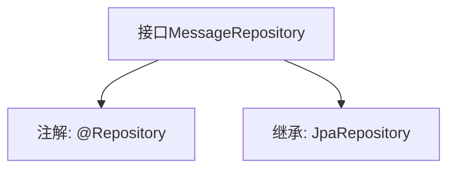

# 基础信息

|      |      |
|------|------|
| 名称 | MessageRepository |
| 编码语言 | .java |
| 代码路径 | WeFe/gateway/src/main/java/com/welab/wefe/gateway/repository/MessageRepository.java |
| 包名 | com.welab.wefe.gateway.repository |
| 依赖项 | ['com.welab.wefe.gateway.entity.MessageEntity', 'org.springframework.data.jpa.repository.JpaRepository', 'org.springframework.stereotype.Repository'] |
| 概述说明 | 消息仓库接口，继承JPA仓库，操作消息实体类，主键类型为字符串。 |

# 说明

该内容定义了一个名为MessageRepository的Spring数据仓库接口，使用@Repository注解标记。该接口继承自JpaRepository泛型接口，指定了实体类型为MessageEntity，主键类型为String。这表明该仓库用于对MessageEntity类型的数据进行持久化操作，继承了JPA提供的标准CRUD操作方法。

# 类列表 Class Summary

| 名称   | 类型  | 说明 |
|-------|------|-------------|
| MessageRepository | interface | 消息仓库接口继承JPA仓库，用于操作消息实体，主键类型为字符串。 |


## 类 MessageRepository

|      |      |
|------|------|
| 访问范围 | @Repository;public |
| 类型 | interface |
| 名称 | MessageRepository |
| 说明 | 消息仓库接口继承JPA仓库，用于操作消息实体，主键类型为字符串。 |


### UML类图

```mermaid
classDiagram
    class MessageRepository {
        <<Interface>>
    }
    class JpaRepository~T, ID~ {
        <<Interface>>
    }
    MessageRepository --|> JpaRepository : 继承
    // MessageRepository接口继承自JpaRepository泛型接口
    // 泛型参数T为MessageEntity，ID为String类型
```

这段类图展示了Spring Data JPA中的仓库接口继承关系。MessageRepository作为数据访问层接口，通过继承JpaRepository<MessageEntity, String>获得基础的CRUD操作能力。其中JpaRepository是Spring Data提供的泛型接口，T代表实体类型（MessageEntity），ID代表主键类型（String）。该设计模式实现了对MessageEntity对象的标准化数据库操作，符合JPA规范且无需手动编写实现类。


### 内部方法调用关系图



这段代码定义了一个Spring Data JPA的Repository接口MessageRepository，用于操作MessageEntity类型的数据，主键类型为String。该接口通过@Repository注解标识为Spring管理的组件，并继承了JpaRepository接口，从而自动获得基础的CRUD操作和分页查询能力。这种设计遵循了Spring Data JPA的规范，无需手动实现方法即可直接注入使用。

### 字段列表 Field List

| 名称  | 类型  | 说明 |
|-------|-------|------|

### 方法列表

| 名称  | 类型  | 说明 |
|-------|-------|------|


