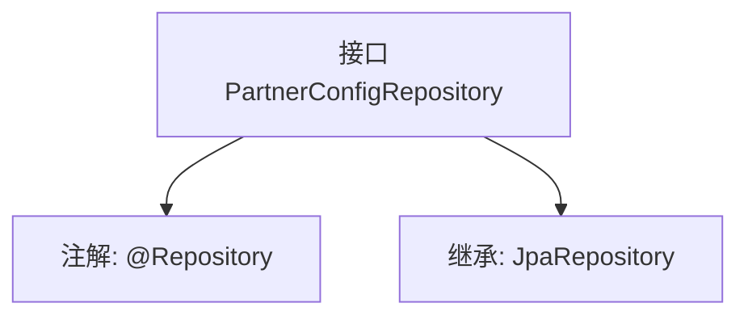

# 基础信息

|      |      |
|------|------|
| 名称 | PartnerConfigRepository |
| 编码语言 | .java |
| 代码路径 | WeFe/gateway/src/main/java/com/welab/wefe/gateway/repository/PartnerConfigRepository.java |
| 包名 | com.welab.wefe.gateway.repository |
| 依赖项 | ['com.welab.wefe.gateway.entity.PartnerConfigEntity', 'org.springframework.data.jpa.repository.JpaRepository', 'org.springframework.stereotype.Repository'] |
| 概述说明 | 接口PartnerConfigRepository继承JpaRepository，用于操作PartnerConfigEntity数据，主键类型为String。 |

# 说明

该内容定义了一个名为PartnerConfigRepository的Spring数据仓库接口，使用@Repository注解标记为Spring管理的组件。该接口继承自JpaRepository，指定了实体类型为PartnerConfigEntity，主键类型为String。这表明该仓库用于对PartnerConfigEntity实体进行持久化操作，提供了JPA标准的数据访问方法。

# 类列表 Class Summary

| 名称   | 类型  | 说明 |
|-------|------|-------------|
| PartnerConfigRepository | interface | 这是一个Spring Data JPA仓库接口，用于操作PartnerConfigEntity实体，主键类型为String。 |


## 类 PartnerConfigRepository

|      |      |
|------|------|
| 访问范围 | @Repository;public |
| 类型 | interface |
| 名称 | PartnerConfigRepository |
| 说明 | 这是一个Spring Data JPA仓库接口，用于操作PartnerConfigEntity实体，主键类型为String。 |


### UML类图

```mermaid
classDiagram
    class PartnerConfigRepository {
        <<Interface>>
    }
    class JpaRepository~T, ID~ {
        <<Interface>>
    }
    PartnerConfigRepository --|> JpaRepository : 继承
    // PartnerConfigRepository继承自JpaRepository泛型接口
    // 泛型参数T为PartnerConfigEntity，ID为String类型
```

这段类图展示了Spring Data JPA中的仓库接口定义。PartnerConfigRepository是一个标记为@Repository的接口，继承自JpaRepository泛型接口，其中T类型参数指定为PartnerConfigEntity，ID类型参数指定为String。该设计提供了对PartnerConfigEntity实体的基本CRUD操作能力，符合Spring Data JPA的规范实现模式，通过继承通用接口避免了重复代码编写。


### 内部方法调用关系图



这段流程图展示了PartnerConfigRepository接口的结构。该接口被@Repository注解标记，表明它是一个Spring数据访问层的组件。同时它继承了JpaRepository泛型接口，指定了实体类型为PartnerConfigEntity，主键类型为String。这种设计模式是Spring Data JPA的典型用法，通过继承基础仓库接口自动获得CRUD操作能力，无需手动实现基础数据访问方法。

### 字段列表 Field List

| 名称  | 类型  | 说明 |
|-------|-------|------|

### 方法列表

| 名称  | 类型  | 说明 |
|-------|-------|------|


