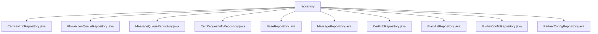

# 基础信息

|      |      |
|------|------|
| 名称 | repository |
| 编码语言 | .java |
| 代码路径 | WeFe/gateway/src/main/java/com/welab/wefe/gateway/repository |
| 包名 | docs.gateway.src.main.java.com.welab.wefe.gateway.repository |
| 概述说明 | 定义了多个Spring数据仓库接口，均继承基类提供CRUD功能。包括CertKeyInfo、FlowActionQueue、MessageQueue、CertRequestInfo、Message、CertInfo、Blacklist、GlobalConfig和PartnerConfig等实体操作仓库。GlobalConfigRepository额外提供findByGroup查询方法。 |

# 说明

## 概述  
该模块是网关系统的数据访问层，核心职责是通过Spring Data JPA提供各类实体数据的CRUD操作，类似数据库访问中间件。接口规范统一继承自BaseRepository或JpaRepository，包含基础CRUD和动态查询能力，例如GlobalConfigRepository还扩展了findByGroup分组查询。  

关键数据结构包括CertKeyInfoEntity、FlowActionQueueEntity等实体类，主键均为String类型。外部依赖仅Spring Data JPA框架。实现案例丰富，例如BlacklistRepository自动获得分页查询能力，CertInfoRepository复用基类方法。  

## 主要业务场景  
模块支撑网关核心业务流程：证书管理（CertKeyInfoRepository）、消息队列处理（MessageQueueRepository）、黑白名单控制（BlacklistRepository）等。采用统一JPA交互模式，如PartnerConfigRepository直接调用save()持久化配置。  

典型应用包含配置查询（例如GlobalConfigRepository按分组筛选）、异步任务管理（FlowActionQueueRepository操作队列数据）。API类型均为Spring Data仓库接口，集成案例如MessageRepository自动实现消息实体的增删改查。

### 包内部结构视图

该流程图展示了WeFe网关项目中repository目录下的所有Java类文件。根节点为repository，直接连接10个不同的Repository类文件，包括CertKeyInfoRepository、FlowActionQueueRepository等，这些类都位于同一层级，没有进一步的子目录结构。

# 文件列表

| 名称   | 类型  | 说明 |
|-------|------|-------------|
| [CertKeyInfoRepository.java](CertKeyInfoRepository.md) | file | 这是一个Spring的仓库接口，继承基础仓库类，用于管理证书密钥信息实体。 |
| [FlowActionQueueRepository.java](FlowActionQueueRepository.md) | file | 这是一个Spring Data JPA仓库接口，用于操作FlowActionQueueEntity实体，继承自JpaRepository提供基础CRUD功能。 |
| [MessageQueueRepository.java](MessageQueueRepository.md) | file | 消息队列仓库接口，继承JPA仓库，操作消息队列实体类，主键类型为字符串。 |
| [CertRequestInfoRepository.java](CertRequestInfoRepository.md) | file | 接口CertRequestInfoRepository继承BaseRepository，用于操作CertRequestInfoEntity实体类，主键类型为String。 |
| [BaseRepository.java](BaseRepository.md) | file | 这是一个Spring Data JPA基础仓库接口，扩展了JpaRepository和JpaSpecificationExecutor，支持泛型实体类型T和可序列化ID类型ID，标注为不生成实际仓库Bean。 |
| [MessageRepository.java](MessageRepository.md) | file | 消息仓库接口，继承JPA仓库，操作消息实体类，主键类型为字符串。 |
| [CertInfoRepository.java](CertInfoRepository.md) | file | 这是一个Spring Data JPA仓库接口，继承基础仓库类，用于操作CertInfoEntity实体类，主键类型为String。 |
| [BlacklistRepository.java](BlacklistRepository.md) | file | 黑名单仓库接口，继承JPA仓库，操作黑名单实体，主键类型为字符串。 |
| [GlobalConfigRepository.java](GlobalConfigRepository.md) | file | Java接口GlobalConfigRepository继承JpaRepository，用于操作GlobalConfigEntity数据，提供按group字段查询功能。 |
| [PartnerConfigRepository.java](PartnerConfigRepository.md) | file | 接口PartnerConfigRepository继承JpaRepository，用于操作PartnerConfigEntity数据，主键类型为String。 |

