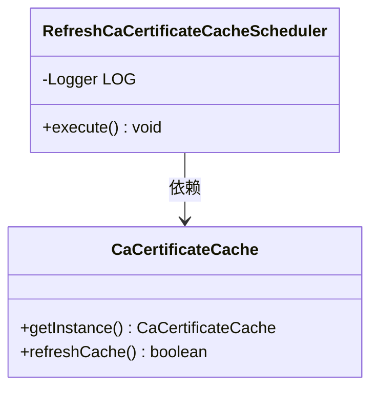
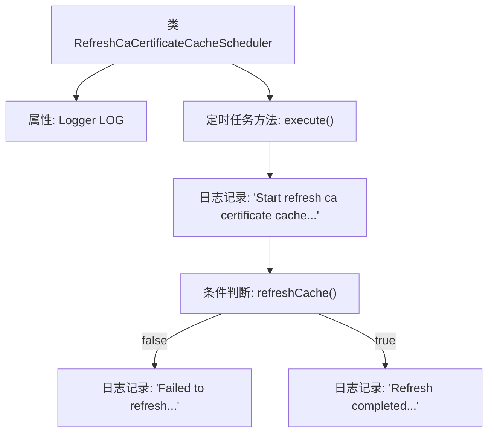

# 基础信息

|      |      |
|------|------|
| 名称 | RefreshCaCertificateCacheScheduler |
| 编码语言 | .java |
| 代码路径 | WeFe/gateway/src/main/java/com/welab/wefe/gateway/scheduler/RefreshCaCertificateCacheScheduler.java |
| 包名 | com.welab.wefe.gateway.scheduler |
| 依赖项 | ['com.welab.wefe.gateway.cache.CaCertificateCache', 'org.slf4j.Logger', 'org.slf4j.LoggerFactory', 'org.springframework.scheduling.annotation.Scheduled', 'org.springframework.stereotype.Component'] |
| 概述说明 | 定时任务类，每30秒刷新CA证书缓存，记录成功或失败日志。 |

# 说明

这是一个名为RefreshCaCertificateCacheScheduler的Spring组件类，用于定期刷新CA证书缓存。该类包含一个使用@Scheduled注解标记的execute方法，该方法每30秒自动执行一次。执行时会先记录开始刷新日志，然后调用CaCertificateCache单例实例的refreshCache方法进行缓存刷新。若刷新失败则记录错误日志，成功则记录完成日志。整个过程通过Logger对象进行详细日志记录。

# 类列表 Class Summary

| 名称   | 类型  | 说明 |
|-------|------|-------------|
| RefreshCaCertificateCacheScheduler | class | 定时任务类每30秒刷新CA证书缓存，成功或失败均记录日志。 |

## 类 RefreshCaCertificateCacheScheduler

|      |      |
|------|------|
| 访问范围 | @Component;public |
| 类型 | class |
| 名称 | RefreshCaCertificateCacheScheduler |
| 说明 | 定时任务类每30秒刷新CA证书缓存，成功或失败均记录日志。 |

### UML类图

类图描述：该图展示了一个定时任务组件`RefreshCaCertificateCacheScheduler`，它通过`@Scheduled`注解定期执行`execute()`方法，调用`CaCertificateCache`单例的`refreshCache()`方法来更新证书缓存。`CaCertificateCache`作为被依赖方提供缓存刷新功能，两者形成单向依赖关系。日志对象`LOG`用于记录任务执行状态，体现了典型的定时任务与工具类交互模式。

### 内部方法调用关系图

该流程图展示了定时刷新CA证书缓存的任务执行过程。首先初始化日志对象，然后通过Spring定时任务触发execute方法，记录开始日志后调用缓存刷新功能，根据刷新结果分别记录失败或成功日志。整个过程体现了定时任务的执行逻辑和异常处理机制。

### 字段列表 Field List

| 名称  | 类型  | 说明 |
|-------|-------|------|
| LOG = LoggerFactory.getLogger(RefreshMemberCacheScheduler.class) | Logger | 定义私有常量LOG，使用LoggerFactory获取RefreshMemberCacheScheduler类的日志记录器实例。 |

### 方法列表

| 名称  | 类型  | 说明 |
|-------|-------|------|
| execute | void | 定时任务每30秒刷新CA证书缓存，成功或失败均记录日志。 |

