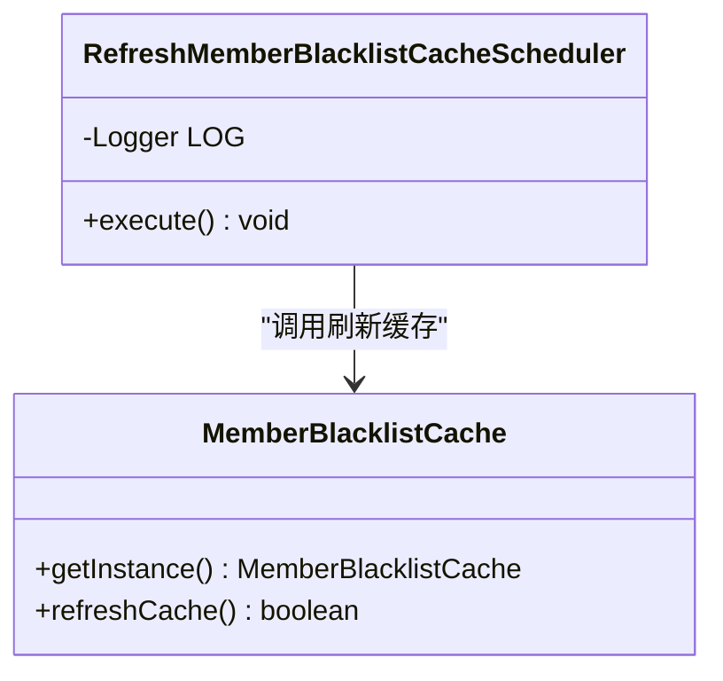
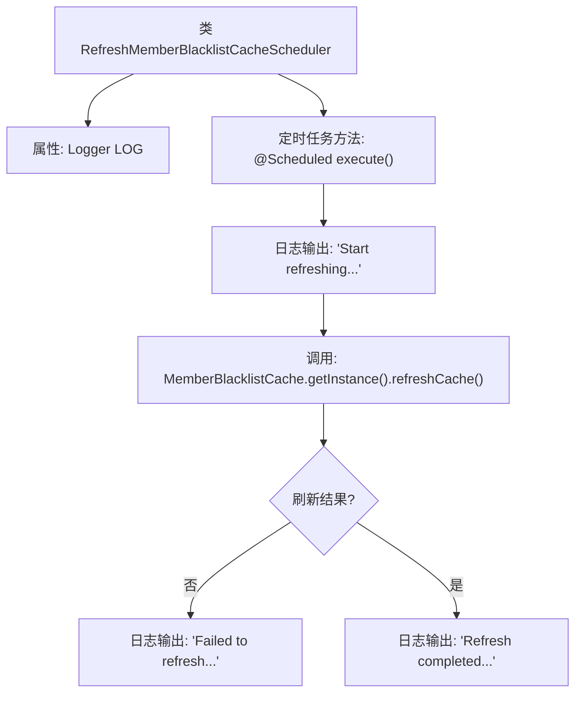

# 基础信息

|      |      |
|------|------|
| 名称 | RefreshMemberBlacklistCacheScheduler |
| 编码语言 | .java |
| 代码路径 | WeFe/gateway/src/main/java/com/welab/wefe/gateway/scheduler/RefreshMemberBlacklistCacheScheduler.java |
| 包名 | com.welab.wefe.gateway.scheduler |
| 依赖项 | ['com.welab.wefe.gateway.cache.MemberBlacklistCache', 'org.slf4j.Logger', 'org.slf4j.LoggerFactory', 'org.springframework.scheduling.annotation.Scheduled', 'org.springframework.stereotype.Component'] |
| 概述说明 | 这是一个定时刷新会员黑名单缓存的调度类，每10秒执行一次，成功或失败都会记录日志。 |

# 说明

这是一个名为RefreshMemberBlacklistCacheScheduler的Spring组件类，用于定时刷新会员黑名单缓存。该类包含一个使用@Scheduled注解标记的execute方法，该方法每10秒执行一次。执行时会先记录开始刷新日志，然后调用MemberBlacklistCache单例的refreshCache方法更新缓存。若刷新失败则记录错误日志，成功则记录完成日志。整个过程通过Logger对象输出不同级别的日志信息以便监控。

# 类列表 Class Summary

| 名称   | 类型  | 说明 |
|-------|------|-------------|
| RefreshMemberBlacklistCacheScheduler | class | 定时任务类，每10秒刷新会员黑名单缓存，记录成功或失败日志。 |

## 类 RefreshMemberBlacklistCacheScheduler

|      |      |
|------|------|
| 访问范围 | @Component;public |
| 类型 | class |
| 名称 | RefreshMemberBlacklistCacheScheduler |
| 说明 | 定时任务类，每10秒刷新会员黑名单缓存，记录成功或失败日志。 |

### UML类图

该类图展示了定时任务组件`RefreshMemberBlacklistCacheScheduler`与缓存类`MemberBlacklistCache`的关系。调度器通过`@Scheduled`注解每10秒执行一次`execute()`方法，调用`MemberBlacklistCache`的单例实例进行缓存刷新，并根据结果记录不同级别的日志。图中清晰体现了Spring组件调度器对缓存类的单向依赖关系，以及缓存类提供的单例访问和刷新功能。

### 内部方法调用关系图

该流程图展示了Spring定时任务组件的执行逻辑。组件每10秒触发一次缓存刷新任务，首先记录开始日志，然后调用MemberBlacklistCache的单例方法刷新缓存。根据刷新结果分别输出失败或成功日志，形成完整的闭环处理流程。图中清晰呈现了条件分支和日志记录点的控制流。

### 字段列表 Field List

| 名称  | 类型  | 说明 |
|-------|-------|------|
| LOG = LoggerFactory.getLogger(RefreshMemberBlacklistCacheScheduler.class) | Logger | 声明一个私有静态日志对象，用于记录RefreshMemberBlacklistCacheScheduler类的日志信息。 |

### 方法列表

| 名称  | 类型  | 说明 |
|-------|-------|------|
| execute | void | 定时任务每10秒刷新会员黑名单缓存，成功或失败均记录日志。 |

