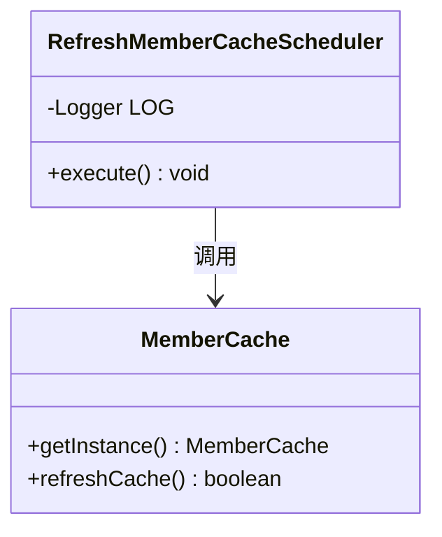
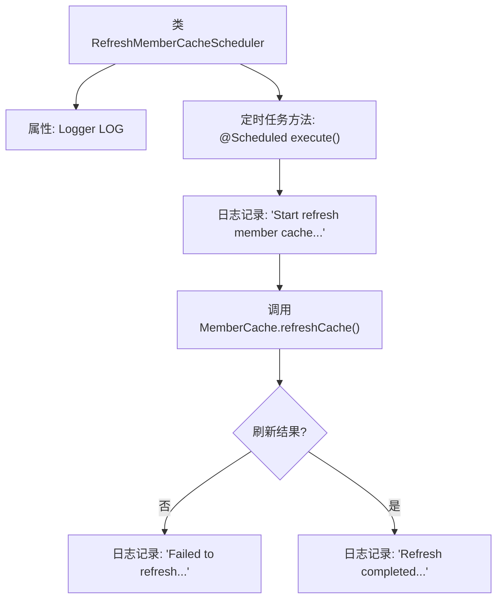

# 基础信息

|      |      |
|------|------|
| 名称 | RefreshMemberCacheScheduler |
| 编码语言 | .java |
| 代码路径 | WeFe/gateway/src/main/java/com/welab/wefe/gateway/scheduler/RefreshMemberCacheScheduler.java |
| 包名 | com.welab.wefe.gateway.scheduler |
| 依赖项 | ['com.welab.wefe.gateway.cache.MemberCache', 'org.slf4j.Logger', 'org.slf4j.LoggerFactory', 'org.springframework.scheduling.annotation.Scheduled', 'org.springframework.stereotype.Component'] |
| 概述说明 | Java定时任务类，每30秒刷新成员缓存，记录成功或失败日志。 |

# 说明

这是一个名为RefreshMemberCacheScheduler的Spring组件类，用于定期刷新成员缓存。该类包含一个使用@Scheduled注解标记的execute方法，该方法每30秒执行一次。执行时会记录开始刷新缓存的日志，然后调用MemberCache的refreshCache方法进行缓存刷新。若刷新失败则记录错误日志，成功则记录完成日志。整个过程通过Logger进行日志输出。

# 类列表 Class Summary

| 名称   | 类型  | 说明 |
|-------|------|-------------|
| RefreshMemberCacheScheduler | class | 这是一个定时刷新成员缓存的调度类，每30秒执行一次，成功或失败都会记录日志。 |

## 类 RefreshMemberCacheScheduler

|      |      |
|------|------|
| 访问范围 | @Component;public |
| 类型 | class |
| 名称 | RefreshMemberCacheScheduler |
| 说明 | 这是一个定时刷新成员缓存的调度类，每30秒执行一次，成功或失败都会记录日志。 |

### UML类图

类图描述：
该图展示了RefreshMemberCacheScheduler类与MemberCache类的关系。RefreshMemberCacheScheduler是一个定时任务组件，通过@Scheduled注解每30秒执行一次execute方法，该方法会调用MemberCache的单例实例来刷新缓存。MemberCache类提供getInstance()获取单例和refreshCache()刷新缓存的方法。箭头表示RefreshMemberCacheScheduler对MemberCache的调用依赖关系。

### 内部方法调用关系图

这段代码展示了一个Spring定时任务组件，每30秒执行一次成员缓存刷新操作。流程图清晰呈现了执行路径：从初始化日志开始，到调用缓存刷新方法，最后根据结果分别记录成功或失败日志。关键节点包括定时触发器、缓存刷新调用和双分支结果处理，体现了定时任务的核心执行逻辑和错误处理机制。

### 字段列表 Field List

| 名称  | 类型  | 说明 |
|-------|-------|------|
| LOG = LoggerFactory.getLogger(RefreshMemberCacheScheduler.class) | Logger | 定义了一个私有静态日志对象LOG，用于记录RefreshMemberCacheScheduler类的日志信息。 |

### 方法列表

| 名称  | 类型  | 说明 |
|-------|-------|------|
| execute | void | 定时任务每30秒刷新成员缓存，成功或失败均记录日志。 |

