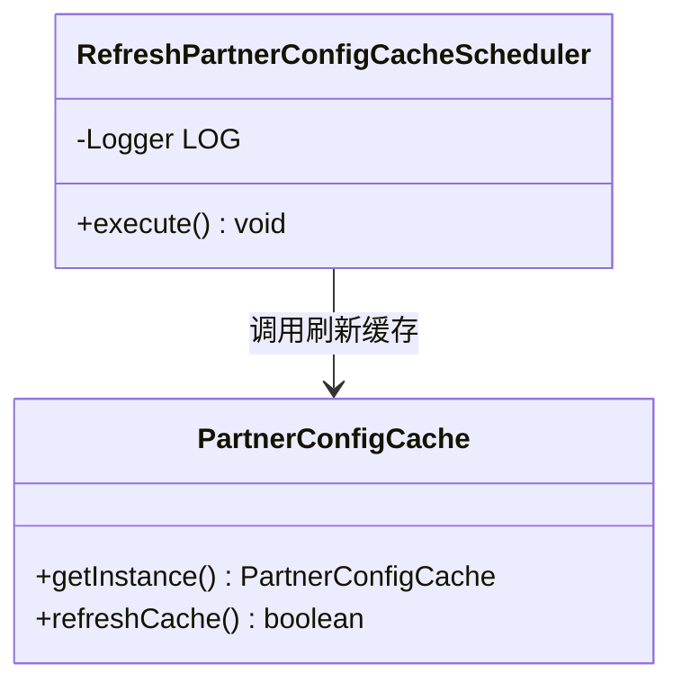
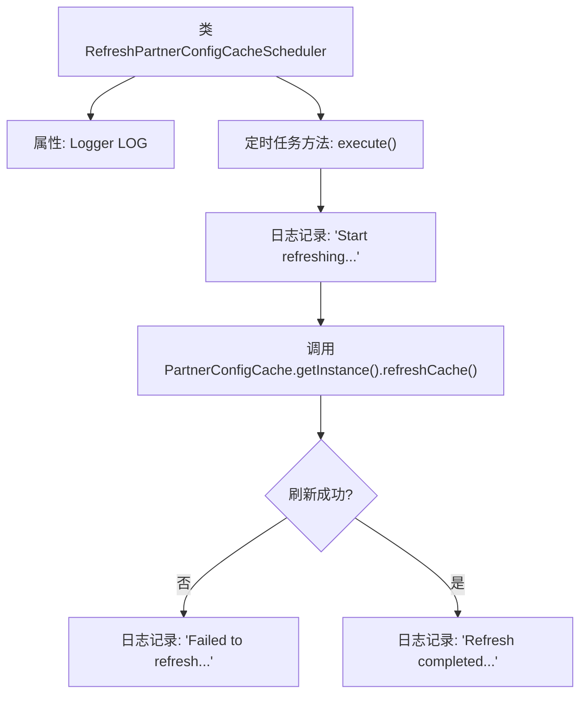

# 基础信息

|      |      |
|------|------|
| 名称 | RefreshPartnerConfigCacheScheduler |
| 编码语言 | .java |
| 代码路径 | WeFe/gateway/src/main/java/com/welab/wefe/gateway/scheduler/RefreshPartnerConfigCacheScheduler.java |
| 包名 | com.welab.wefe.gateway.scheduler |
| 依赖项 | ['com.welab.wefe.gateway.cache.PartnerConfigCache', 'org.slf4j.Logger', 'org.slf4j.LoggerFactory', 'org.springframework.scheduling.annotation.Scheduled'] |
| 概述说明 | 定时任务类，每10秒刷新合作伙伴配置缓存，记录成功或失败日志。 |

# 说明

这是一个名为RefreshPartnerConfigCacheScheduler的Java类，用于定时刷新合作伙伴配置缓存。它使用Spring的Scheduled注解设置每10秒执行一次的定时任务。执行时首先记录开始刷新日志，然后调用PartnerConfigCache单例实例的refreshCache方法更新缓存。若刷新失败则记录错误日志，成功则记录完成日志。整个流程通过类内的Logger对象进行关键节点日志记录。

# 类列表 Class Summary

| 名称   | 类型  | 说明 |
|-------|------|-------------|
| RefreshPartnerConfigCacheScheduler | class | 定时任务类，每10秒刷新合作伙伴配置缓存，记录成功或失败日志。 |

## 类 RefreshPartnerConfigCacheScheduler

|      |      |
|------|------|
| 访问范围 | public |
| 类型 | class |
| 名称 | RefreshPartnerConfigCacheScheduler |
| 说明 | 定时任务类，每10秒刷新合作伙伴配置缓存，记录成功或失败日志。 |

### UML类图

类图描述：该图展示了RefreshPartnerConfigCacheScheduler类通过定时任务调用PartnerConfigCache单例的缓存刷新功能。调度器类包含日志记录器和执行方法，PartnerConfigCache提供获取实例和刷新缓存的方法，两者通过依赖关系实现定时缓存更新机制，体现了典型的定时任务与单例模式交互场景。

### 内部方法调用关系图

这段代码展示了一个定时刷新合作伙伴配置缓存的调度器类。流程图描述了从定时任务触发开始，到日志记录启动信息，然后调用缓存刷新方法，最后根据刷新结果记录不同状态日志的完整流程。关键路径包括初始化日志、执行缓存刷新操作和基于结果的分支处理，体现了定时任务的核心逻辑和错误处理机制。

### 字段列表 Field List

| 名称  | 类型  | 说明 |
|-------|-------|------|
| LOG = LoggerFactory.getLogger(RefreshPartnerConfigCacheScheduler.class) | Logger | 定义私有静态日志对象LOG，用于RefreshPartnerConfigCacheScheduler类的日志记录。 |

### 方法列表

| 名称  | 类型  | 说明 |
|-------|-------|------|
| execute | void | 定时任务每10秒执行，刷新合作方配置缓存，成功或失败均记录日志。 |

