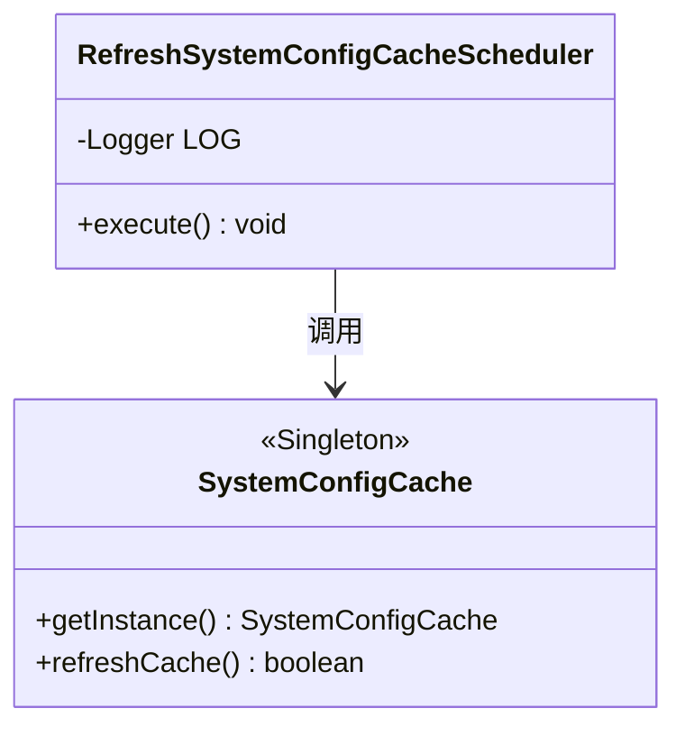
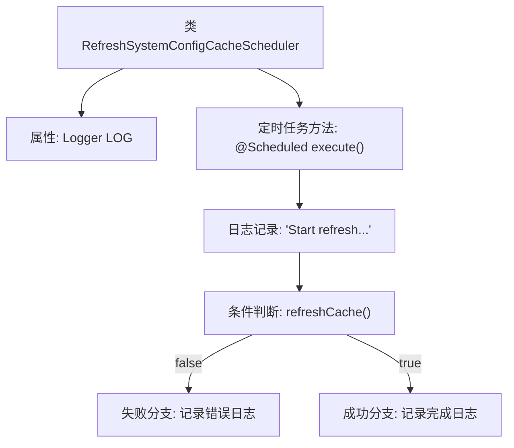

# 基础信息

|      |      |
|------|------|
| 名称 | RefreshSystemConfigCacheScheduler |
| 编码语言 | .java |
| 代码路径 | WeFe/gateway/src/main/java/com/welab/wefe/gateway/scheduler/RefreshSystemConfigCacheScheduler.java |
| 包名 | com.welab.wefe.gateway.scheduler |
| 依赖项 | ['com.welab.wefe.gateway.cache.SystemConfigCache', 'org.slf4j.Logger', 'org.slf4j.LoggerFactory', 'org.springframework.scheduling.annotation.Scheduled', 'org.springframework.stereotype.Component'] |
| 概述说明 | 定时任务类，每30秒刷新系统配置缓存，记录成功或失败日志。 |

# 说明

这是一个名为RefreshSystemConfigCacheScheduler的Spring组件类，用于定期刷新系统配置缓存。该类包含一个使用@Scheduled注解标记的execute方法，该方法每30秒执行一次。执行时会首先记录开始刷新缓存的日志信息，然后调用SystemConfigCache.getInstance().refreshCache()方法刷新缓存。如果刷新失败，会记录错误日志；如果成功，则记录完成日志。整个过程通过类中定义的Logger对象进行日志记录。

# 类列表 Class Summary

| 名称   | 类型  | 说明 |
|-------|------|-------------|
| RefreshSystemConfigCacheScheduler | class | 定时任务类，每30秒刷新系统配置缓存，记录成功或失败日志。 |

## 类 RefreshSystemConfigCacheScheduler

|      |      |
|------|------|
| 访问范围 | @Component;public |
| 类型 | class |
| 名称 | RefreshSystemConfigCacheScheduler |
| 说明 | 定时任务类，每30秒刷新系统配置缓存，记录成功或失败日志。 |

### UML类图

这段代码展示了一个定时刷新系统配置缓存的调度器类。RefreshSystemConfigCacheScheduler 通过 @Scheduled 注解每30秒执行一次execute方法，该方法会调用SystemConfigCache单例的refreshCache方法来更新缓存，并根据结果记录日志。SystemConfigCache是一个单例类，提供缓存刷新功能。类图清晰地表现了调度器对缓存单例的依赖关系。

### 内部方法调用关系图

该流程图描述了定时缓存刷新组件的执行逻辑。类包含一个Logger属性和被@Scheduled注解的execute方法，方法启动时先记录日志，然后调用SystemConfigCache的refreshCache方法更新缓存，根据返回结果分别记录失败或成功日志。整个过程展示了从任务触发到结果处理的完整控制流。

### 字段列表 Field List

| 名称  | 类型  | 说明 |
|-------|-------|------|
| LOG = LoggerFactory.getLogger(RefreshSystemConfigCacheScheduler.class) | Logger | 声明一个私有静态日志对象，用于记录RefreshSystemConfigCacheScheduler类的日志。 |

### 方法列表

| 名称  | 类型  | 说明 |
|-------|-------|------|
| execute | void | 定时任务每30秒刷新系统配置缓存，成功或失败均记录日志。 |

