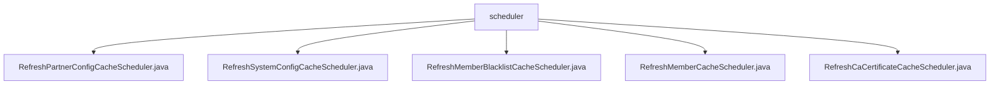

# 基础信息

|      |      |
|------|------|
| 名称 | scheduler |
| 编码语言 | .java |
| 代码路径 | WeFe/gateway/src/main/java/com/welab/wefe/gateway/scheduler |
| 包名 | docs.gateway.src.main.java.com.welab.wefe.gateway.scheduler |
| 概述说明 | 五个Spring定时任务类，分别每10/30秒刷新合作伙伴配置、系统配置、会员黑名单、成员和CA证书缓存，均含开始/成功/失败日志记录。 |

# 说明

## 概述  
该模块是一组基于Spring的定时缓存刷新组件，核心职责是定期更新各类系统配置和业务数据缓存。所有调度器均采用类似事件总线模式，通过@Scheduled注解实现周期触发，例如合作伙伴配置每10秒刷新，系统配置和CA证书每30秒刷新。统一接口规范为：每个类包含execute方法，调用对应单例Cache的refreshCache方法，并通过Logger记录执行状态。关键数据结构包括PartnerConfigCache、SystemConfigCache等单例缓存实例。外部依赖仅为Spring框架的定时任务模块。

## 主要业务场景  
模块服务于网关系统的实时数据同步需求，形成完整的缓存更新体系。典型流程为：定时触发→日志记录→调用缓存刷新→状态日志记录，类似心跳检测机制。例如会员黑名单每10秒更新，成员数据每30秒同步。所有组件遵循相同交互模式：无参数调用、异常捕获、状态日志。典型应用包括证书自动续期、黑名单实时同步等场景，通过高频刷新确保系统数据一致性。API类型均为定时任务触发器，集成案例覆盖配置、证书、会员等多业务维度。

### 包内部结构视图

该流程图展示了WeFe网关项目中调度器模块的Java类文件结构。根节点"scheduler"下包含5个定时任务类，分别用于刷新合作伙伴配置缓存、系统配置缓存、成员黑名单缓存、成员缓存以及CA证书缓存。所有类均位于同一目录层级，没有更深层次的嵌套关系。

# 文件列表

| 名称   | 类型  | 说明 |
|-------|------|-------------|
| [RefreshPartnerConfigCacheScheduler.java](RefreshPartnerConfigCacheScheduler.md) | file | 定时任务类，每10秒刷新合作伙伴配置缓存，记录成功或失败日志。 |
| [RefreshSystemConfigCacheScheduler.java](RefreshSystemConfigCacheScheduler.md) | file | 定时任务类，每30秒刷新系统配置缓存，记录成功或失败日志。 |
| [RefreshMemberBlacklistCacheScheduler.java](RefreshMemberBlacklistCacheScheduler.md) | file | 这是一个定时刷新会员黑名单缓存的调度类，每10秒执行一次，成功或失败都会记录日志。 |
| [RefreshMemberCacheScheduler.java](RefreshMemberCacheScheduler.md) | file | Java定时任务类，每30秒刷新成员缓存，记录成功或失败日志。 |
| [RefreshCaCertificateCacheScheduler.java](RefreshCaCertificateCacheScheduler.md) | file | 定时任务类，每30秒刷新CA证书缓存，记录成功或失败日志。 |

