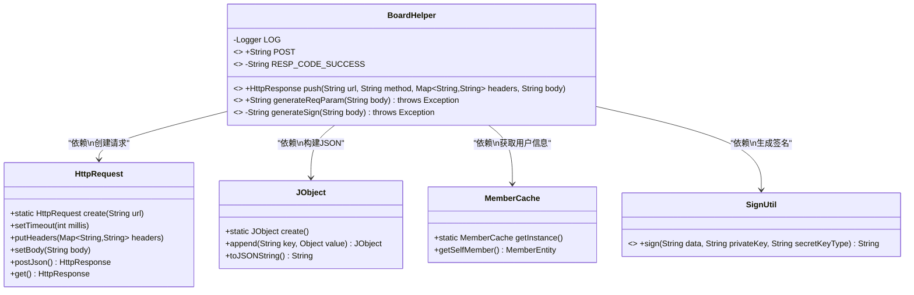
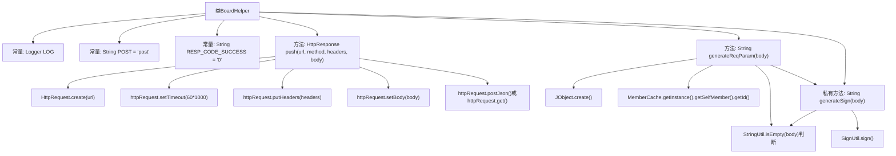

# 基础信息

|      |      |
|------|------|
| 名称 | BoardHelper |
| 编码语言 | .java |
| 代码路径 | WeFe/gateway/src/main/java/com/welab/wefe/gateway/sdk/BoardHelper.java |
| 包名 | com.welab.wefe.gateway.sdk |
| 依赖项 | ['com.welab.wefe.common.http.HttpRequest', 'com.welab.wefe.common.http.HttpResponse', 'com.welab.wefe.common.util.JObject', 'com.welab.wefe.common.util.RSAUtil', 'com.welab.wefe.common.util.SignUtil', 'com.welab.wefe.common.util.StringUtil', 'com.welab.wefe.gateway.cache.MemberCache', 'com.welab.wefe.gateway.entity.MemberEntity', 'org.slf4j.Logger', 'org.slf4j.LoggerFactory', 'java.util.Map'] |
| 概述说明 | BoardHelper类提供HTTP请求和签名功能，包含push方法发送请求，generateReqParam生成请求体，generateSign生成签名，使用成员ID和私钥。 |

# 说明

BoardHelper是一个工具类，主要用于处理HTTP请求和生成请求参数。类中包含静态常量POST和RESP_CODE_SUCCESS，分别表示HTTP方法和成功响应码。push方法用于发送HTTP请求，支持POST和GET方法，可设置超时时间、请求头和请求体。generateReqParam方法用于生成请求参数，包含成员ID、请求数据和签名。generateSign方法用于生成签名，基于成员私钥和密钥类型对请求体进行签名。所有方法均涉及成员信息的获取和字符串处理。

# 类列表 Class Summary

| 名称   | 类型  | 说明 |
|-------|------|-------------|
| BoardHelper | class | BoardHelper类提供HTTP请求推送和请求参数生成功能，包含POST常量、成功响应码、push方法发送请求，以及生成请求体和签名的工具方法。 |

## 类 BoardHelper

|      |      |
|------|------|
| 访问范围 | public |
| 类型 | class |
| 名称 | BoardHelper |
| 说明 | BoardHelper类提供HTTP请求推送和请求参数生成功能，包含POST常量、成功响应码、push方法发送请求，以及生成请求体和签名的工具方法。 |

### UML类图

类图描述：BoardHelper是一个工具类，主要提供HTTP请求推送和参数生成功能。它依赖HttpRequest进行网络请求，使用JObject构建JSON参数，通过MemberCache获取当前用户信息，并调用SignUtil生成签名。类中包含静态常量POST和RESP_CODE_SUCCESS，核心方法push()处理请求发送，generateReqParam()生成带签名的请求参数。

### 内部方法调用关系图

这段代码是BoardHelper工具类，主要提供HTTP请求推送和参数生成功能。流程图展示了类结构，包含常量定义、公开方法push()和generateReqParam()，以及私有方法generateSign()。push方法创建HTTP请求并设置超时、头部和正文，根据方法类型执行POST或GET；generateReqParam生成包含成员ID、数据和签名的JSON请求体；generateSign使用成员私钥对正文进行签名。各方法间通过清晰的调用关系连接，体现了参数处理和签名验证的完整流程。

### 字段列表 Field List

| 名称  | 类型  | 说明 |
|-------|-------|------|
| LOG = LoggerFactory.getLogger(BoardHelper.class) | Logger | 定义BoardHelper类的私有静态日志常量LOG。 |
| RESP_CODE_SUCCESS = "0" | String | 定义静态常量RESP_CODE_SUCCESS，值为"0"，表示成功响应码。 |
| POST = "post" | String | 定义了一个公共静态常量字符串POST，值为"post"。 |

### 方法列表

| 名称  | 类型  | 说明 |
|-------|-------|------|
| generateReqParam | String | 静态方法生成请求参数，包含会员ID、数据体和签名，数据体为空时用空字符串代替，最终转为JSON字符串。 |
| push | HttpResponse | 静态方法push接收URL、方法、请求头和请求体，设置超时后发送POST或GET请求并返回响应。 |
| generateSign | String | 该方法用于生成签名，接收字符串参数body，若为空则转为空字符串。通过MemberCache获取当前成员私钥和密钥类型，调用SignUtil.sign进行签名并返回结果。 |

