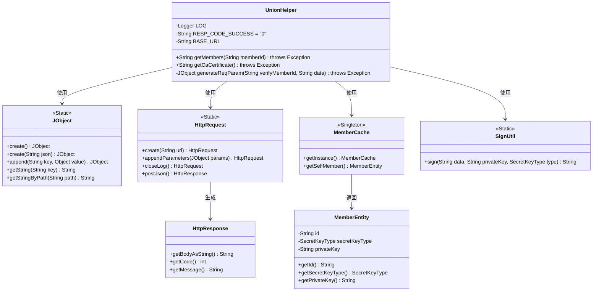
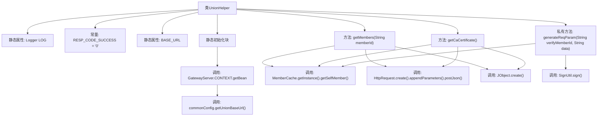
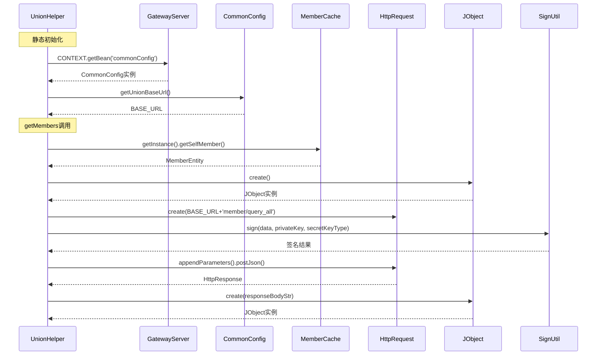

# 基础信息

|      |      |
|------|------|
| 名称 | UnionHelper |
| 编码语言 | .java |
| 代码路径 | WeFe/gateway/src/main/java/com/welab/wefe/gateway/sdk/UnionHelper.java |
| 包名 | com.welab.wefe.gateway.sdk |
| 依赖项 | ['com.welab.wefe.common.constant.SecretKeyType', 'com.welab.wefe.common.http.HttpRequest', 'com.welab.wefe.common.http.HttpResponse', 'com.welab.wefe.common.util.JObject', 'com.welab.wefe.common.util.SignUtil', 'com.welab.wefe.common.util.StringUtil', 'com.welab.wefe.gateway.GatewayServer', 'com.welab.wefe.gateway.cache.CaCertificateCache', 'com.welab.wefe.gateway.cache.MemberCache', 'com.welab.wefe.gateway.config.CommonConfig', 'com.welab.wefe.gateway.config.ConfigProperties', 'com.welab.wefe.gateway.entity.MemberEntity', 'org.slf4j.Logger', 'org.slf4j.LoggerFactory', 'java.util.ArrayList', 'java.util.List'] |
| 概述说明 | UnionHelper类提供静态方法：初始化BASE_URL；查询成员信息（支持按ID筛选）；查询CA证书；生成带签名的请求参数。使用JObject处理JSON，通过HttpRequest发送请求，校验响应码和数据。异常时记录日志并抛出。 |

# 说明

UnionHelper类是一个用于处理联盟网络请求的工具类。它包含静态初始化块，从配置中获取基础URL并确保以斜杠结尾。类中定义了两个主要方法：getMembers用于查询成员信息，支持按成员ID筛选；getCaCertificate用于查询所有CA证书。两个方法都通过HTTP请求与云端交互，使用generateReqParam方法生成带签名的请求参数，并处理响应数据验证。错误处理包括日志记录和异常抛出，成功响应码为"0"。类中还定义了日志记录器和成功响应码常量。

# 类列表 Class Summary

| 名称   | 类型  | 说明 |
|-------|------|-------------|
| UnionHelper | class | UnionHelper类提供静态方法查询成员和CA证书信息。初始化时从配置获取基础URL。方法通过HTTP请求获取数据，验证响应码和业务数据，失败时抛出异常。生成请求参数时使用签名确保安全。 |

## 类 UnionHelper

|      |      |
|------|------|
| 访问范围 | public |
| 类型 | class |
| 名称 | UnionHelper |
| 说明 | UnionHelper类提供静态方法查询成员和CA证书信息。初始化时从配置获取基础URL。方法通过HTTP请求获取数据，验证响应码和业务数据，失败时抛出异常。生成请求参数时使用签名确保安全。 |

### UML类图

类图描述：
UnionHelper是一个工具类，主要用于与联盟网络进行交互，包含获取成员信息和CA证书的功能。它依赖JObject处理JSON数据，使用HttpRequest发送HTTP请求，通过MemberCache获取当前成员信息，并调用SignUtil进行数据签名。类图清晰地展示了这些组件之间的依赖关系，体现了工具类与辅助类的协作方式。

### 内部方法调用关系图

这段代码是UnionHelper工具类，主要功能包括静态初始化基础URL、查询成员信息和CA证书。流程图展示了类结构和方法调用关系，时序图详细描述了静态初始化和getMembers方法的执行流程。代码通过Spring上下文获取配置，使用HTTP请求与云端交互，并通过签名验证确保数据安全性，最后对响应数据进行多层校验确保业务数据有效性。

### 字段列表 Field List

| 名称  | 类型  | 说明 |
|-------|-------|------|
| RESP_CODE_SUCCESS = "0" | String | 定义私有静态常量RESP_CODE_SUCCESS，值为"0"，表示成功响应码。 |
| BASE_URL | String | 定义静态字符串变量BASE_URL，用于存储基础URL地址。 |
| LOG = LoggerFactory.getLogger(UnionHelper.class) | Logger | UnionHelper类中定义的私有静态不可变日志记录器实例。 |

### 方法列表

| 名称  | 类型  | 说明 |
|-------|-------|------|
| getMembers | String | 该方法通过HTTP请求查询成员信息，验证参数后发送请求，处理响应数据并返回结果，错误时抛出异常并记录日志。 |
| getCaCertificate | String | 静态方法getCaCertificate通过HTTP请求查询CA证书信息，验证成员ID后处理响应数据，成功返回证书列表，失败抛出异常并记录日志。 |
| generateReqParam | JObject | 生成请求参数的静态方法，使用成员ID和数据，通过私钥和密钥类型签名，返回包含签名、成员ID和数据的JSON对象。 |

