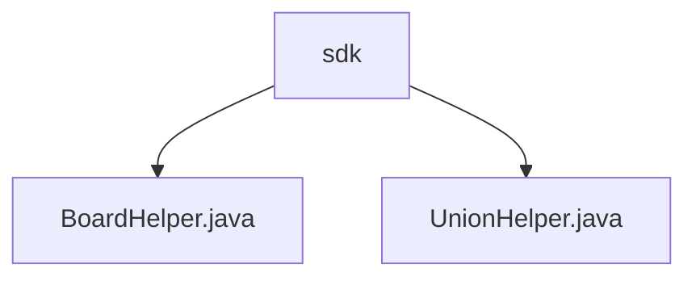

# 基础信息

|      |      |
|------|------|
| 名称 | sdk |
| 编码语言 | .java |
| 代码路径 | WeFe/gateway/src/main/java/com/welab/wefe/gateway/sdk |
| 包名 | docs.gateway.src.main.java.com.welab.wefe.gateway.sdk |
| 概述说明 | BoardHelper是处理HTTP请求的工具类，含POST和RESP_CODE_SUCCESS常量，提供push发送请求、generateReqParam生成参数、generateSign签名功能。UnionHelper处理联盟网络请求，含getMembers查询成员和getCaCertificate查询CA证书方法，均通过HTTP交互并验证响应。 |

# 说明

## 概述  
该模块核心职责是提供HTTP请求处理和联盟网络交互的工具类，包含请求参数生成、签名验证及成员信息查询等功能。接口规范包括统一使用POST/RESP_CODE_SUCCESS常量，支持带签名的请求参数生成（例如generateReqParam）和响应验证。关键数据结构涉及成员ID、请求数据、签名及CA证书。外部依赖包括HTTP客户端、日志系统和密钥管理服务。例如BoardHelper处理基础HTTP请求，UnionHelper专用于联盟成员和证书查询。

## 主要业务场景  
模块主要服务于联盟网络通信，典型流程为：生成签名参数→发送HTTP请求→验证响应。交互模式类似API网关，如UnionHelper通过getMembers/getCaCertificate查询成员或证书。功能完整性体现在错误处理（日志+异常）和成功码校验。典型应用包括成员管理（例如按ID筛选）和CA证书同步。API类型涵盖查询类（GET）和提交类（POST），集成案例如BoardHelper的push方法支持超时设置。

### 包内部结构视图

该流程图展示了WeFe网关SDK模块的代码结构，其中sdk目录下包含两个Java类文件：BoardHelper.java和UnionHelper.java。这两个类文件都直接隶属于sdk目录，没有更深层次的嵌套关系，形成了简单的二级目录结构。

# 文件列表

| 名称   | 类型  | 说明 |
|-------|------|-------------|
| [BoardHelper.java](BoardHelper.md) | file | BoardHelper类提供HTTP请求和签名功能，包含push方法发送请求，generateReqParam生成请求体，generateSign生成签名，使用成员ID和私钥。 |
| [UnionHelper.java](UnionHelper.md) | file | UnionHelper类提供静态方法：初始化BASE_URL；查询成员信息（支持按ID筛选）；查询CA证书；生成带签名的请求参数。使用JObject处理JSON，通过HttpRequest发送请求，校验响应码和数据。异常时记录日志并抛出。 |

