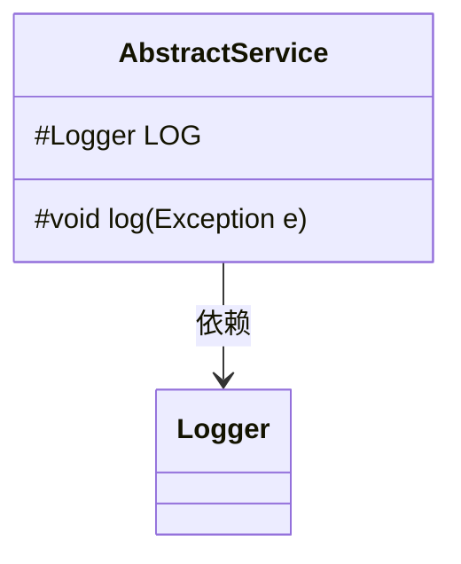
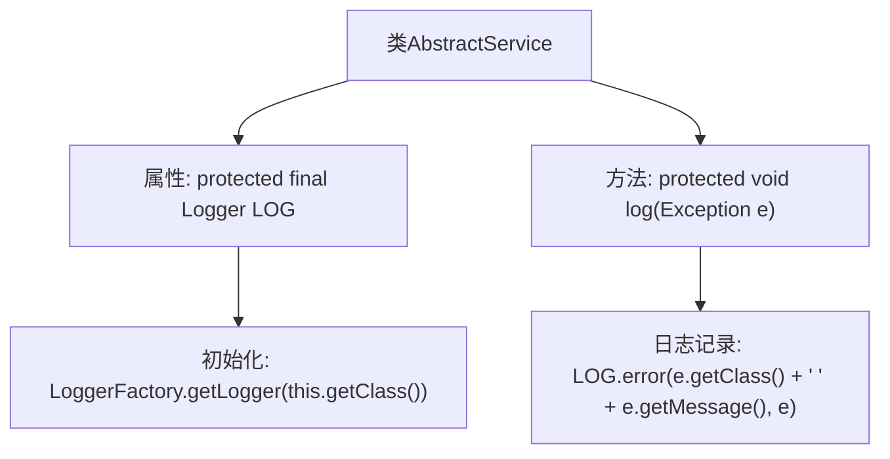

# 基础信息

|      |      |
|------|------|
| 名称 | AbstractService |
| 编码语言 | .java |
| 代码路径 | WeFe/gateway/src/main/java/com/welab/wefe/gateway/service/AbstractService.java |
| 包名 | com.welab.wefe.gateway.service |
| 依赖项 | ['org.slf4j.Logger', 'org.slf4j.LoggerFactory'] |
| 概述说明 | 抽象服务类提供日志记录功能，包含一个受保护的日志对象和异常日志方法。 |

# 说明

这是一个名为AbstractService的抽象类，主要用于提供日志记录功能。类中包含一个受保护的Logger实例，通过LoggerFactory获取当前类的日志记录器。还定义了一个受保护的log方法，用于记录异常信息，该方法会输出异常类名、异常消息以及完整的异常堆栈。这个类可以作为其他服务类的基类，提供统一的异常日志处理能力。

# 类列表 Class Summary

| 名称   | 类型  | 说明 |
|-------|------|-------------|
| AbstractService | class | 抽象服务类提供日志记录功能，包含日志对象和异常日志方法。 |

## 类 AbstractService

|      |      |
|------|------|
| 访问范围 | public |
| 类型 | class |
| 名称 | AbstractService |
| 说明 | 抽象服务类提供日志记录功能，包含日志对象和异常日志方法。 |

### UML类图

这段代码展示了一个抽象服务类`AbstractService`，它包含一个受保护的日志记录器`LOG`和一个受保护的日志记录方法`log`。该类通过`LoggerFactory`获取当前类的日志记录器实例，并提供了统一的异常日志记录功能，将异常类型、消息及完整堆栈信息记录到日志系统中。这种设计模式常用于服务层基类，为子类提供统一的日志处理能力。

### 内部方法调用关系图

这段代码展示了一个抽象服务类AbstractService，包含一个受保护的日志记录器LOG和一个日志记录方法log。流程图清晰地描述了类结构：首先初始化Logger对象，然后通过log方法捕获异常并记录错误信息，包括异常类型和消息。该设计为子类提供了统一的异常日志处理能力，符合面向对象的封装原则。

### 字段列表 Field List

| 名称  | 类型  | 说明 |
|-------|-------|------|
| LOG = LoggerFactory.getLogger(this.getClass()) | Logger | 类中定义了一个受保护且不可变的日志记录器实例，用于当前类的日志输出。 |

### 方法列表

| 名称  | 类型  | 说明 |
|-------|-------|------|
| log | void | 该方法用于记录异常日志，包含异常类名和消息，并输出完整异常堆栈。 |

