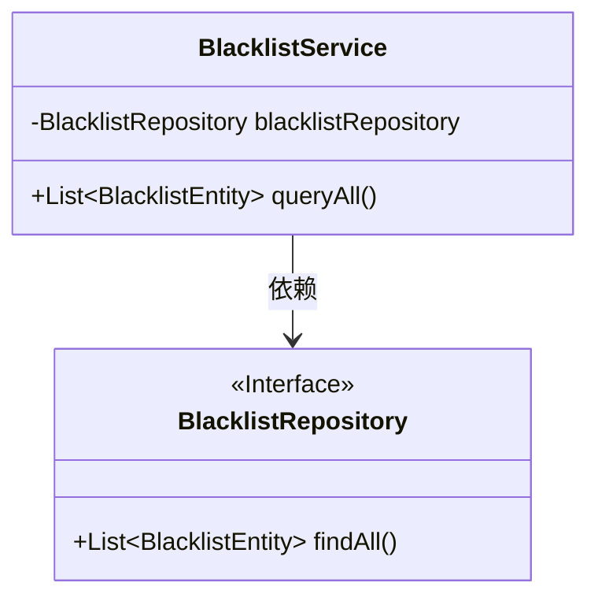
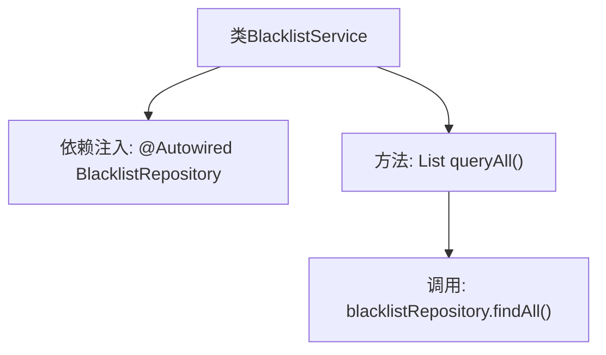

# 基础信息

|      |      |
|------|------|
| 名称 | BlacklistService |
| 编码语言 | .java |
| 代码路径 | WeFe/gateway/src/main/java/com/welab/wefe/gateway/service/BlacklistService.java |
| 包名 | com.welab.wefe.gateway.service |
| 依赖项 | ['com.welab.wefe.gateway.entity.BlacklistEntity', 'com.welab.wefe.gateway.repository.BlacklistRepository', 'org.springframework.beans.factory.annotation.Autowired', 'org.springframework.stereotype.Service', 'java.util.List'] |
| 概述说明 | 黑名单服务类，自动注入仓库，提供查询所有黑名单方法。 |

# 说明

这是一个名为BlacklistService的服务类，使用@Service注解标记为Spring服务组件。它通过@Autowired自动注入了一个BlacklistRepository实例用于数据访问。该类提供了一个queryAll方法，调用blacklistRepository的findAll方法来查询并返回所有黑名单实体列表。整个类专注于黑名单数据的查询功能，结构简洁明了。

# 类列表 Class Summary

| 名称   | 类型  | 说明 |
|-------|------|-------------|
| BlacklistService | class | 黑名单服务类，自动注入仓库接口，提供查询全部黑名单数据的方法。 |

## 类 BlacklistService

|      |      |
|------|------|
| 访问范围 | @Service;public |
| 类型 | class |
| 名称 | BlacklistService |
| 说明 | 黑名单服务类，自动注入仓库接口，提供查询全部黑名单数据的方法。 |

### UML类图

这段类图展示了Spring服务层组件BlacklistService及其依赖关系。BlacklistService通过@Autowired自动注入BlacklistRepository接口实例，并暴露queryAll()方法对外提供服务。BlacklistRepository作为JPA接口（标记<<Interface>>）定义了findAll()抽象方法。图中清晰呈现了服务层调用持久层的单向依赖关系，符合典型的分层架构设计模式。

### 内部方法调用关系图

这段流程图展示了Spring服务类BlacklistService的结构和调用关系。该类通过@Autowired自动注入BlacklistRepository依赖，提供queryAll()方法对外服务。该方法内部直接调用JPA仓库的findAll()接口获取全量数据，体现了典型的Spring Data JPA分层架构模式。整个流程简洁清晰，符合单一职责原则，适合处理黑名单数据的查询需求。

### 字段列表 Field List

| 名称  | 类型  | 说明 |
|-------|-------|------|
| blacklistRepository | BlacklistRepository | 自动注入黑名单仓库实例。 |

### 方法列表

| 名称  | 类型  | 说明 |
|-------|-------|------|
| queryAll | List<BlacklistEntity> | 查询所有黑名单实体，调用blacklistRepository的findAll方法返回列表。 |

