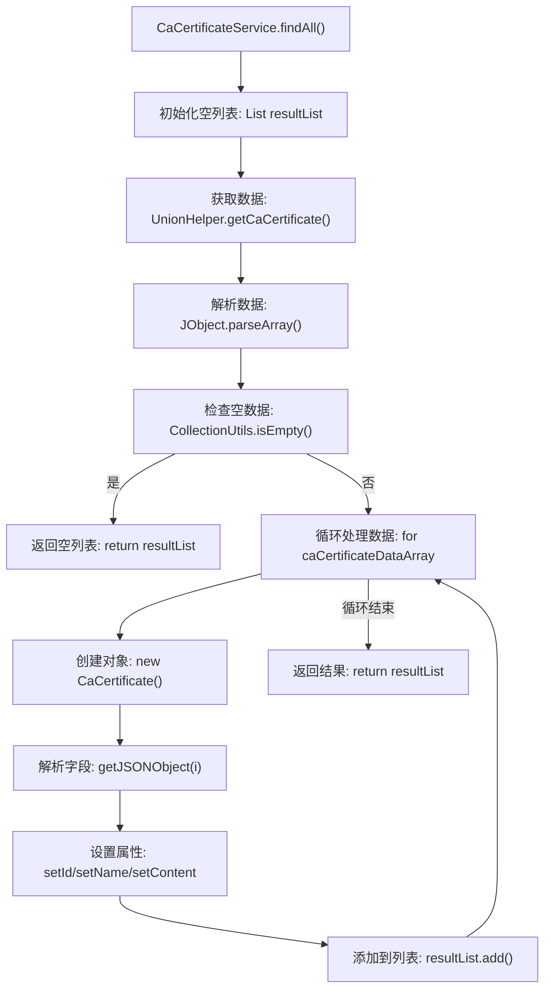

# 基础信息

|      |      |
|------|------|
| 名称 | CaCertificateService |
| 编码语言 | .java |
| 代码路径 | WeFe/gateway/src/main/java/com/welab/wefe/gateway/service/CaCertificateService.java |
| 包名 | com.welab.wefe.gateway.service |
| 依赖项 | ['com.alibaba.fastjson.JSONArray', 'com.alibaba.fastjson.JSONObject', 'com.welab.wefe.common.util.JObject', 'com.welab.wefe.gateway.cache.CaCertificateCache', 'com.welab.wefe.gateway.sdk.UnionHelper', 'org.apache.commons.collections4.CollectionUtils', 'org.springframework.stereotype.Service', 'java.util.ArrayList', 'java.util.List'] |
| 概述说明 | CaCertificateService类提供findAll方法，从联合服务获取CA证书数据并解析为列表返回，包含序列号、主题名和证书内容。 |

# 说明

CaCertificateService类中的findAll方法用于从联合服务获取所有CA证书数据。该方法首先创建空列表存储结果，然后通过UnionHelper获取CA证书JSON数组数据。若数据为空则返回空列表。遍历数组时，为每个证书创建CaCertificate对象，从JSON对象中提取序列号、主题名称和证书内容并设置到对象中，最后将所有证书对象添加到结果列表返回。

# 类列表 Class Summary

| 名称   | 类型  | 说明 |
|-------|------|-------------|
| CaCertificateService | class | CaCertificateService类提供findAll方法，从联合服务获取CA证书数据并解析为列表返回。 |


## 类 CaCertificateService

|      |      |
|------|------|
| 访问范围 | @Service;public |
| 类型 | class |
| 名称 | CaCertificateService |
| 说明 | CaCertificateService类提供findAll方法，从联合服务获取CA证书数据并解析为列表返回。 |


### UML类图

```mermaid
classDiagram
    class CaCertificateService {
        +findAll() List~CaCertificateCache.CaCertificate~
    }
    
    class CaCertificateCache {
        class CaCertificate {
            -String id
            -String name
            -String content
            +setId(String id)
            +setName(String name)
            +setContent(String content)
        }
    }
    
    class UnionHelper {
        <<Interface>>
        +getCaCertificate() String
    }
    
    class JObject {
        <<Interface>>
        +parseArray(String json) JSONArray
    }
    
    class CollectionUtils {
        <<Interface>>
        +isEmpty(JSONArray array) boolean
    }
    
    CaCertificateService --> UnionHelper : 依赖
    CaCertificateService --> JObject : 依赖
    CaCertificateService --> CollectionUtils : 依赖
    CaCertificateService --> CaCertificateCache : 包含
```

这段代码描述了一个CA证书服务类`CaCertificateService`，它通过调用`UnionHelper`获取CA证书数据，使用`JObject`解析JSON数组，并通过`CollectionUtils`判断数据是否为空。服务类内部使用`CaCertificateCache.CaCertificate`来存储证书信息（序列号、主题名称和证书内容）。类图展示了这些类之间的依赖关系和内部结构，其中`UnionHelper`、`JObject`和`CollectionUtils`被标记为接口，而`CaCertificateCache`包含一个内部类`CaCertificate`用于封装证书数据。


### 内部方法调用关系图



该流程图描述了CaCertificateService类中findAll()方法的完整执行流程。方法首先初始化空列表，通过UnionHelper获取CA证书数据并解析为JSON数组。若数据为空则直接返回空列表，否则循环处理每个证书数据项：创建CaCertificate对象、设置对象属性（序列号、主题名称、证书内容），最后将完整列表返回。整个过程包含数据获取、空值检查、循环处理和结果返回等关键步骤。

### 字段列表 Field List

| 名称  | 类型  | 说明 |
|-------|-------|------|

### 方法列表

| 名称  | 类型  | 说明 |
|-------|-------|------|
| findAll | List<CaCertificateCache.CaCertificate> | 方法findAll获取CA证书列表，解析JSON数据并填充到CaCertificate对象中，返回包含序列号、主题名和证书内容的列表。若无数据返回空列表。 |


