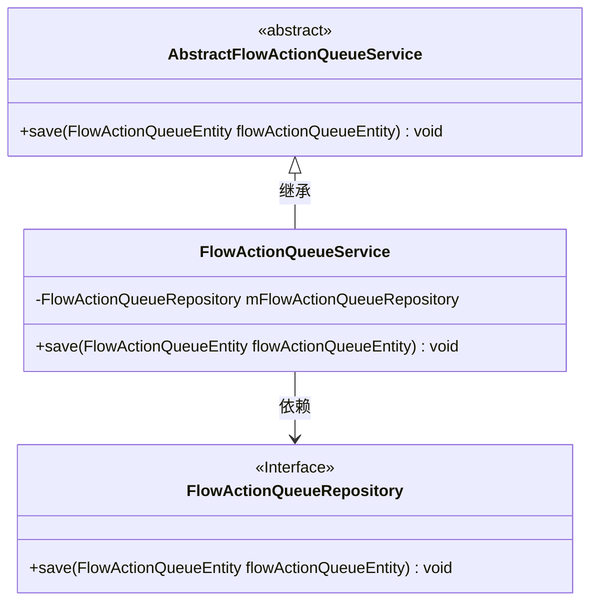
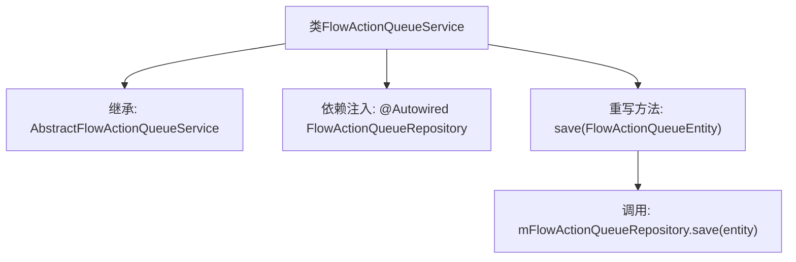

# 基础信息

|      |      |
|------|------|
| 名称 | FlowActionQueueService |
| 编码语言 | .java |
| 代码路径 | WeFe/gateway/src/main/java/com/welab/wefe/gateway/service/FlowActionQueueService.java |
| 包名 | com.welab.wefe.gateway.service |
| 依赖项 | ['com.welab.wefe.gateway.entity.FlowActionQueueEntity', 'com.welab.wefe.gateway.repository.FlowActionQueueRepository', 'com.welab.wefe.gateway.service.base.AbstractFlowActionQueueService', 'org.springframework.beans.factory.annotation.Autowired', 'org.springframework.stereotype.Service'] |
| 概述说明 | FlowActionQueueService继承AbstractFlowActionQueueService，通过FlowActionQueueRepository保存FlowActionQueueEntity实体。 |

# 说明

这是一个名为FlowActionQueueService的服务类，继承自AbstractFlowActionQueueService。它使用@Autowired注解自动注入了一个FlowActionQueueRepository实例。该类重写了save方法，通过调用mFlowActionQueueRepository的save方法来保存传入的FlowActionQueueEntity实体对象。整个类的主要功能是提供对流程动作队列实体的持久化操作。

# 类列表 Class Summary

| 名称   | 类型  | 说明 |
|-------|------|-------------|
| FlowActionQueueService | class | FlowActionQueueService继承AbstractFlowActionQueueService，通过FlowActionQueueRepository保存FlowActionQueueEntity实体。 |

## 类 FlowActionQueueService

|      |      |
|------|------|
| 访问范围 | @Service;public |
| 类型 | class |
| 名称 | FlowActionQueueService |
| 说明 | FlowActionQueueService继承AbstractFlowActionQueueService，通过FlowActionQueueRepository保存FlowActionQueueEntity实体。 |

### UML类图

这段代码展示了一个基于Spring框架的服务层实现，其中FlowActionQueueService继承自抽象类AbstractFlowActionQueueService，并通过依赖注入的方式使用FlowActionQueueRepository接口来持久化FlowActionQueueEntity实体。该设计遵循了依赖倒置原则，具体存储实现由接口解耦，便于替换和测试。类图清晰地反映了继承关系和依赖关系，体现了分层架构的思想。

### 内部方法调用关系图

该流程图描述了FlowActionQueueService类的结构，它继承自AbstractFlowActionQueueService，并通过@Autowired注入FlowActionQueueRepository依赖。核心逻辑是重写save方法，内部直接调用repository的save操作完成持久化。整个设计体现了Spring服务层的典型模式，将业务逻辑委托给基础设施层实现。

### 字段列表 Field List

| 名称  | 类型  | 说明 |
|-------|-------|------|
| mFlowActionQueueRepository | FlowActionQueueRepository | 自动注入FlowActionQueueRepository实例。 |

### 方法列表

| 名称  | 类型  | 说明 |
|-------|-------|------|
| save | void | 重写save方法，调用存储库保存流程动作队列实体。 |

