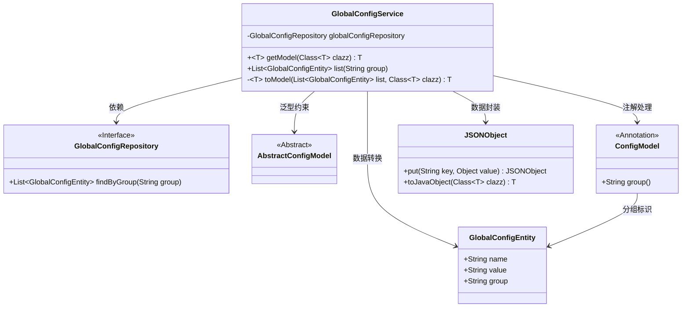
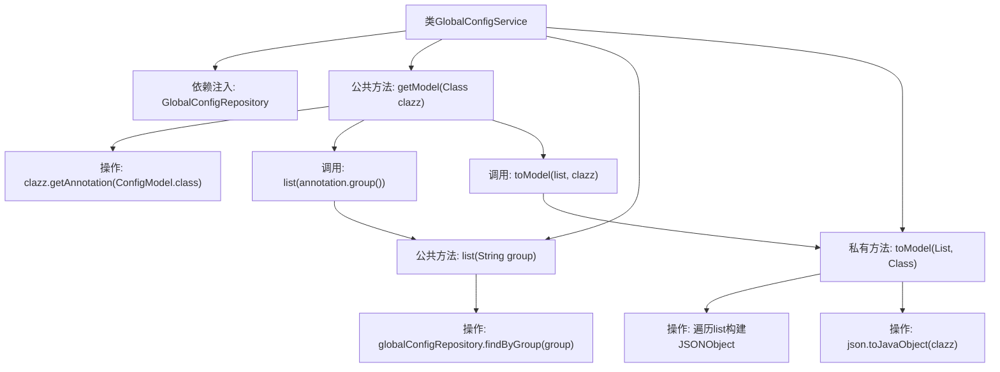

# 基础信息

|      |      |
|------|------|
| 名称 | GlobalConfigService |
| 编码语言 | .java |
| 代码路径 | WeFe/gateway/src/main/java/com/welab/wefe/gateway/service/GlobalConfigService.java |
| 包名 | com.welab.wefe.gateway.service |
| 依赖项 | ['com.alibaba.fastjson.JSONObject', 'com.welab.wefe.common.wefe.dto.global_config.base.AbstractConfigModel', 'com.welab.wefe.common.wefe.dto.global_config.base.ConfigModel', 'com.welab.wefe.gateway.entity.GlobalConfigEntity', 'com.welab.wefe.gateway.repository.GlobalConfigRepository', 'org.springframework.beans.factory.annotation.Autowired', 'org.springframework.stereotype.Service', 'java.util.List'] |
| 概述说明 | GlobalConfigService提供配置管理功能，通过group查询配置项列表，并将配置项转换为指定类型的模型对象。核心方法包括getModel获取配置模型、list按组查询配置项、toModel将配置项转为实体对象。 |

# 说明

GlobalConfigService是一个服务类，用于管理全局配置。它通过GlobalConfigRepository访问数据库，提供两个主要方法：getModel根据指定类获取对应的配置实体，内部调用list方法按组查询配置项列表，再通过toModel将列表转换为目标实体。toModel方法将配置项列表转为JSON对象，再转换为指定类的实例。该类支持通过注解标识配置模型，实现配置数据的灵活获取与转换。

# 类列表 Class Summary

| 名称   | 类型  | 说明 |
|-------|------|-------------|
| GlobalConfigService | class | GlobalConfigService提供配置管理功能，通过group查询配置项列表，并将配置项转换为指定类型的模型对象。使用Repository操作数据，支持JSON转换。 |

## 类 GlobalConfigService

|      |      |
|------|------|
| 访问范围 | @Service;public |
| 类型 | class |
| 名称 | GlobalConfigService |
| 说明 | GlobalConfigService提供配置管理功能，通过group查询配置项列表，并将配置项转换为指定类型的模型对象。使用Repository操作数据，支持JSON转换。 |

### UML类图

该代码实现了一个全局配置服务，通过注解分组机制动态查询和转换配置数据。GlobalConfigService 作为核心服务类，依赖GlobalConfigRepository接口获取原始数据，使用JSONObject进行数据封装，并通过泛型方法将配置项转换为指定类型的模型对象。类图展示了从数据访问层到业务模型转换的完整链路，包含接口、抽象类、注解和实体类的多层级交互关系。

### 内部方法调用关系图

该流程图展示了GlobalConfigService类的核心结构和工作流程。类通过依赖注入使用GlobalConfigRepository，提供获取配置模型和查询配置列表的公共方法。主要流程为：getModel方法首先获取类注解，然后调用list方法查询数据库，最后通过toModel方法将查询结果转换为目标模型对象。私有方法toModel负责数据转换逻辑，包括空值检查、JSON对象构建和类型转换。整个过程体现了从数据库查询到对象模型的完整转换链条。

### 字段列表 Field List

| 名称  | 类型  | 说明 |
|-------|-------|------|
| globalConfigRepository | GlobalConfigRepository | 代码片段使用@Autowired注解自动注入GlobalConfigRepository实例。 |

### 方法列表

| 名称  | 类型  | 说明 |
|-------|-------|------|
| list | List<GlobalConfigEntity> | 查询指定分组的全局配置列表。 |
| toModel | T | 将配置实体列表转换为指定类型的模型对象，若列表为空则返回null。遍历列表构建JSON对象后转换为目标类实例。 |
| getModel | T | 这是一个Java方法，用于获取指定配置类的模型实例。它通过注解获取配置组信息，查询相关配置列表，并将其转换为目标模型对象。方法支持泛型，返回类型为继承自AbstractConfigModel的类。 |

