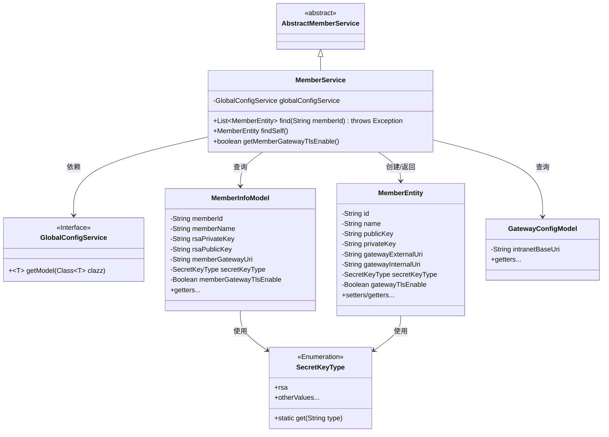
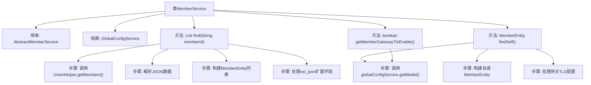

# 基础信息

|      |      |
|------|------|
| 名称 | MemberService |
| 编码语言 | .java |
| 代码路径 | WeFe/gateway/src/main/java/com/welab/wefe/gateway/service/MemberService.java |
| 包名 | com.welab.wefe.gateway.service |
| 依赖项 | ['java.util.ArrayList', 'java.util.List', 'com.welab.wefe.common.wefe.dto.global_config.GatewayConfigModel', 'com.welab.wefe.common.wefe.dto.global_config.storage.ClickHouseStorageConfigModel', 'org.apache.commons.collections4.CollectionUtils', 'org.apache.commons.lang3.math.NumberUtils', 'org.springframework.beans.factory.annotation.Autowired', 'org.springframework.stereotype.Service', 'com.alibaba.fastjson.JSONArray', 'com.alibaba.fastjson.JSONObject', 'com.welab.wefe.common.constant.SecretKeyType', 'com.welab.wefe.common.util.JObject', 'com.welab.wefe.common.util.StringUtil', 'com.welab.wefe.common.wefe.dto.global_config.MemberInfoModel', 'com.welab.wefe.gateway.GatewayServer', 'com.welab.wefe.gateway.entity.MemberEntity', 'com.welab.wefe.gateway.sdk.UnionHelper', 'com.welab.wefe.gateway.service.base.AbstractMemberService'] |
| 概述说明 | MemberService类继承AbstractMemberService，提供查找成员列表和自身信息功能，处理成员实体数据包括ID、名称、密钥及网关配置，支持TLS设置检查。 |

# 说明

MemberService类继承AbstractMemberService，提供成员信息查询功能。find方法通过UnionHelper获取成员列表，解析JSON数据构建MemberEntity对象列表，包含网关URI、名称、ID、公钥等属性，支持扩展JSON中的密钥类型和TLS启用状态。findSelf方法查询当前成员信息，从GlobalConfigService获取MemberInfoModel数据填充MemberEntity对象，包含内外网URI、公私钥等属性。getMemberGatewayTlsEnable方法检查当前成员网关TLS是否启用。

# 类列表 Class Summary

| 名称   | 类型  | 说明 |
|-------|------|-------------|
| MemberService | class | MemberService类提供成员信息查询功能，包括根据ID查找成员列表和查询自身信息，处理成员实体属性如密钥、网关URI等，并支持TLS配置检查。 |

## 类 MemberService

|      |      |
|------|------|
| 访问范围 | @Service;public |
| 类型 | class |
| 名称 | MemberService |
| 说明 | MemberService类提供成员信息查询功能，包括根据ID查找成员列表和查询自身信息，处理成员实体属性如密钥、网关URI等，并支持TLS配置检查。 |

### UML类图

类图描述：该图展示了MemberService继承自AbstractMemberService，并依赖GlobalConfigService接口获取配置信息。MemberService主要操作MemberEntity对象，通过MemberInfoModel和GatewayConfigModel获取数据，并使用SecretKeyType枚举类。MemberEntity包含成员基本信息及网关配置，各模型类通过getter方法提供数据访问。

### 内部方法调用关系图

该流程图展示了MemberService类的核心结构和主要方法调用关系。类继承自AbstractMemberService并依赖GlobalConfigService，包含三个主要方法：find()用于查询成员列表并处理JSON数据，findSelf()获取自身成员信息，getMemberGatewayTlsEnable()检查网关TLS启用状态。关键流程包括JSON解析、实体构建和配置服务调用，体现了从数据获取到业务对象转换的完整处理链。

### 字段列表 Field List

| 名称  | 类型  | 说明 |
|-------|-------|------|
| globalConfigService | GlobalConfigService | 自动注入全局配置服务实例。 |

### 方法列表

| 名称  | 类型  | 说明 |
|-------|-------|------|
| find | List<MemberEntity> | 方法find通过memberId获取成员列表，解析JSON数据并转换为MemberEntity对象列表，包含基础信息和扩展属性。 |
| findSelf | MemberEntity | 该方法通过全局配置获取会员信息，构建并返回会员实体对象，包含ID、名称、密钥、网关URI等属性。若会员信息为空则返回null。 |
| getMemberGatewayTlsEnable | boolean | 该方法检查成员网关TLS是否启用，若未设置则返回false，否则返回配置值。 |

