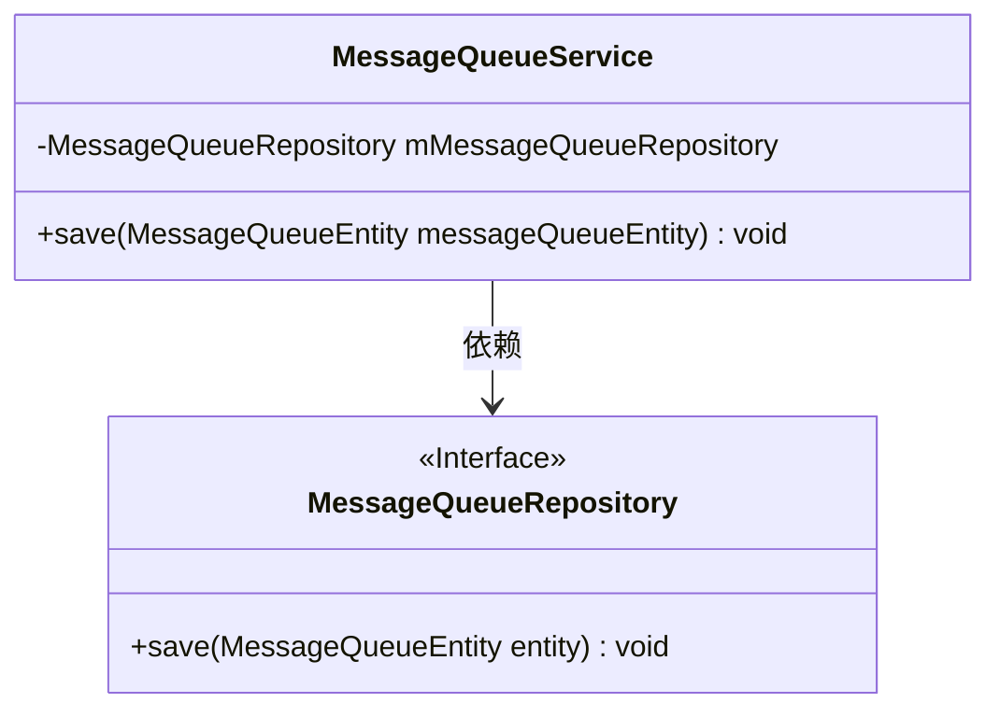
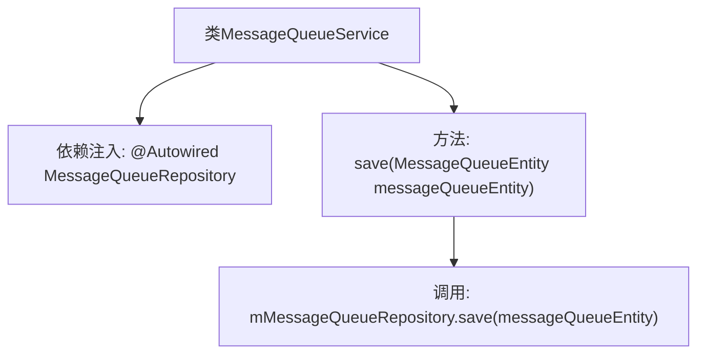

# 基础信息

|      |      |
|------|------|
| 名称 | MessageQueueService |
| 编码语言 | .java |
| 代码路径 | WeFe/gateway/src/main/java/com/welab/wefe/gateway/service/MessageQueueService.java |
| 包名 | com.welab.wefe.gateway.service |
| 依赖项 | ['com.welab.wefe.gateway.entity.MessageQueueEntity', 'com.welab.wefe.gateway.repository.MessageQueueRepository', 'org.springframework.beans.factory.annotation.Autowired', 'org.springframework.stereotype.Service'] |
| 概述说明 | MessageQueueService类使用@Autowired注入MessageQueueRepository，提供save方法保存MessageQueueEntity实体。 |

# 说明

这是一个名为MessageQueueService的服务类，使用@Service注解标识为Spring服务组件。该类通过@Autowired自动注入了一个MessageQueueRepository类型的私有成员变量mMessageQueueRepository。它提供了一个save方法，接收MessageQueueEntity类型的参数，并调用mMessageQueueRepository的save方法将实体保存到数据库中。该服务类主要用于处理消息队列实体的持久化操作。

# 类列表 Class Summary

| 名称   | 类型  | 说明 |
|-------|------|-------------|
| MessageQueueService | class | MessageQueueService是一个Spring服务类，通过MessageQueueRepository保存MessageQueueEntity实体数据。 |

## 类 MessageQueueService

|      |      |
|------|------|
| 访问范围 | @Service;public |
| 类型 | class |
| 名称 | MessageQueueService |
| 说明 | MessageQueueService是一个Spring服务类，通过MessageQueueRepository保存MessageQueueEntity实体数据。 |

### UML类图

这段类图展示了Spring服务层组件MessageQueueService及其对JPA仓库接口MessageQueueRepository的依赖关系。MessageQueueService通过@Autowired注入MessageQueueRepository实例，并暴露一个save方法用于持久化消息队列实体。MessageQueueRepository作为Spring Data JPA接口，由框架自动实现其CRUD操作。该设计遵循了依赖倒置原则，高层模块不直接依赖低层实现，而是通过接口进行抽象交互。

### 内部方法调用关系图

这段流程图描述了MessageQueueService类的结构和工作流程。该类通过@Autowired自动注入MessageQueueRepository依赖，核心方法save()将接收到的MessageQueueEntity实体对象委托给repository进行持久化存储。整个流程展示了Spring服务层组件与数据访问层的典型协作模式，体现了依赖注入和单一职责原则。

### 字段列表 Field List

| 名称  | 类型  | 说明 |
|-------|-------|------|
| mMessageQueueRepository | MessageQueueRepository | 代码片段使用@Autowired自动注入MessageQueueRepository实例到私有变量mMessageQueueRepository。 |

### 方法列表

| 名称  | 类型  | 说明 |
|-------|-------|------|
| save | void | 保存消息队列实体到存储库。 |

