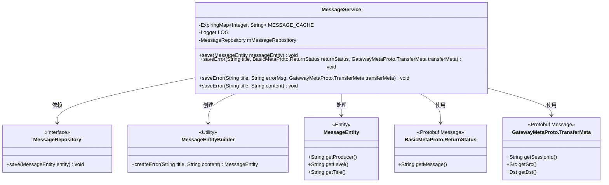
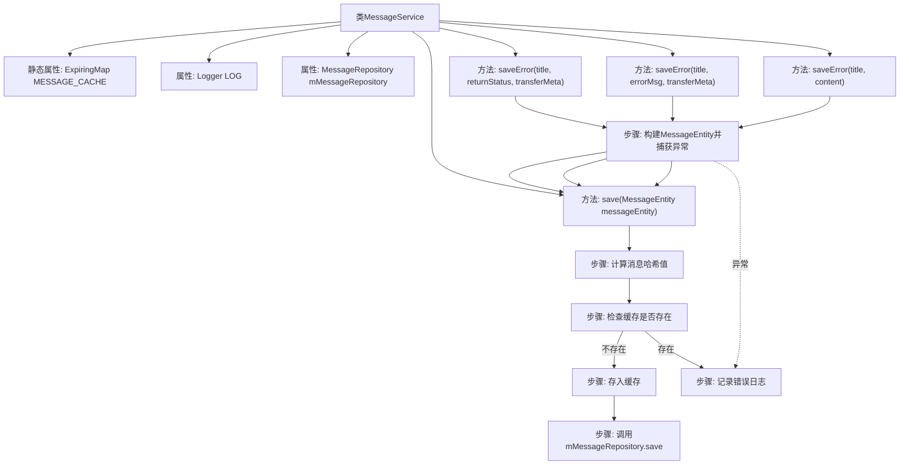

# 基础信息

|      |      |
|------|------|
| 名称 | MessageService |
| 编码语言 | .java |
| 代码路径 | WeFe/gateway/src/main/java/com/welab/wefe/gateway/service/MessageService.java |
| 包名 | com.welab.wefe.gateway.service |
| 依赖项 | ['com.welab.wefe.gateway.api.meta.basic.BasicMetaProto', 'com.welab.wefe.gateway.api.meta.basic.GatewayMetaProto', 'com.welab.wefe.gateway.common.MessageEntityBuilder', 'com.welab.wefe.gateway.entity.MessageEntity', 'com.welab.wefe.gateway.repository.MessageRepository', 'net.jodah.expiringmap.ExpirationPolicy', 'net.jodah.expiringmap.ExpiringMap', 'org.slf4j.Logger', 'org.slf4j.LoggerFactory', 'org.springframework.beans.factory.annotation.Autowired', 'org.springframework.stereotype.Service', 'java.util.concurrent.TimeUnit'] |
| 概述说明 | MessageService类使用ExpiringMap缓存60秒内消息哈希避免重复存储，提供多个saveError方法记录网关错误信息到数据库，异常时记录日志。 |

# 说明

MessageService是一个服务类，用于处理消息存储和去重。它使用ExpiringMap作为缓存，避免短时间内重复写入相同消息。缓存策略为创建后60秒过期，最大容量100条。类中注入了MessageRepository用于持久化存储。主要方法包括save和多个saveError重载方法。save方法通过计算消息哈希值检查缓存，未缓存则存入数据库。saveError方法封装了错误消息构建逻辑，记录网关相关错误信息，包括发送方、接收方、会话ID和错误原因，并处理异常情况。所有操作都包含异常处理，错误时记录日志。

# 类列表 Class Summary

| 名称   | 类型  | 说明 |
|-------|------|-------------|
| MessageService | class | 消息服务类，使用缓存避免重复消息，60秒过期，最大100条。提供保存消息及错误信息方法，记录网关错误详情。 |

## 类 MessageService

|      |      |
|------|------|
| 访问范围 | @Service;public |
| 类型 | class |
| 名称 | MessageService |
| 说明 | 消息服务类，使用缓存避免重复消息，60秒过期，最大100条。提供保存消息及错误信息方法，记录网关错误详情。 |

### UML类图

该代码实现了一个消息服务，主要功能是通过缓存机制避免短时间内重复保存相同消息。MessageService 使用 ExpiringMap 作为缓存，通过消息内容的哈希值进行去重，缓存有效期为60秒。服务提供多个 saveError 方法重载，用于处理不同类型的错误消息，最终统一调用 save 方法保存到数据库。类图中展示了服务与消息实体、仓库接口及辅助构建器的关系，体现了分层设计和依赖倒置原则。

### 内部方法调用关系图

这段代码展示了一个消息服务类，主要用于处理网关消息的缓存和存储逻辑。核心功能包括：使用ExpiringMap实现60秒缓存去重，通过哈希值判断重复消息，提供三种saveError重载方法处理不同错误场景。所有操作都包含异常处理机制，并通过Logger记录错误日志。流程图清晰呈现了消息处理流程、缓存校验逻辑以及方法间的调用关系。

### 字段列表 Field List

| 名称  | 类型  | 说明 |
|-------|-------|------|
| MESSAGE_CACHE = ExpiringMap            .builder()            .expirationPolicy(ExpirationPolicy.CREATED)            .expiration(60, TimeUnit.SECONDS)            .maxSize(100)            .build() | ExpiringMap<Integer, String> | 创建静态ExpiringMap缓存MESSAGE_CACHE，键为整型，值为字符串。设置过期策略为创建后60秒失效，最大容量100。 |
| LOG = LoggerFactory.getLogger(SendTransferMetaService.class) | Logger | 类SendTransferMetaService中定义了一个私有不可变的Logger实例LOG，用于记录日志。 |
| mMessageRepository | MessageRepository | 使用@Autowired自动注入MessageRepository实例。 |

### 方法列表

| 名称  | 类型  | 说明 |
|-------|-------|------|
| saveError | void | 方法saveError记录网关错误信息，包含标题、发送接收方、会话ID和错误原因，异常时记录日志。 |
| save | void | 方法save接收MessageEntity对象，计算其生产者、级别和标题的哈希值。若哈希值存在于缓存MESSAGE_CACHE中则直接返回，否则存入缓存并调用mMessageRepository保存消息实体。 |
| saveError | void | 方法saveError记录网关错误信息，包含标题、错误消息及传输元数据（发送方、接收方、会话ID）。异常时记录日志。 |
| saveError | void | 方法saveError记录错误信息，包含标题和内容，以"网关："为前缀。若保存失败，记录异常日志。 |

