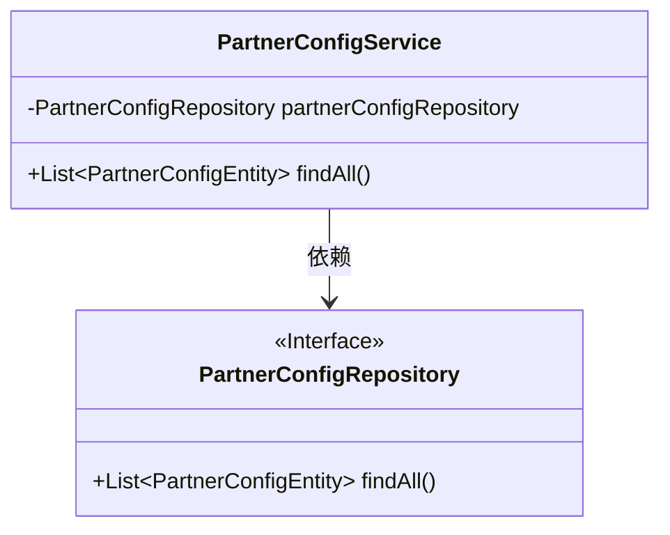
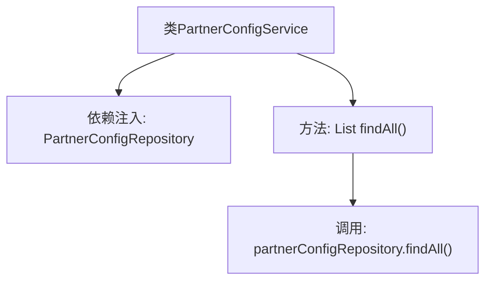

# 基础信息

|      |      |
|------|------|
| 名称 | PartnerConfigService |
| 编码语言 | .java |
| 代码路径 | WeFe/gateway/src/main/java/com/welab/wefe/gateway/service/PartnerConfigService.java |
| 包名 | com.welab.wefe.gateway.service |
| 依赖项 | ['com.welab.wefe.gateway.entity.PartnerConfigEntity', 'com.welab.wefe.gateway.repository.PartnerConfigRepository', 'org.springframework.beans.factory.annotation.Autowired', 'org.springframework.stereotype.Service', 'java.util.List'] |
| 概述说明 | PartnerConfigService类通过PartnerConfigRepository获取所有PartnerConfigEntity数据。 |

# 说明

这是一个名为PartnerConfigService的Spring服务类，用于管理合作伙伴配置数据。它通过自动注入的PartnerConfigRepository与数据库交互，提供了一个findAll方法用于获取所有合作伙伴配置实体列表。该类标注了@Service注解，表明它是一个Spring管理的服务组件。

# 类列表 Class Summary

| 名称   | 类型  | 说明 |
|-------|------|-------------|
| PartnerConfigService | class | PartnerConfigService类通过PartnerConfigRepository获取所有PartnerConfigEntity数据。 |

## 类 PartnerConfigService

|      |      |
|------|------|
| 访问范围 | @Service;public |
| 类型 | class |
| 名称 | PartnerConfigService |
| 说明 | PartnerConfigService类通过PartnerConfigRepository获取所有PartnerConfigEntity数据。 |

### UML类图

这段类图展示了PartnerConfigService服务类与PartnerConfigRepository接口之间的依赖关系。PartnerConfigService通过依赖注入持有PartnerConfigRepository接口实例，并暴露一个公有方法findAll()来获取所有合作伙伴配置实体列表。PartnerConfigRepository作为Spring Data JPA接口，通过继承机制自动实现基础CRUD操作，此处标注为<<Interface>>以明确其接口性质。

### 内部方法调用关系图

这段流程图展示了PartnerConfigService类的结构和工作流程。该类通过@Autowired注解自动注入PartnerConfigRepository依赖，提供一个findAll()方法用于获取所有合作伙伴配置数据。该方法内部直接调用partnerConfigRepository的findAll()方法完成数据库查询操作，体现了典型的Spring服务层与Repository层的协作模式，符合JPA规范的数据访问设计模式。

### 字段列表 Field List

| 名称  | 类型  | 说明 |
|-------|-------|------|
| partnerConfigRepository | PartnerConfigRepository | 自动注入PartnerConfigRepository实例。 |

### 方法列表

| 名称  | 类型  | 说明 |
|-------|-------|------|
| findAll | List<PartnerConfigEntity> | 这是一个Java方法，功能是从partnerConfigRepository获取所有PartnerConfigEntity对象并以列表形式返回。 |

