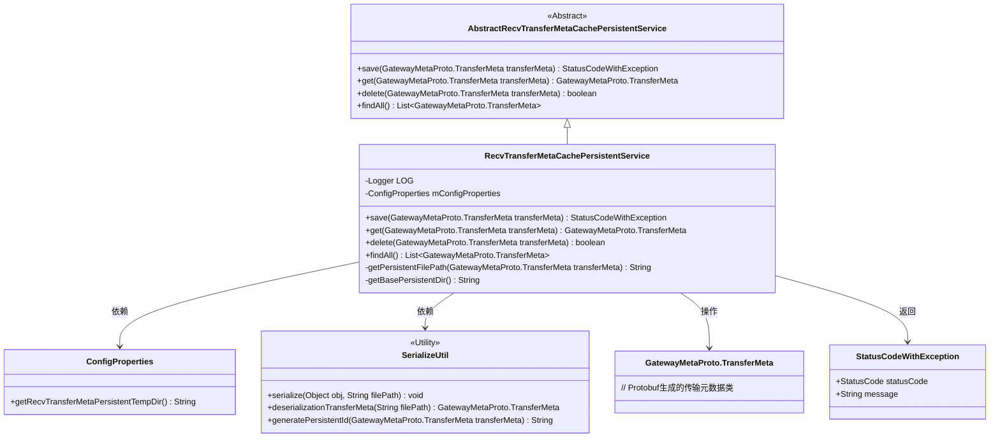
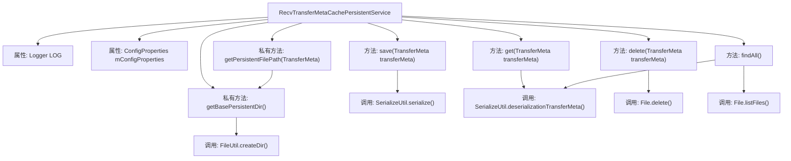

# 基础信息

|      |      |
|------|------|
| 名称 | RecvTransferMetaCachePersistentService |
| 编码语言 | .java |
| 代码路径 | WeFe/gateway/src/main/java/com/welab/wefe/gateway/service/RecvTransferMetaCachePersistentService.java |
| 包名 | com.welab.wefe.gateway.service |
| 依赖项 | ['com.welab.wefe.common.StatusCode', 'com.welab.wefe.common.exception.StatusCodeWithException', 'com.welab.wefe.common.util.FileUtil', 'com.welab.wefe.gateway.api.meta.basic.GatewayMetaProto', 'com.welab.wefe.gateway.config.ConfigProperties', 'com.welab.wefe.gateway.service.base.AbstractRecvTransferMetaCachePersistentService', 'com.welab.wefe.gateway.util.SerializeUtil', 'org.slf4j.Logger', 'org.slf4j.LoggerFactory', 'org.springframework.beans.factory.annotation.Autowired', 'org.springframework.boot.autoconfigure.condition.ConditionalOnExpression', 'org.springframework.stereotype.Service', 'java.io.File', 'java.util.ArrayList', 'java.util.List'] |
| 概述说明 | 接收传输元数据缓存持久化服务，基于本地文件系统存储，提供保存、查询、删除和查找全部元数据功能，处理序列化和反序列化操作，确保目录权限和路径正确。 |

# 说明

该代码定义了一个基于本地文件系统的接收传输元数据缓存持久化服务类RecvTransferMetaCachePersistentService。它继承自抽象类AbstractRecvTransferMetaCachePersistentService，并通过@ConditionalOnExpression条件注解确保仅在配置属性recv.transfer.meta.persistent.type匹配LOCAL_FILE_SYS类型时生效。主要功能包括：将传输元数据序列化保存到本地文件、从文件反序列化获取元数据、删除指定元数据文件以及查找所有持久化的元数据。服务使用配置属性mConfigProperties获取存储目录路径，并通过SerializeUtil工具类处理序列化操作，同时包含完善的错误处理和日志记录机制。

# 类列表 Class Summary

| 名称   | 类型  | 说明 |
|-------|------|-------------|
| RecvTransferMetaCachePersistentService | class | 接收传输元数据缓存持久化服务类，基于本地文件系统存储，提供保存、查询、删除和查找全部元数据功能，处理序列化与反序列化操作，确保目录权限正常。 |

## 类 RecvTransferMetaCachePersistentService

|      |      |
|------|------|
| 访问范围 | @ConditionalOnExpression("#{T(com.welab.wefe.gateway.common.TransferMetaCachePersistentTypeEnum).LOCAL_FILE_SYS.getType().equals(environment.getProperty('recv.transfer.meta.persistent.type', T(com.welab.wefe.gateway.common.TransferMetaCachePersistentTypeEnum).LOCAL_FILE_SYS.getType()))}");@Service;public |
| 类型 | class |
| 名称 | RecvTransferMetaCachePersistentService |
| 说明 | 接收传输元数据缓存持久化服务类，基于本地文件系统存储，提供保存、查询、删除和查找全部元数据功能，处理序列化与反序列化操作，确保目录权限正常。 |

### UML类图

该类图展示了接收传输元数据缓存持久化服务的继承关系和依赖结构。RecvTransferMetaCachePersistentService继承自抽象基类，通过SerializeUtil工具类实现元数据的序列化操作，依赖ConfigProperties获取配置路径，并操作GatewayMetaProto.TransferMeta传输对象。服务提供完整的CRUD功能，包含异常处理和日志记录能力，采用文件系统作为持久化存储介质。

### 内部方法调用关系图

该流程图展示了RecvTransferMetaCachePersistentService类的核心结构和调用关系。这个服务类主要负责传输元数据的本地文件系统持久化操作，包含四个主要公共方法：save()用于序列化保存数据，get()用于反序列化读取数据，delete()用于删除文件，findAll()用于批量查询数据。私有方法getPersistentFilePath()和getBasePersistentDir()处理文件路径相关逻辑。类通过ConfigProperties获取配置，使用SerializeUtil进行序列化操作，依赖File和FileUtil进行文件系统操作，并通过Logger记录错误日志。整个流程体现了从数据存储到检索的完整生命周期管理。

### 字段列表 Field List

| 名称  | 类型  | 说明 |
|-------|-------|------|
| LOG = LoggerFactory.getLogger(RecvTransferMetaCachePersistentService.class) | Logger | 类RecvTransferMetaCachePersistentService中定义了一个私有不可变的日志记录器LOG。 |
| mConfigProperties | ConfigProperties | 使用@Autowired自动注入ConfigProperties配置属性对象。 |

### 方法列表

| 名称  | 类型  | 说明 |
|-------|-------|------|
| save | StatusCodeWithException | 方法save尝试序列化transferMeta对象到指定路径，成功返回SUCCESS状态，失败记录错误并返回SYSTEM_ERROR及提示信息。 |
| get | GatewayMetaProto.TransferMeta | 方法get接收TransferMeta对象，尝试从持久化文件反序列化数据，失败时记录错误并返回原对象。 |
| delete | boolean | 该方法删除指定传输元数据对应的持久化文件，返回删除操作是否成功。 |
| findAll | List<GatewayMetaProto.TransferMeta> | 该方法从文件系统读取并反序列化所有传输元数据文件，忽略目录，异常时记录错误日志，最后返回元数据列表。 |
| getPersistentFilePath | String | 获取持久化文件路径方法：基于基础目录和传输元数据生成的ID拼接完整路径。 |
| getBasePersistentDir | String | 获取持久化目录路径，确保以分隔符结尾并创建目录。 |

