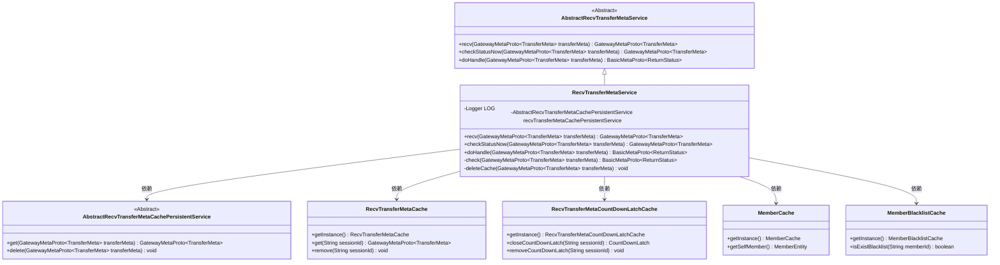
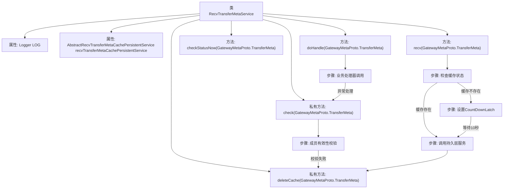

# 基础信息

|      |      |
|------|------|
| 名称 | RecvTransferMetaService |
| 编码语言 | .java |
| 代码路径 | WeFe/gateway/src/main/java/com/welab/wefe/gateway/service/RecvTransferMetaService.java |
| 包名 | com.welab.wefe.gateway.service |
| 依赖项 | ['com.welab.wefe.gateway.api.meta.basic.BasicMetaProto', 'com.welab.wefe.gateway.api.meta.basic.GatewayMetaProto', 'com.welab.wefe.gateway.cache.MemberBlacklistCache', 'com.welab.wefe.gateway.cache.MemberCache', 'com.welab.wefe.gateway.cache.RecvTransferMetaCache', 'com.welab.wefe.gateway.cache.RecvTransferMetaCountDownLatchCache', 'com.welab.wefe.gateway.common.ReturnStatusBuilder', 'com.welab.wefe.gateway.entity.MemberEntity', 'com.welab.wefe.gateway.service.base.AbstractRecvTransferMetaCachePersistentService', 'com.welab.wefe.gateway.service.base.AbstractRecvTransferMetaService', 'com.welab.wefe.gateway.service.processors.ProcessorContext', 'com.welab.wefe.gateway.util.ReturnStatusUtil', 'org.slf4j.Logger', 'org.slf4j.LoggerFactory', 'org.springframework.beans.factory.annotation.Autowired', 'org.springframework.stereotype.Service', 'java.util.concurrent.CountDownLatch', 'java.util.concurrent.TimeUnit'] |
| 概述说明 | RecvTransferMetaService处理接收传输元数据，检查状态并执行业务逻辑。包含缓存管理、状态检查和黑名单验证功能。 |

# 说明

RecvTransferMetaService是一个处理传输元数据的服务类，继承自AbstractRecvTransferMetaService。它通过缓存和持久化服务管理传输状态，主要功能包括接收传输元数据、检查状态和执行业务处理。接收数据时，会检查缓存状态，若已完成或出错则从持久层获取数据并清理缓存；否则设置阻塞锁等待处理。检查状态方法直接返回缓存数据或标记为处理中。业务处理通过ProcessorContext执行，并验证消息有效性，包括检查接收方成员ID和黑名单状态。最后提供删除缓存功能，清理相关缓存和持久化数据。整个过程通过日志记录关键操作和异常。

# 类列表 Class Summary

| 名称   | 类型  | 说明 |
|-------|------|-------------|
| RecvTransferMetaService | class | RecvTransferMetaService处理接收的传输元数据，检查状态、验证消息有效性并执行业务处理。使用缓存和持久层管理数据，支持阻塞等待和黑名单检查。 |

## 类 RecvTransferMetaService

|      |      |
|------|------|
| 访问范围 | @Service;public |
| 类型 | class |
| 名称 | RecvTransferMetaService |
| 说明 | RecvTransferMetaService处理接收的传输元数据，检查状态、验证消息有效性并执行业务处理。使用缓存和持久层管理数据，支持阻塞等待和黑名单检查。 |

### UML类图

该图展示了RecvTransferMetaService的类结构及其依赖关系。RecvTransferMetaService继承自AbstractRecvTransferMetaService，实现了接收、检查和处理传输元数据的功能。它依赖于多个缓存服务（如RecvTransferMetaCache、RecvTransferMetaCountDownLatchCache）和持久化服务（AbstractRecvTransferMetaCachePersistentService）来管理数据。同时，它还使用MemberCache和MemberBlacklistCache来验证成员身份和黑名单状态。整体设计体现了分层和模块化的思想，各组件职责明确。

### 内部方法调用关系图

该流程图展示了RecvTransferMetaService的核心处理逻辑，包含接收元数据时的缓存检查、阻塞等待机制、持久层交互和业务处理流程。类通过CountDownLatch实现同步控制，采用三级缓存架构（内存缓存、持久层、业务处理器），并包含严格的成员身份校验和黑名单机制。异常处理贯穿整个流程，关键操作均通过日志记录，体现了高可靠性的消息接收服务设计。

### 字段列表 Field List

| 名称  | 类型  | 说明 |
|-------|-------|------|
| LOG = LoggerFactory.getLogger(RecvTransferMetaService.class) | Logger | 类RecvTransferMetaService中定义了一个私有不可变的日志记录器LOG，用于记录日志信息。 |
| recvTransferMetaCachePersistentService | AbstractRecvTransferMetaCachePersistentService | 使用@Autowired自动注入AbstractRecvTransferMetaCachePersistentService实例。 |

### 方法列表

| 名称  | 类型  | 说明 |
|-------|-------|------|
| doHandle | BasicMetaProto.ReturnStatus | 处理传输元数据：先检查有效性，无效则返回状态；有效则执行业务处理，异常时记录错误并返回系统异常状态。 |
| recv | GatewayMetaProto.TransferMeta | 方法接收传输元数据，检查缓存状态。若完成或错误则从持久层获取数据并清理缓存。否则设置阻塞锁等待10秒，再次检查状态，返回处理结果。 |
| checkStatusNow | GatewayMetaProto.TransferMeta | 方法检查传输状态，若缓存无数据则设为处理中并返回。 |
| check | BasicMetaProto.ReturnStatus | 方法检查传输元数据：验证接收方ID是否匹配自身，否则拒收并提示地址错误；检查发送方是否在黑名单，是则拒收；均通过则返回成功。 |
| deleteCache | void | 该方法删除缓存：获取会话ID，清除倒计时锁和接收元数据缓存，最后删除持久化数据。 |

