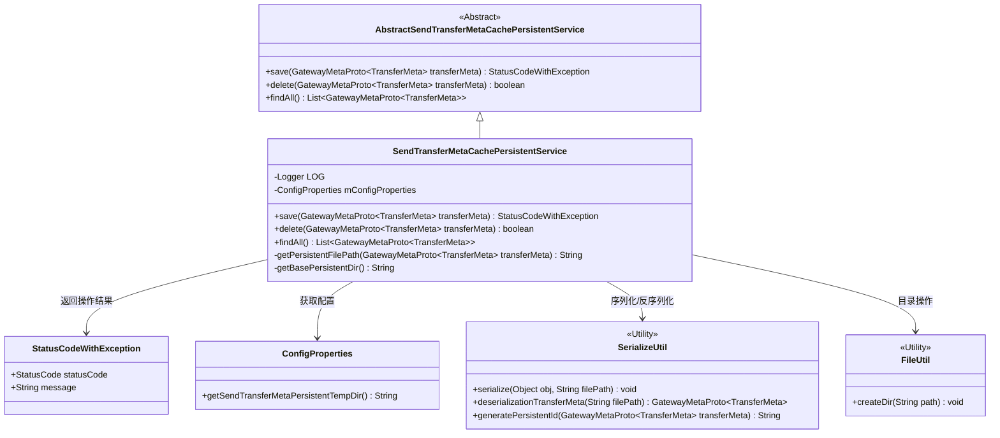
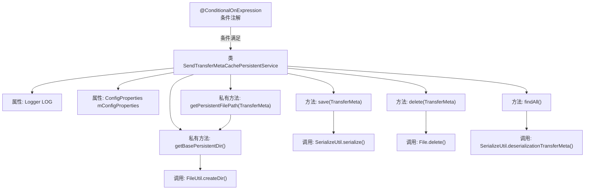

# 基础信息

|      |      |
|------|------|
| 名称 | SendTransferMetaCachePersistentService |
| 编码语言 | .java |
| 代码路径 | WeFe/gateway/src/main/java/com/welab/wefe/gateway/service/SendTransferMetaCachePersistentService.java |
| 包名 | com.welab.wefe.gateway.service |
| 依赖项 | ['com.welab.wefe.common.StatusCode', 'com.welab.wefe.common.exception.StatusCodeWithException', 'com.welab.wefe.common.util.FileUtil', 'com.welab.wefe.gateway.api.meta.basic.GatewayMetaProto', 'com.welab.wefe.gateway.config.ConfigProperties', 'com.welab.wefe.gateway.service.base.AbstractSendTransferMetaCachePersistentService', 'com.welab.wefe.gateway.util.SerializeUtil', 'org.slf4j.Logger', 'org.slf4j.LoggerFactory', 'org.springframework.beans.factory.annotation.Autowired', 'org.springframework.boot.autoconfigure.condition.ConditionalOnExpression', 'org.springframework.stereotype.Service', 'java.io.File', 'java.util.ArrayList', 'java.util.List'] |
| 概述说明 | SendTransferMetaCachePersistentService类基于条件注解实现本地文件系统持久化，提供保存、删除和查询传输元数据功能，处理异常并记录日志。 |

# 说明

该内容描述了一个基于条件注解的Spring服务类SendTransferMetaCachePersistentService，用于处理传输元数据的本地文件系统持久化操作。该类继承自抽象服务类，包含保存、删除和查询传输元数据的方法实现。保存时使用序列化工具将数据写入指定路径文件，删除时直接移除对应文件，查询时遍历目录反序列化所有文件数据。配置路径通过ConfigProperties获取，并自动处理目录分隔符和创建目录。操作过程中会记录日志并返回状态码，异常时返回系统错误信息。

# 类列表 Class Summary

| 名称   | 类型  | 说明 |
|-------|------|-------------|
| SendTransferMetaCachePersistentService | class | SendTransferMetaCachePersistentService类，基于条件加载，实现本地文件系统存储TransferMeta数据，提供保存、删除和查询功能，处理序列化和异常。 |

## 类 SendTransferMetaCachePersistentService

|      |      |
|------|------|
| 访问范围 | @ConditionalOnExpression("#{T(com.welab.wefe.gateway.common.TransferMetaCachePersistentTypeEnum).LOCAL_FILE_SYS.getType().equals(environment.getProperty('send.transfer.meta.persistent.type', T(com.welab.wefe.gateway.common.TransferMetaCachePersistentTypeEnum).LOCAL_FILE_SYS.getType()))}");@Service;public |
| 类型 | class |
| 名称 | SendTransferMetaCachePersistentService |
| 说明 | SendTransferMetaCachePersistentService类，基于条件加载，实现本地文件系统存储TransferMeta数据，提供保存、删除和查询功能，处理序列化和异常。 |

### UML类图

这段代码实现了一个基于本地文件系统的传输元数据持久化服务，继承自抽象父类并实现了三个核心方法：保存元数据到文件、删除文件中的元数据以及从文件系统加载所有元数据。服务通过配置获取存储路径，使用序列化工具处理对象存储，依赖文件工具类确保目录存在。整个过程包含异常处理和日志记录，返回包含状态码的结果对象。

### 内部方法调用关系图

该流程图展示了SendTransferMetaCachePersistentService类的核心结构和调用关系。这个服务类在满足特定条件表达式时才会被加载，主要功能是实现传输元数据的本地文件系统持久化操作。包含保存(save)、删除(delete)和查询所有(findAll)三个核心方法，其中save方法调用序列化工具保存数据，delete方法直接操作文件删除，findAll方法遍历目录并反序列化文件内容。两个私有方法分别处理文件路径生成和基础目录创建，体现了清晰的职责划分和工具类复用。

### 字段列表 Field List

| 名称  | 类型  | 说明 |
|-------|-------|------|
| mConfigProperties | ConfigProperties | 使用@Autowired自动注入ConfigProperties配置属性类实例。 |
| LOG = LoggerFactory.getLogger(SendTransferMetaCachePersistentService.class) | Logger | 类SendTransferMetaCachePersistentService中定义的私有静态日志对象LOG。 |

### 方法列表

| 名称  | 类型  | 说明 |
|-------|-------|------|
| save | StatusCodeWithException | 方法save用于序列化并保存传输元数据到文件系统。成功返回SUCCESS状态，失败记录错误并返回SYSTEM_ERROR状态及提示信息。 |
| findAll | List<GatewayMetaProto.TransferMeta> | 该方法遍历指定目录下的文件，反序列化为TransferMeta对象列表，异常时记录日志并返回空列表。 |
| delete | boolean | 该方法删除指定传输元数据对应的持久化文件，返回删除结果。 |
| getPersistentFilePath | String | 该方法根据传输元数据生成持久化文件路径，结合基础目录和序列化生成的ID。 |
| getBasePersistentDir | String | 获取基础持久化目录路径，确保以分隔符结尾并创建目录。 |

