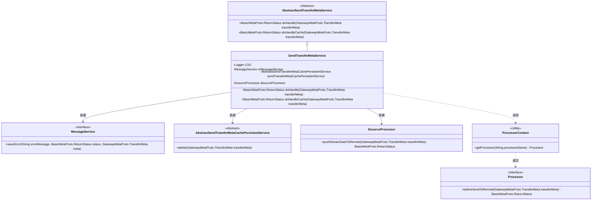
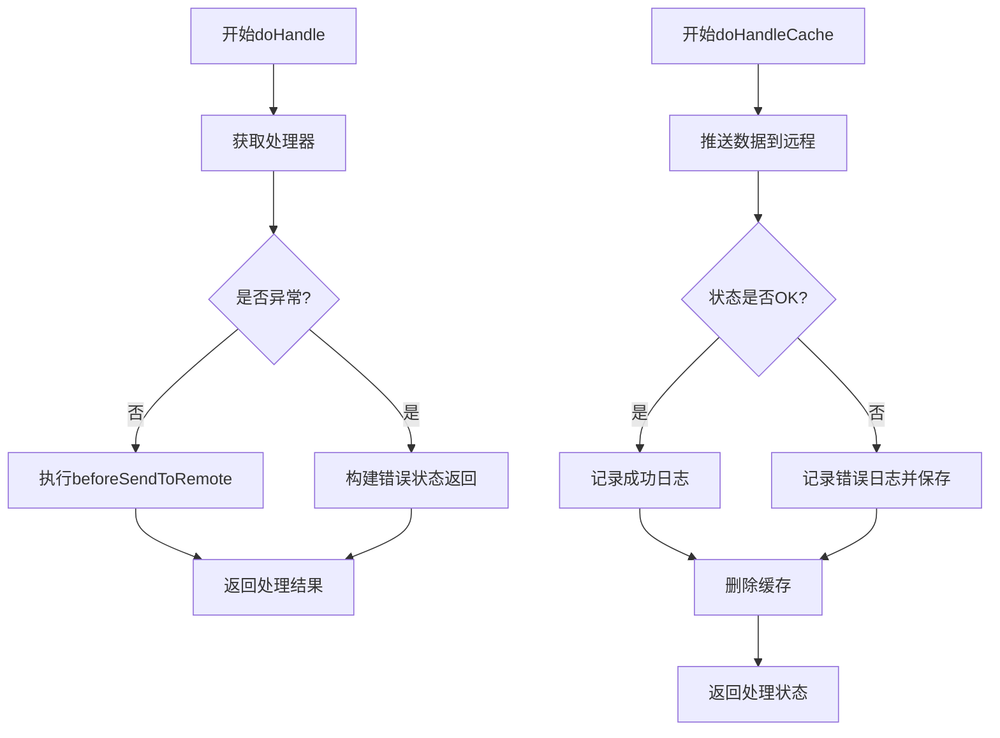
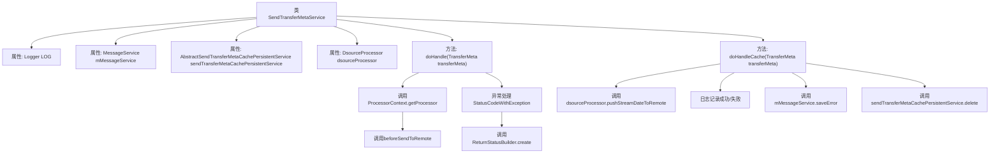

# 基础信息

|      |      |
|------|------|
| 名称 | SendTransferMetaService |
| 编码语言 | .java |
| 代码路径 | WeFe/gateway/src/main/java/com/welab/wefe/gateway/service/SendTransferMetaService.java |
| 包名 | com.welab.wefe.gateway.service |
| 依赖项 | ['com.welab.wefe.common.exception.StatusCodeWithException', 'com.welab.wefe.gateway.api.meta.basic.BasicMetaProto', 'com.welab.wefe.gateway.api.meta.basic.GatewayMetaProto', 'com.welab.wefe.gateway.common.ReturnStatusBuilder', 'com.welab.wefe.gateway.service.base.AbstractSendTransferMetaCachePersistentService', 'com.welab.wefe.gateway.service.base.AbstractSendTransferMetaService', 'com.welab.wefe.gateway.service.processors.DsourceProcessor', 'com.welab.wefe.gateway.service.processors.ProcessorContext', 'com.welab.wefe.gateway.util.ReturnStatusUtil', 'com.welab.wefe.gateway.util.TransferMetaUtil', 'org.slf4j.Logger', 'org.slf4j.LoggerFactory', 'org.springframework.beans.factory.annotation.Autowired', 'org.springframework.stereotype.Service'] |
| 概述说明 | SendTransferMetaService处理消息传输，包含远程发送和缓存处理逻辑，记录日志并调用相关服务。 |

# 说明

SendTransferMetaService是一个继承自AbstractSendTransferMetaService的服务类，用于处理传输元数据的发送和缓存操作。该类通过依赖注入获取MessageService、AbstractSendTransferMetaCachePersistentService和DsourceProcessor实例。主要包含两个方法：doHandle方法根据传输元数据中的处理器类型调用相应的前置处理逻辑，并处理可能出现的异常；doHandleCache方法通过dsourceProcessor将流数据推送到远程，记录成功或失败的日志信息，并在操作完成后删除缓存中的传输元数据。整个过程涉及状态返回、异常处理和日志记录等功能。

# 类列表 Class Summary

| 名称   | 类型  | 说明 |
|-------|------|-------------|
| SendTransferMetaService | class | SendTransferMetaService处理消息传输，包含远程发送和缓存处理逻辑，记录日志并调用相关服务。 |

## 类 SendTransferMetaService

|      |      |
|------|------|
| 访问范围 | @Service;public |
| 类型 | class |
| 名称 | SendTransferMetaService |
| 说明 | SendTransferMetaService处理消息传输，包含远程发送和缓存处理逻辑，记录日志并调用相关服务。 |

### UML类图

该代码实现了一个消息传输服务，包含核心处理逻辑和缓存处理逻辑。类图展示了SendTransferMetaService继承自抽象父类，并依赖多个服务组件（消息服务、缓存持久化服务、数据源处理器）。流程图清晰呈现了两个主要方法的执行路径：doHandle通过处理器链执行预处理，doHandleCache处理数据推送和状态跟踪。系统通过分层设计实现了处理逻辑与基础设施的分离。

### 内部方法调用关系图

这段代码流程图展示了SendTransferMetaService类的核心处理逻辑。该类继承自AbstractSendTransferMetaService，主要包含两个关键方法：doHandle处理传输元数据的主流程，通过ProcessorContext获取处理器并执行远程发送前操作；doHandleCache处理缓存逻辑，先调用dsourceProcessor推送数据，根据返回状态记录日志，失败时保存错误信息，最后删除缓存。流程清晰展现了正常流程和异常处理路径，以及各依赖组件的交互关系。

### 字段列表 Field List

| 名称  | 类型  | 说明 |
|-------|-------|------|
| LOG = LoggerFactory.getLogger(SendTransferMetaService.class) | Logger | 类SendTransferMetaService中定义了一个私有静态日志对象LOG，用于记录日志信息。 |
| mMessageService | MessageService | 使用@Autowired自动注入MessageService实例。 |
| dsourceProcessor | DsourceProcessor | 使用@Autowired自动注入DsourceProcessor实例。 |
| sendTransferMetaCachePersistentService | AbstractSendTransferMetaCachePersistentService | 使用@Autowired自动注入AbstractSendTransferMetaCachePersistentService实例。 |

### 方法列表

| 名称  | 类型  | 说明 |
|-------|-------|------|
| doHandle | BasicMetaProto.ReturnStatus | 方法处理传输元数据，调用对应处理器前置逻辑，异常时返回状态码和会话ID。 |
| doHandleCache | BasicMetaProto.ReturnStatus | 该方法处理缓存推送，调用远程推送数据并记录日志，成功或失败均删除缓存，返回推送状态。失败时保存错误信息。 |

