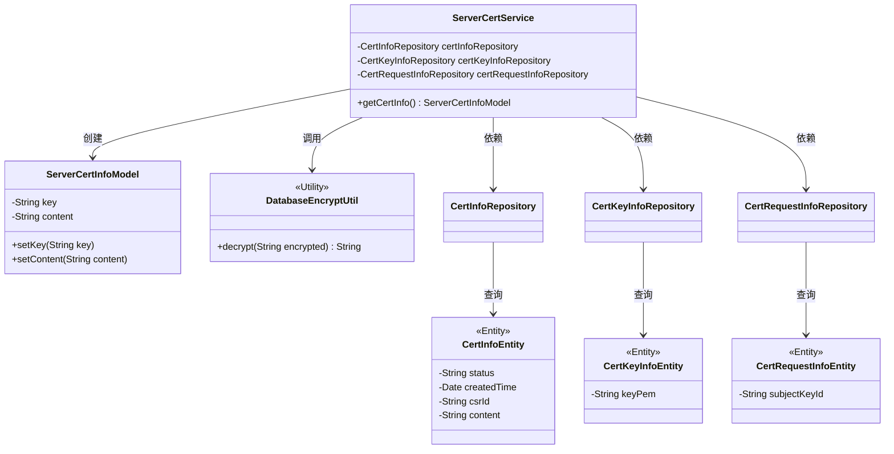
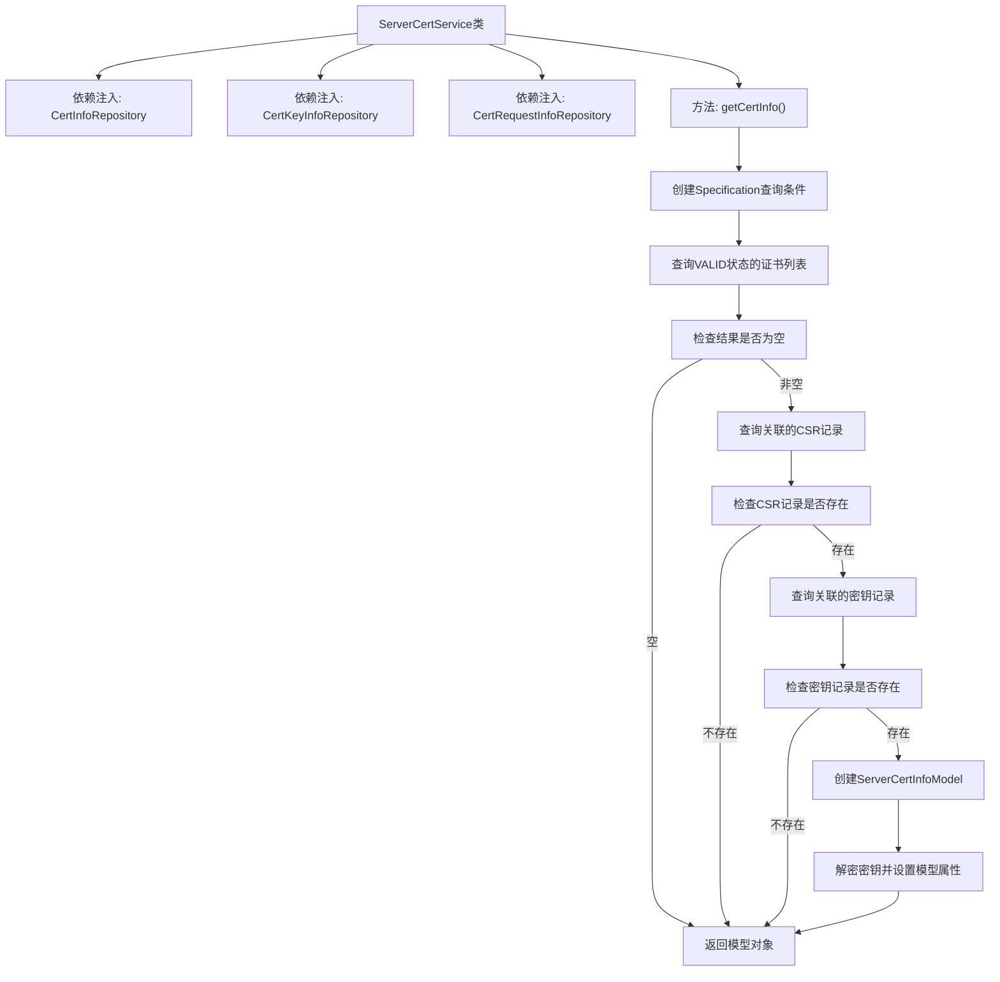

# 基础信息

|      |      |
|------|------|
| 名称 | ServerCertService |
| 编码语言 | .java |
| 代码路径 | WeFe/gateway/src/main/java/com/welab/wefe/gateway/service/ServerCertService.java |
| 包名 | com.welab.wefe.gateway.service |
| 依赖项 | ['java.util.List', 'org.apache.commons.collections4.CollectionUtils', 'org.springframework.beans.factory.annotation.Autowired', 'org.springframework.data.jpa.domain.Specification', 'org.springframework.stereotype.Service', 'com.welab.wefe.common.data.mysql.Where', 'com.welab.wefe.common.data.mysql.enums.OrderBy', 'com.welab.wefe.common.exception.StatusCodeWithException', 'com.welab.wefe.common.wefe.dto.global_config.ServerCertInfoModel', 'com.welab.wefe.gateway.entity.CertInfoEntity', 'com.welab.wefe.gateway.entity.CertKeyInfoEntity', 'com.welab.wefe.gateway.entity.CertRequestInfoEntity', 'com.welab.wefe.gateway.repository.CertInfoRepository', 'com.welab.wefe.gateway.repository.CertKeyInfoRepository', 'com.welab.wefe.gateway.repository.CertRequestInfoRepository', 'com.welab.wefe.gateway.util.DatabaseEncryptUtil'] |
| 概述说明 | ServerCertService类通过查询VALID状态的证书信息，关联获取密钥和请求数据，解密后返回ServerCertInfoModel对象。 |

# 说明

ServerCertService是一个服务类，用于获取服务器证书信息。它依赖三个仓库类：CertInfoRepository、CertKeyInfoRepository和CertRequestInfoRepository。getCertInfo方法首先查询状态为VALID的证书实体列表，按创建时间降序排序。若列表为空则返回null。接着通过证书实体的csrId查询证书请求实体，再通过请求实体的subjectKeyId查询密钥实体。若任一实体不存在则返回null。最后构建ServerCertInfoModel对象，解密密钥内容并设置证书内容后返回。

# 类列表 Class Summary

| 名称   | 类型  | 说明 |
|-------|------|-------------|
| ServerCertService | class | ServerCertService类通过查询VALID状态的证书信息，关联请求和密钥数据，返回解密后的密钥和证书内容。 |

## 类 ServerCertService

|      |      |
|------|------|
| 访问范围 | @Service;public |
| 类型 | class |
| 名称 | ServerCertService |
| 说明 | ServerCertService类通过查询VALID状态的证书信息，关联请求和密钥数据，返回解密后的密钥和证书内容。 |

### UML类图

这段类图展示了ServerCertService与多个实体类及工具类的关系。ServerCertService通过三个Repository(CertInfoRepository、CertKeyInfoRepository、CertRequestInfoRepository)分别操作CertInfoEntity、CertKeyInfoEntity和CertRequestInfoEntity实体，最终构建ServerCertInfoModel对象。其中使用了DatabaseEncryptUtil工具类进行密钥解密，整体流程体现了从数据库查询证书信息到组装返回模型的完整过程。

### 内部方法调用关系图

这段代码流程图展示了ServerCertService类中获取证书信息的完整流程。该服务通过三个Repository组件操作数据库，首先查询有效状态的证书列表，然后依次关联查询CSR请求记录和密钥记录，最后构建并返回包含解密后密钥和证书内容的模型对象。流程中包含三个关键的空值检查节点，确保在任一环节数据缺失时都能安全返回null。整个流程体现了从数据获取到业务模型转换的完整处理链条。

### 字段列表 Field List

| 名称  | 类型  | 说明 |
|-------|-------|------|
| certKeyInfoRepository | CertKeyInfoRepository | 自动注入CertKeyInfoRepository实例。 |
| certInfoRepository | CertInfoRepository | 自动注入CertInfoRepository实例。 |
| certRequestInfoRepository | CertRequestInfoRepository | 使用@Autowired自动注入CertRequestInfoRepository实例。 |

### 方法列表

| 名称  | 类型  | 说明 |
|-------|-------|------|
| getCertInfo | ServerCertInfoModel | 获取有效证书信息，包括密钥和内容，若不存在则返回空。 |

