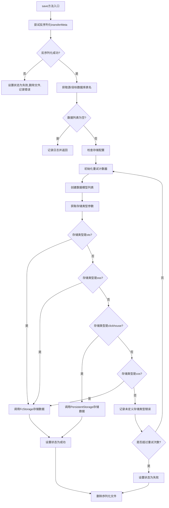
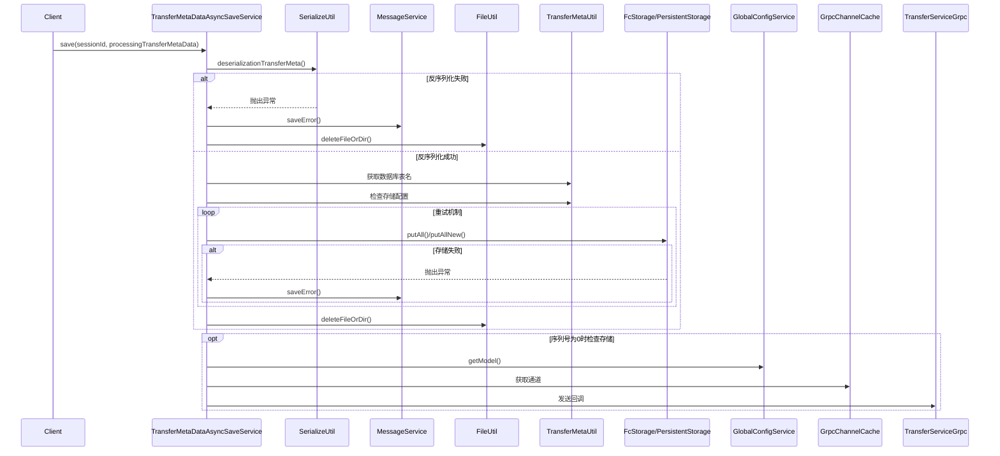

# 基础信息

|      |      |
|------|------|
| 名称 | TransferMetaDataAsyncSaveService |
| 编码语言 | .java |
| 代码路径 | WeFe/gateway/src/main/java/com/welab/wefe/gateway/service/TransferMetaDataAsyncSaveService.java |
| 包名 | com.welab.wefe.gateway.service |
| 依赖项 | ['com.welab.wefe.common.data.storage.model.DataItemModel', 'com.welab.wefe.common.data.storage.service.fc.FcStorage', 'com.welab.wefe.common.data.storage.service.persistent.PersistentStorage', 'com.welab.wefe.common.util.FileUtil', 'com.welab.wefe.common.util.StringUtil', 'com.welab.wefe.common.util.ThreadUtil', 'com.welab.wefe.common.wefe.dto.global_config.GatewayConfigModel', 'com.welab.wefe.common.wefe.enums.GatewayProcessorType', 'com.welab.wefe.gateway.api.meta.basic.BasicMetaProto', 'com.welab.wefe.gateway.api.meta.basic.GatewayMetaProto', 'com.welab.wefe.gateway.api.service.proto.TransferServiceGrpc', 'com.welab.wefe.gateway.cache.GrpcChannelCache', 'com.welab.wefe.gateway.cache.MemberCache', 'com.welab.wefe.gateway.init.InitStorageManager', 'com.welab.wefe.gateway.util.GrpcUtil', 'com.welab.wefe.gateway.util.SerializeUtil', 'com.welab.wefe.gateway.util.TransferMetaUtil', 'io.grpc.ManagedChannel', 'org.apache.commons.collections4.CollectionUtils', 'org.apache.commons.lang3.math.NumberUtils', 'org.slf4j.Logger', 'org.slf4j.LoggerFactory', 'org.springframework.beans.factory.annotation.Autowired', 'org.springframework.scheduling.annotation.Async', 'org.springframework.stereotype.Service', 'java.util', 'java.util.concurrent.TimeUnit'] |
| 概述说明 | 异步保存传输元数据服务，支持反序列化数据并检查存储配置，根据类型（OTS/OSS/COS/ClickHouse）存储数据，失败重试3次，处理成功或失败状态。 |

# 说明

TransferMetaDataAsyncSaveService是一个异步保存传输元数据的服务类，通过@Async注解使用特定线程池执行任务。主要功能包括：反序列化传输元数据，提取源和目标数据库表名，检查存储配置（如FC和ClickHouse），并根据存储类型（如ots、oss、clickhouse、cos）将数据保存到相应存储系统。支持失败重试机制（最多3次），失败时记录错误信息并更新状态。同时包含检查存储配置的方法，若配置异常会通知发送方。整个过程涉及日志记录、错误处理和文件清理。

# 类列表 Class Summary

| 名称   | 类型  | 说明 |
|-------|------|-------------|
| TransferMetaDataAsyncSaveService | class | 异步保存传输元数据服务，支持反序列化数据并检查存储配置，根据类型（OTS/OSS/COS/ClickHouse）保存数据，失败重试3次，处理成功或失败后删除序列化文件。 |

## 类 TransferMetaDataAsyncSaveService

|      |      |
|------|------|
| 访问范围 | @Service;public |
| 类型 | class |
| 名称 | TransferMetaDataAsyncSaveService |
| 说明 | 异步保存传输元数据服务，支持反序列化数据并检查存储配置，根据类型（OTS/OSS/COS/ClickHouse）保存数据，失败重试3次，处理成功或失败后删除序列化文件。 |

### UML类图

```mermaid
classDiagram
    class TransferMetaDataAsyncSaveService {
        -Logger LOG
        -MessageService messageService
        -GlobalConfigService globalConfigService
        +save(String sessionId, TransferMetaDataSink~ProcessingTransferMetaData~ processingTransferMetaData) void
        -checkStorageAndCallback(GatewayMetaProto~TransferMeta~ transferMeta) void
    }

    class MessageService {
        <<Interface>>
        +saveError(String title, String message) void
        +saveError(String title, String message, GatewayMetaProto~TransferMeta~ transferMeta) void
    }

    class GlobalConfigService {
        <<Interface>>
        +getModel(Class~T~ clazz) T
    }

    class TransferMetaDataSink {
        <<Interface>>
    }

    class GatewayMetaProto {
        <<Interface>>
    }

    class BasicMetaProto {
        <<Interface>>
    }

    class DataItemModel~K,V~ {
        +K k
        +V v
        +setK(K k) void
        +setV(V v) void
    }

    class FcStorage {
        +getInstance() FcStorage
        +putAll(List~DataItemModel~byte[],byte[]~~ dataList, Map~String,Object~ args) void
    }

    class PersistentStorage {
        +getInstance() PersistentStorage
        +putAllNew(String dbName, String tableName, List~DataItemModel~byte[],byte[]~~ dataList) void
    }

    class InitStorageManager {
        <<Interface>>
    }

    class MemberCache {
        +getInstance() MemberCache
        +get(String memberId) Object
    }

    class GrpcChannelCache {
        +getInstance() GrpcChannelCache
        +getNonNull(String uri, boolean secure, Object params) ManagedChannel
    }

    class TransferServiceGrpc {
        <<Interface>>
        +newBlockingStub(ManagedChannel channel) TransferServiceBlockingStub
    }

    TransferMetaDataAsyncSaveService --> MessageService : 依赖
    TransferMetaDataAsyncSaveService --> GlobalConfigService : 依赖
    TransferMetaDataAsyncSaveService --> TransferMetaDataSink : 处理数据
    TransferMetaDataAsyncSaveService --> GatewayMetaProto : 解析元数据
    TransferMetaDataAsyncSaveService --> BasicMetaProto : 处理键值数据
    TransferMetaDataAsyncSaveService --> DataItemModel : 创建数据项
    TransferMetaDataAsyncSaveService --> FcStorage : 存储数据(FC)
    TransferMetaDataAsyncSaveService --> PersistentStorage : 存储数据(CK)
    TransferMetaDataAsyncSaveService --> InitStorageManager : 检查存储状态
    TransferMetaDataAsyncSaveService --> MemberCache : 获取成员信息
    TransferMetaDataAsyncSaveService --> GrpcChannelCache : 获取gRPC通道
    TransferMetaDataAsyncSaveService --> TransferServiceGrpc : 发送回调
```

这段类图展示了TransferMetaDataAsyncSaveService的核心结构和依赖关系。该服务主要负责异步保存传输的元数据，支持多种存储类型（OTS/OSS/CK/COS），包含数据反序列化、存储状态检查、错误重试机制和回调通知功能。通过MessageService记录错误日志，依赖GlobalConfigService获取配置，使用FcStorage和PersistentStorage进行数据存储，并通过gRPC通道实现跨节点通信。整个设计体现了高可靠性的数据传输处理能力，通过三层重试机制和状态管理确保数据完整性。

### 内部方法调用关系图

这段代码是TransferMetaDataAsyncSaveService类的核心实现，主要功能是异步保存传输的元数据。流程图展示了完整的处理逻辑，包括反序列化、数据验证、多类型存储支持（OTS/OSS/ClickHouse/COS）和重试机制。时序图则详细描述了服务与各组件间的交互过程，特别是异常处理和存储配置检查的流程。代码通过@Async注解实现异步执行，支持多种存储后端，并具备完善的错误处理和重试机制。

### 字段列表 Field List

| 名称  | 类型  | 说明 |
|-------|-------|------|
| globalConfigService | GlobalConfigService | 自动注入全局配置服务实例。 |
| LOG = LoggerFactory.getLogger(TransferMetaDataAsyncSaveService.class) | Logger | 类TransferMetaDataAsyncSaveService中定义了一个私有不可变的日志记录器LOG，用于记录日志信息。 |
| messageService | MessageService | 自动注入MessageService实例。 |

### 方法列表

| 名称  | 类型  | 说明 |
|-------|-------|------|
| save | void | 异步方法save处理传输元数据，包括反序列化、检查配置、根据存储类型（OTS、OSS、ClickHouse、COS）上传数据，失败重试3次，最终更新状态并删除临时文件。 |
| checkStorageAndCallback | void | 检查存储状态并回调：若序列号非零则跳过；根据存储类型检查初始化状态，未完成则构造错误信息并通知发送方，通过gRPC发送回调。 |

