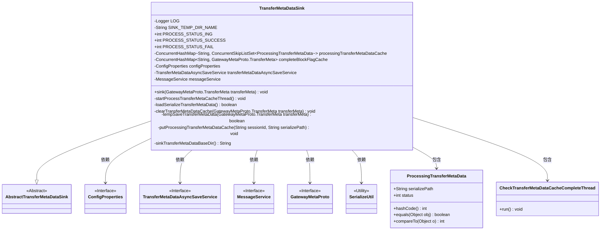
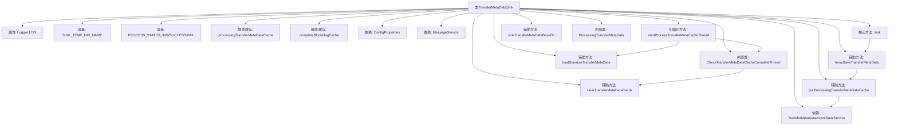

# 基础信息

|      |      |
|------|------|
| 名称 | TransferMetaDataSink |
| 编码语言 | .java |
| 代码路径 | WeFe/gateway/src/main/java/com/welab/wefe/gateway/service/TransferMetaDataSink.java |
| 包名 | com.welab.wefe.gateway.service |
| 依赖项 | ['com.welab.wefe.common.util.FileUtil', 'com.welab.wefe.common.util.StringUtil', 'com.welab.wefe.common.util.ThreadUtil', 'com.welab.wefe.gateway.api.meta.basic.GatewayMetaProto', 'com.welab.wefe.gateway.config.ConfigProperties', 'com.welab.wefe.gateway.service.base.AbstractTransferMetaDataSink', 'com.welab.wefe.gateway.util.SerializeUtil', 'org.apache.commons.collections4.CollectionUtils', 'org.slf4j.Logger', 'org.slf4j.LoggerFactory', 'org.springframework.beans.factory.annotation.Autowired', 'org.springframework.stereotype.Service', 'java.io.File', 'java.util.ArrayList', 'java.util.List', 'java.util.Map', 'java.util.concurrent.ConcurrentHashMap', 'java.util.concurrent.ConcurrentSkipListSet'] |
| 概述说明 | TransferMetaDataSink类处理元数据传输，包含缓存管理、状态检查线程、序列化数据加载和临时存储功能，支持处理中、成功和失败三种状态。 |

# 说明

TransferMetaDataSink是一个用于处理元数据传输的服务类，继承自AbstractTransferMetaDataSink。它包含三个处理状态常量：进行中、成功和失败。使用两个ConcurrentHashMap缓存处理中的元数据和已完成的块标识。通过Autowired注入配置属性、异步保存服务和消息服务。启动时加载序列化数据并启动检查缓存是否接收完成的线程。sink方法临时保存传输元数据。内部类CheckTransferMetaDataCacheCompleteThread定期检查缓存数据是否处理完成，更新状态并清理缓存。提供序列化元数据加载、临时保存、缓存管理和基础目录获取等功能。ProcessingTransferMetaData内部类定义了处理中元数据的结构和比较逻辑。

# 类列表 Class Summary

| 名称   | 类型  | 说明 |
|-------|------|-------------|
| TransferMetaDataSink | class | TransferMetaDataSink类用于处理元数据传输，包含缓存管理、状态检查和异步存储功能，支持处理中、成功和失败三种状态，通过线程检查完成情况并清理缓存。 |

## 类 TransferMetaDataSink

|      |      |
|------|------|
| 访问范围 | @Service;public |
| 类型 | class |
| 名称 | TransferMetaDataSink |
| 说明 | TransferMetaDataSink类用于处理元数据传输，包含缓存管理、状态检查和异步存储功能，支持处理中、成功和失败三种状态，通过线程检查完成情况并清理缓存。 |

### UML类图

这段代码描述了一个元数据传输接收器系统，主要包含TransferMetaDataSink类及其内部类ProcessingTransferMetaData和CheckTransferMetaDataCacheCompleteThread。该系统通过缓存管理、异步处理和序列化技术实现元数据的可靠传输，包含状态管理、临时存储、异常处理和自动恢复机制。类图展示了核心组件间的继承、依赖和包含关系，包括与配置服务、消息服务和序列化工具的交互。

### 内部方法调用关系图

该流程图展示了TransferMetaDataSink类的完整结构，包含核心数据流转路径：通过sink()方法接收元数据后，调用tempSaveTransferMetaData进行临时存储，并触发putProcessingTransferMetaDataCache更新缓存和异步存储。初始化时会加载序列化数据并启动检查线程CheckTransferMetaDataCacheCompleteThread，该线程持续监控缓存完成状态并清理已完成数据。类中维护两个核心ConcurrentHashMap缓存，通过ProcessingTransferMetaData内部类跟踪处理状态，整体实现了一个高可靠性的元数据接收和处理管道。

### 字段列表 Field List

| 名称  | 类型  | 说明 |
|-------|-------|------|
| completeBlockFlagCache = new ConcurrentHashMap<>() | ConcurrentHashMap<String, GatewayMetaProto.TransferMeta> | 定义一个私有静态的ConcurrentHashMap，键为String，值为GatewayMetaProto.TransferMeta，用于缓存完整区块标志。 |
| PROCESS_STATUS_ING = 0 | int | 定义静态常量PROCESS_STATUS_ING，值为0，表示处理中状态。 |
| configProperties | ConfigProperties | 自动注入配置属性对象。 |
| transferMetaDataAsyncSaveService | TransferMetaDataAsyncSaveService | 使用@Autowired自动注入TransferMetaDataAsyncSaveService服务实例。 |
| PROCESS_STATUS_FAIL = 2 | int | 常量PROCESS_STATUS_FAIL值为2，表示处理失败状态。 |
| SINK_TEMP_DIR_NAME = "sink" | String | 定义常量字符串SINK_TEMP_DIR_NAME，值为"sink"。 |
| PROCESS_STATUS_SUCCESS = 1 | int | 定义了一个公共静态常量，表示处理状态成功，值为1。 |
| processingTransferMetaDataCache = new ConcurrentHashMap<>() | ConcurrentHashMap<String, ConcurrentSkipListSet<ProcessingTransferMetaData>> | 私有静态并发哈希表，键为字符串，值为并发跳表集合，存储处理传输元数据。 |
| messageService | MessageService | 使用@Autowired自动注入MessageService实例。 |
| LOG = LoggerFactory.getLogger(TransferMetaDataSink.class) | Logger | 定义TransferMetaDataSink类的私有静态日志对象LOG。 |

### 方法列表

| 名称  | 类型  | 说明 |
|-------|-------|------|
| startProcessTransferMetaCacheThread | void | 使用@Autowired注入方法，加载序列化数据失败则系统退出，并启动检查元数据缓存接收状态的线程。 |
| clearTransferMetaDataCache | void | 清理传输元数据缓存：删除指定会话ID的完成标志和正在处理的数据缓存，并清除对应的持久化文件。 |
| loadSerializeTransferMetaData | boolean | 方法加载序列化传输元数据：检查目录文件，反序列化元数据并缓存处理中文件，最后处理完成标记文件。成功返回true，失败返回false。 |
| sink | void | 方法`sink`临时存储传输元数据`transferMeta`，可能抛出异常。 |
| tempSaveTransferMetaData | boolean | 方法tempSaveTransferMetaData保存传输元数据到指定目录，根据是否为结束块分别处理，成功返回true，失败记录错误并返回false。 |
| putProcessingTransferMetaDataCache | void | 私有同步方法，将处理中的传输元数据存入缓存并异步保存到数据库。根据sessionId获取或创建有序集合，添加元数据后更新缓存，最后调用异步服务保存数据。 |
| sinkTransferMetaDataBaseDir | String | 该方法获取接收元数据临时存储目录路径，确保路径以分隔符结尾并拼接指定目录名。 |

