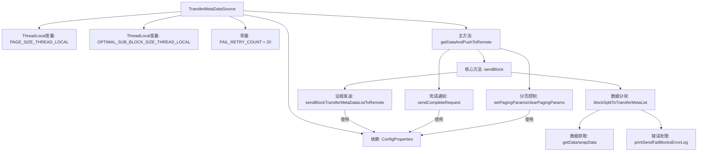
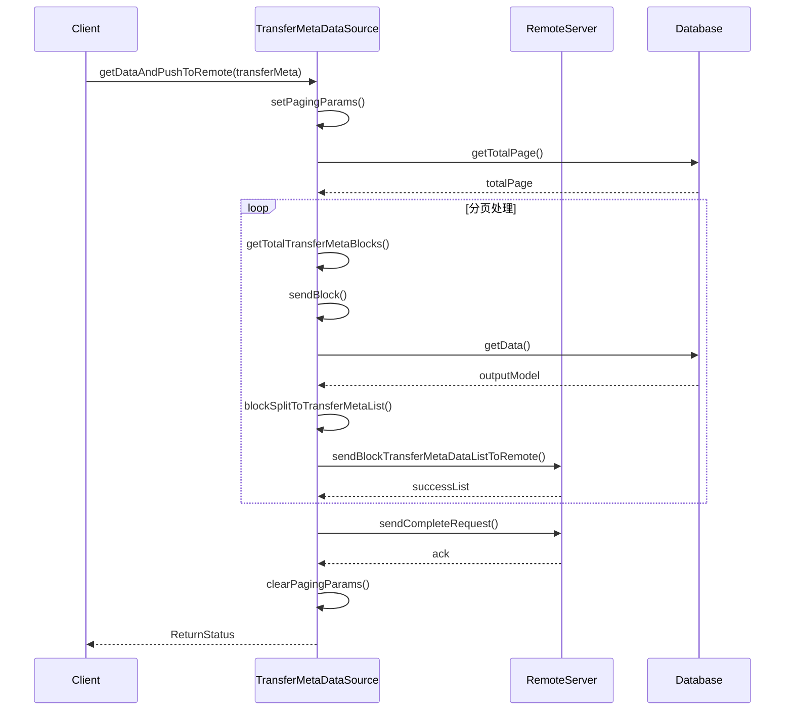

# 基础信息

|      |      |
|------|------|
| 名称 | TransferMetaDataSource |
| 编码语言 | .java |
| 代码路径 | WeFe/gateway/src/main/java/com/welab/wefe/gateway/service/TransferMetaDataSource.java |
| 包名 | com.welab.wefe.gateway.service |
| 依赖项 | ['com.google.common.util.concurrent.SettableFuture', 'com.welab.wefe.common.data.storage.model.DataItemModel', 'com.welab.wefe.common.data.storage.model.PageInputModel', 'com.welab.wefe.common.data.storage.model.PageOutputModel', 'com.welab.wefe.common.data.storage.service.persistent.PersistentStorage', 'com.welab.wefe.common.util.ThreadUtil', 'com.welab.wefe.gateway.api.meta.basic.BasicMetaProto', 'com.welab.wefe.gateway.api.meta.basic.GatewayMetaProto', 'com.welab.wefe.gateway.api.service.proto.NetworkDataTransferProxyServiceGrpc', 'com.welab.wefe.gateway.api.streammessage.PushDataSourceResponseStreamObserver', 'com.welab.wefe.gateway.cache.GrpcChannelCache', 'com.welab.wefe.gateway.cache.MemberCache', 'com.welab.wefe.gateway.common.EndpointBuilder', 'com.welab.wefe.gateway.common.KeyValueDataBuilder', 'com.welab.wefe.gateway.common.ReturnStatusBuilder', 'com.welab.wefe.gateway.config.ConfigProperties', 'com.welab.wefe.gateway.entity.MemberEntity', 'com.welab.wefe.gateway.interceptor.ClientCallCredentials', 'com.welab.wefe.gateway.interceptor.SignVerifyMetadataBuilder', 'com.welab.wefe.gateway.interceptor.SystemTimestampMetadataBuilder', 'com.welab.wefe.gateway.service.base.AbstractTransferMetaDataSource', 'com.welab.wefe.gateway.util.GrpcUtil', 'com.welab.wefe.gateway.util.TlsUtil', 'com.welab.wefe.gateway.util.TransferMetaUtil', 'io.grpc.ManagedChannel', 'io.grpc.StatusRuntimeException', 'io.grpc.stub.StreamObserver', 'org.apache.commons.collections4.CollectionUtils', 'org.slf4j.Logger', 'org.slf4j.LoggerFactory', 'org.springframework.beans.factory.annotation.Autowired', 'org.springframework.stereotype.Service', 'java.util.ArrayList', 'java.util.List'] |
| 概述说明 | TransferMetaDataSource类实现数据分页传输功能，通过线程局部变量管理分页参数，支持失败重试机制，使用gRPC异步通信将数据块发送至远程服务，处理签名验证、SSL连接等异常，并记录传输日志。 |

# 说明

TransferMetaDataSource是一个服务类，负责将元数据分页传输到远程服务器。主要功能包括：设置分页参数，获取待发送的数据块列表，分批发送数据块，处理发送失败的重试逻辑，以及发送完成标识。类中使用ThreadLocal存储分页大小和最优子块大小，默认失败重试次数为20次。通过GRPC异步流式传输数据，支持SSL和签名验证。发送过程中会记录日志，处理网络异常、签名验证失败等错误情况，并最终返回传输状态。还包括数据分块、包装、错误处理、参数清理等辅助方法。

# 类列表 Class Summary

| 名称   | 类型  | 说明 |
|-------|------|-------------|
| TransferMetaDataSource | class | TransferMetaDataSource类实现数据分页传输功能，包含分页参数设置、数据块分割、远程发送及失败重试机制，支持SSL和签名验证，失败重试20次，记录日志并清理线程局部变量。 |

## 类 TransferMetaDataSource

|      |      |
|------|------|
| 访问范围 | @Service;public |
| 类型 | class |
| 名称 | TransferMetaDataSource |
| 说明 | TransferMetaDataSource类实现数据分页传输功能，包含分页参数设置、数据块分割、远程发送及失败重试机制，支持SSL和签名验证，失败重试20次，记录日志并清理线程局部变量。 |

### UML类图

```mermaid
classDiagram
    class TransferMetaDataSource {
        -Logger LOG
        -ThreadLocal~Integer~ PAGE_SIZE_THREAD_LOCAL
        -ThreadLocal~Integer~ OPTIMAL_SUB_BLOCK_SIZE_THREAD_LOCAL
        -int FAIL_RETRY_COUNT = 20
        -ConfigProperties configProperties
        +BasicMetaProto.ReturnStatus getDataAndPushToRemote(GatewayMetaProto.TransferMeta transferMeta)
        -List~GatewayMetaProto.TransferMeta~ sendBlock(GatewayMetaProto.TransferMeta block)
        -List~GatewayMetaProto.TransferMeta~ blockSplitToTransferMetaList(GatewayMetaProto.TransferMeta block)
        -List~GatewayMetaProto.TransferMeta~ sendBlockTransferMetaDataListToRemote(GatewayMetaProto.TransferMeta block, List~GatewayMetaProto.TransferMeta~ transferMetaDataList)
        -List~GatewayMetaProto.TransferMeta~ getSendFailedTransferMetaList(List~GatewayMetaProto.TransferMeta~ totalTransferMetaList, List~GatewayMetaProto.TransferMeta~ sendSuccessBlocks)
        -boolean sendCompleteRequest(GatewayMetaProto.TransferMeta transferMeta, boolean success)
        -List~GatewayMetaProto.TransferMeta~ getTotalTransferMetaBlocks(GatewayMetaProto.TransferMeta transferMeta)
        -int getTotalPage(GatewayMetaProto.TransferMeta transferMeta)
        -PageOutputModel~byte[], byte[]~ getData(GatewayMetaProto.TransferMeta transferMeta, PageInputModel inputModel)
        -List~BasicMetaProto.KeyValueData~ wrapData(PageOutputModel~byte[], byte[]~ outputModel)
        -void printSendFailBlocksErrorLog(List~GatewayMetaProto.TransferMeta~ sendFailBlocks)
        -List~List~BasicMetaProto.KeyValueData~~ splitConfigDataList(List~BasicMetaProto.KeyValueData~ configDataList)
        -int getBlockSequenceNo(int blockNo)
        -int getSplitBlockCount(int totalCount, int perSplitCount)
        -void setPagingParams(GatewayMetaProto.TransferMeta transferMeta)
        -void clearPagingParams()
    }

    class AbstractTransferMetaDataSource {
        <<Abstract>>
    }

    class ConfigProperties {
        +double persistentStorageBatchInsertSize
    }

    class GatewayMetaProto {
        <<Interface>>
    }

    class BasicMetaProto {
        <<Interface>>
    }

    class PersistentStorage {
        +int count(String dbName, String tableName)
        +PageOutputModel~byte[], byte[]~ getPageBytes(String dbName, String tableName, PageInputModel inputModel)
        +int getCountByByteSize(String dbName, String tableName, long byteSize)
    }

    class PageInputModel {
        +int pageNum
        +int pageSize
    }

    class PageOutputModel~K, V~ {
        +List~DataItemModel~K, V~~ data
    }

    class DataItemModel~K, V~ {
        +K k
        +V v
    }

    class GrpcChannelCache {
        +ManagedChannel getNonNull(String uri, boolean tlsEnable, List~X509Certificate~ certificates)
    }

    class NetworkDataTransferProxyServiceGrpc {
        <<Interface>>
    }

    class AsyncResponseCollector {
        +List~GatewayMetaProto.TransferMeta~ successList
    }

    class ClientCallCredentials {
        +ClientCallCredentials(Object credentials, SignVerifyMetadataBuilder signVerifyMetadataBuilder, SystemTimestampMetadataBuilder systemTimestampMetadataBuilder)
    }

    TransferMetaDataSource --|> AbstractTransferMetaDataSource : 继承
    TransferMetaDataSource --> ConfigProperties : 依赖
    TransferMetaDataSource --> PersistentStorage : 依赖
    TransferMetaDataSource --> GrpcChannelCache : 依赖
    TransferMetaDataSource --> NetworkDataTransferProxyServiceGrpc : 依赖
    TransferMetaDataSource --> AsyncResponseCollector : 依赖
    TransferMetaDataSource --> ClientCallCredentials : 依赖
    TransferMetaDataSource --> GatewayMetaProto : 依赖
    TransferMetaDataSource --> BasicMetaProto : 依赖
    PageOutputModel --> DataItemModel : 包含
```

类图描述：该图展示了TransferMetaDataSource类及其相关依赖关系，继承自AbstractTransferMetaDataSource，主要处理数据传输逻辑。包含线程局部变量、配置属性、持久化存储操作，以及与gRPC服务交互的组件。通过分页、数据块分割和重试机制实现可靠数据传输，涉及多个辅助类和接口协作完成核心功能。

### 内部方法调用关系图

该流程图展示了TransferMetaDataSource类的核心结构和数据流转过程。主方法getDataAndPushToRemote通过分页控制、数据分块、远程发送三个核心阶段完成数据传输，使用ThreadLocal维护分页参数，支持失败重试机制和多种异常处理。时序图详细描述了从客户端请求到数据库查询、数据分块、远程推送的完整交互过程，包含20次重试机制和SSL/TLS安全通信等关键流程。整个设计实现了高效可靠的大数据量分块传输能力。

### 字段列表 Field List

| 名称  | 类型  | 说明 |
|-------|-------|------|
| configProperties | ConfigProperties | 自动注入配置属性对象。 |
| FAIL_RETRY_COUNT = 20 | int | 私有静态常量，失败重试次数设为20。 |
| LOG = LoggerFactory.getLogger(TransferMetaDataSource.class) | Logger | 声明一个私有不可变的日志记录器实例，用于TransferMetaDataSource类的日志输出。 |
| OPTIMAL_SUB_BLOCK_SIZE_THREAD_LOCAL = new ThreadLocal<>() | ThreadLocal<Integer> | 定义线程局部变量OPTIMAL_SUB_BLOCK_SIZE_THREAD_LOCAL，存储整数类型值，每个线程独立访问。 |
| PAGE_SIZE_THREAD_LOCAL = new ThreadLocal<>() | ThreadLocal<Integer> | 线程局部变量，存储整型页大小，静态私有常量。 |

### 方法列表

| 名称  | 类型  | 说明 |
|-------|-------|------|
| printSendFailBlocksErrorLog | void | 方法记录发送失败块日志，包含会话ID、数据库名、表名及序列号列表。若无失败块则跳过。 |
| blockSplitToTransferMetaList | List<GatewayMetaProto.TransferMeta> | 方法将块数据分割为传输元数据列表：查询数据库获取分页数据，验证非空后封装并分割数据，生成新传输元数据列表，设置序列号、状态及数据内容。 |
| getSendFailedTransferMetaList | List<GatewayMetaProto.TransferMeta> | 获取发送失败的传输元数据列表，通过比较总列表和成功列表的序列号，返回未成功的元数据。 |
| setPagingParams | void | 该方法计算并设置分页参数，根据存储配置和表数据大小确定最优子块大小和页大小。 |
| getTotalPage | int | 获取分页总数方法：从transferMeta提取数据库名和表名，重试3次查询记录总数，成功或重试结束后计算并返回分页数。 |
| sendBlockTransferMetaDataListToRemote | List<GatewayMetaProto.TransferMeta> | 方法将传输元数据列表发送到远程服务器，使用gRPC异步流处理。检查列表非空后，建立通道并设置请求流，逐个发送数据。若服务器处理出错则停止发送，最终返回发送失败的元数据列表。异常时关闭流并抛出错误。 |
| sendBlock | List<GatewayMetaProto.TransferMeta> | 方法发送数据块，拆分后重试发送，失败时刷新目标地址并休眠重试，超过重试次数抛出异常。 |
| getData | PageOutputModel<byte[], byte[]> | 方法getData从存储中获取分页数据，最多重试3次，每次失败后等待时间递增。成功返回数据，否则返回null。 |
| wrapData | List<BasicMetaProto.KeyValueData> | 将PageOutputModel中的键值对数据转换为KeyValueData列表，若输入非空则遍历处理每个数据项，构建列表后返回。 |
| getBlockSequenceNo | int | 方法getBlockSequenceNo根据块号计算序列号，使用分块数量和当前页大小与最优子块大小确定分块数，公式为块号乘分块数加1。 |
| splitConfigDataList | List<List<BasicMetaProto.KeyValueData>> | 将配置数据列表按指定块大小分割成多个子列表，返回分割后的列表集合。 |
| getTotalTransferMetaBlocks | List<GatewayMetaProto.TransferMeta> | 方法getTotalTransferMetaBlocks根据transferMeta的分页总数生成多个TransferMeta块，每块设置序列号、未结束标志和处理状态，最后返回块列表。 |
| clearPagingParams | void | 清除分页参数：移除线程本地存储的最优子块大小和分页大小变量。 |
| sendCompleteRequest | boolean | 方法sendCompleteRequest通过gRPC发送传输完成请求，支持失败重试，设置传输状态并处理响应，成功返回true，失败抛异常。 |
| getSplitBlockCount | int | 计算分块数量：总数量除以每块数量，有余数则块数加1。 |
| getDataAndPushToRemote | BasicMetaProto.ReturnStatus | 方法getDataAndPushToRemote处理数据传输：分页获取数据块，发送至远程，记录失败块并重试。成功返回OK，失败返回错误信息（网络、SSL、签名等问题）。最后清理分页参数并记录耗时。 |

