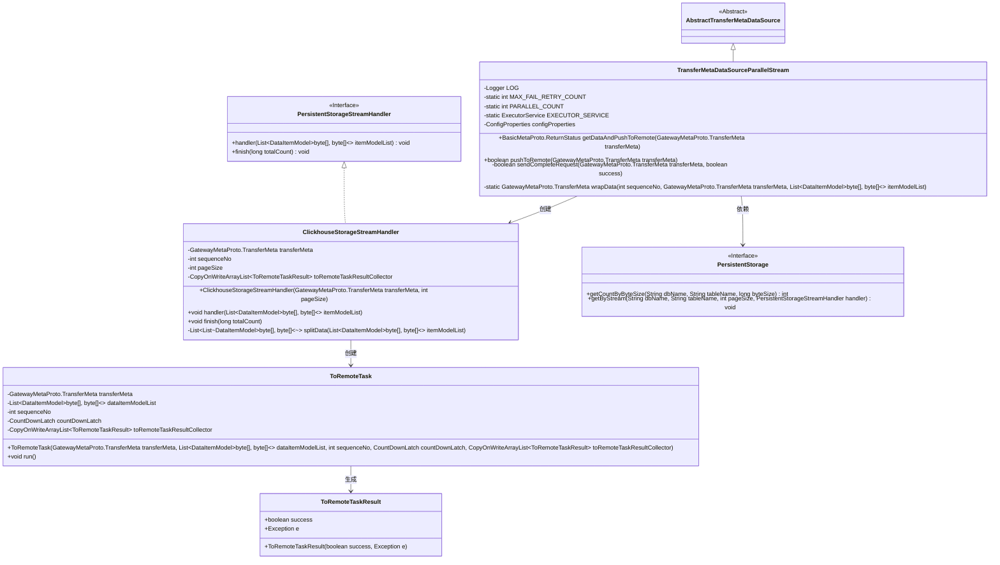
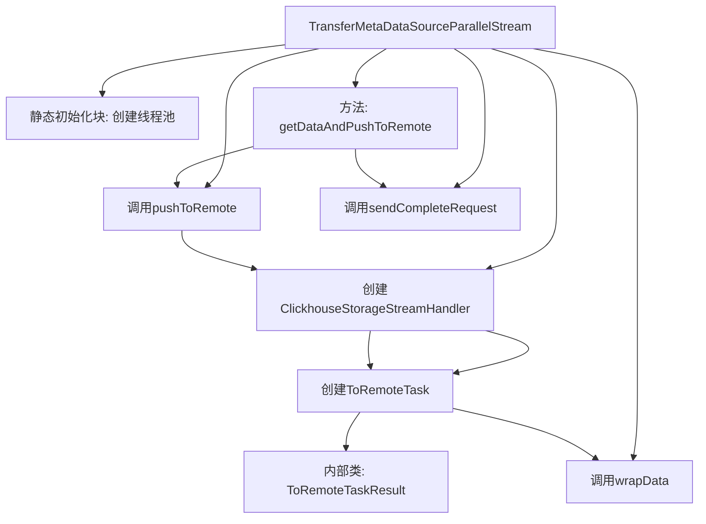
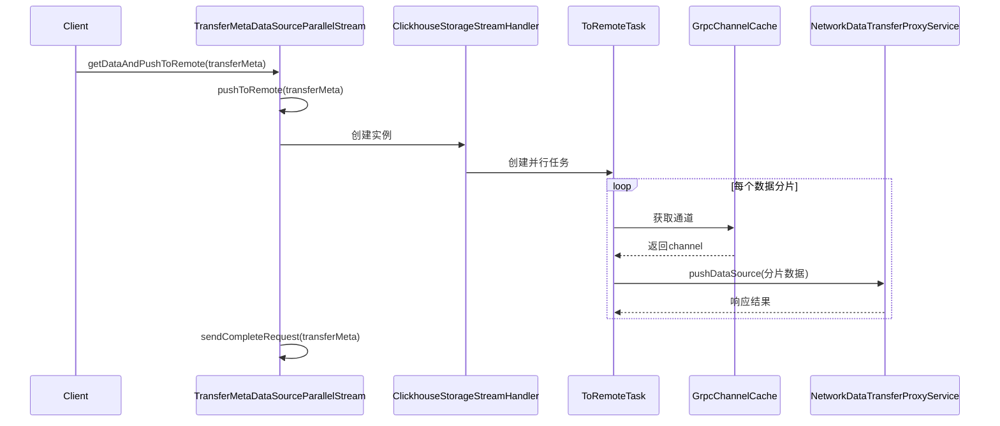

# 基础信息

|      |      |
|------|------|
| 名称 | TransferMetaDataSourceParallelStream |
| 编码语言 | .java |
| 代码路径 | WeFe/gateway/src/main/java/com/welab/wefe/gateway/service/TransferMetaDataSourceParallelStream.java |
| 包名 | com.welab.wefe.gateway.service |
| 依赖项 | ['com.google.common.util.concurrent.SettableFuture', 'com.welab.wefe.common.data.storage.model.DataItemModel', 'com.welab.wefe.common.data.storage.service.persistent.PersistentStorage', 'com.welab.wefe.common.data.storage.service.persistent.PersistentStorageStreamHandler', 'com.welab.wefe.common.util.ThreadUtil', 'com.welab.wefe.gateway.api.meta.basic.BasicMetaProto', 'com.welab.wefe.gateway.api.meta.basic.GatewayMetaProto', 'com.welab.wefe.gateway.api.service.proto.NetworkDataTransferProxyServiceGrpc', 'com.welab.wefe.gateway.api.streammessage.PushDataSourceResponseStreamObserver', 'com.welab.wefe.gateway.cache.GrpcChannelCache', 'com.welab.wefe.gateway.common.EndpointBuilder', 'com.welab.wefe.gateway.common.KeyValueDataBuilder', 'com.welab.wefe.gateway.common.ReturnStatusBuilder', 'com.welab.wefe.gateway.config.ConfigProperties', 'com.welab.wefe.gateway.interceptor.ClientCallCredentials', 'com.welab.wefe.gateway.interceptor.SignVerifyMetadataBuilder', 'com.welab.wefe.gateway.interceptor.SystemTimestampMetadataBuilder', 'com.welab.wefe.gateway.service.base.AbstractTransferMetaDataSource', 'com.welab.wefe.gateway.util.GrpcUtil', 'com.welab.wefe.gateway.util.TlsUtil', 'com.welab.wefe.gateway.util.TransferMetaUtil', 'io.grpc.ManagedChannel', 'io.grpc.StatusRuntimeException', 'io.grpc.stub.StreamObserver', 'org.apache.commons.collections4.CollectionUtils', 'org.slf4j.Logger', 'org.slf4j.LoggerFactory', 'org.springframework.beans.factory.annotation.Autowired', 'org.springframework.stereotype.Service', 'java.util.ArrayList', 'java.util.List', 'java.util.concurrent.CopyOnWriteArrayList', 'java.util.concurrent.CountDownLatch', 'java.util.concurrent.ExecutorService'] |
| 概述说明 | 并行传输数据服务类，支持失败重试和分片处理，通过GRPC异步推送数据到远程，包含日志记录和异常处理。 |

# 说明

TransferMetaDataSourceParallelStream是一个并行数据传输服务类，继承自AbstractTransferMetaDataSource。它通过并行流处理机制将数据分片推送到远程节点，支持失败重试机制（最大重试50次）和并行处理（默认5个并行任务）。核心功能包括：使用线程池执行并行推送任务，按页大小切割数据块，通过gRPC异步流式传输数据，并处理SSL连接、签名验证等异常情况。类内包含嵌套类ClickhouseStorageStreamHandler用于数据分片处理，以及ToRemoteTask实现具体推送逻辑。服务会记录传输耗时、数据量等详细日志，并在完成时发送状态标识请求。异常处理涵盖网络连接、证书验证、时间同步等多种错误场景。

# 类列表 Class Summary

| 名称   | 类型  | 说明 |
|-------|------|-------------|
| TransferMetaDataSourceParallelStream | class | 并行传输数据服务类，支持失败重试50次，并行数5，使用线程池处理数据分片推送，包含网络异常处理和日志记录。 |

## 类 TransferMetaDataSourceParallelStream

|      |      |
|------|------|
| 访问范围 | @Service;public |
| 类型 | class |
| 名称 | TransferMetaDataSourceParallelStream |
| 说明 | 并行传输数据服务类，支持失败重试50次，并行数5，使用线程池处理数据分片推送，包含网络异常处理和日志记录。 |

### UML类图

这段代码展示了一个并行数据传输系统的类结构，核心是TransferMetaDataSourceParallelStream类，它继承自AbstractTransferMetaDataSource并实现了并行推送数据到远程的功能。系统通过ClickhouseStorageStreamHandler处理数据流，使用ToRemoteTask进行并行任务分发，并通过ToRemoteTaskResult收集任务结果。整个架构采用线程池执行并行任务，支持失败重试机制，并与持久化存储(PersistentStorage)和gRPC服务进行交互，实现了高效可靠的数据传输。

### 内部方法调用关系图

这段代码实现了一个并行数据转移服务，主要功能是通过多线程方式将ClickHouse数据分片推送到远程服务。流程图展示了类结构关系，时序图描述了核心数据推送流程。代码包含异常处理、重试机制、并行控制等关键功能，使用静态线程池提高性能，通过GRPC实现数据传输，并支持TLS加密和签名验证等安全特性。内部类ClickhouseStorageStreamHandler负责数据分片处理，ToRemoteTask实现具体的数据推送任务。

### 字段列表 Field List

| 名称  | 类型  | 说明 |
|-------|-------|------|
| PARALLEL_COUNT = 5 | int | 定义并行处理数量常量，值为5。 |
| configProperties | ConfigProperties | 使用@Autowired自动注入ConfigProperties配置类实例。 |
| LOG = LoggerFactory.getLogger(TransferMetaDataSourceParallelStream.class) | Logger | 定义TransferMetaDataSourceParallelStream类的私有静态日志对象LOG。 |
| EXECUTOR_SERVICE | ExecutorService | 私有静态线程池服务实例。 |
| MAX_FAIL_RETRY_COUNT = 50 | int | 定义最大失败重试次数常量，值为50。 |

### 方法列表

| 名称  | 类型  | 说明 |
|-------|-------|------|
| pushToRemote | boolean | 方法pushToRemote尝试将数据推送至远程存储。计算批量大小后，获取存储实例和表信息，按字节大小分页读取数据并流式传输。成功返回true，失败记录异常并返回false。 |
| wrapData | GatewayMetaProto.TransferMeta | 方法将数据项列表转换为KeyValueData列表，更新传输元数据的序列号、状态并替换内容，返回构建后的元数据对象。 |
| sendCompleteRequest | boolean | 发送完成请求方法，通过gRPC通道发送传输元数据，设置传输状态为完成或错误，支持失败重试，成功返回true，失败返回false或抛出异常。 |
| getDataAndPushToRemote | BasicMetaProto.ReturnStatus | 方法getDataAndPushToRemote尝试将数据推送至远程并处理结果。成功则返回OK，失败则记录日志并返回错误信息，包括网络问题、签名验证失败、SSL连接问题等异常情况。 |

