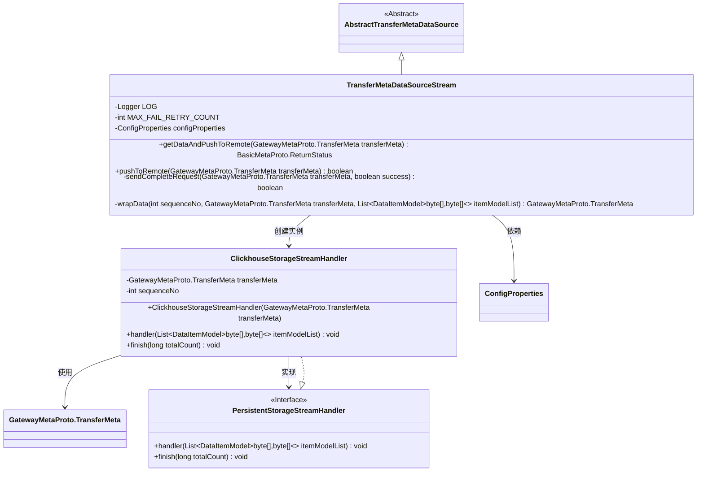
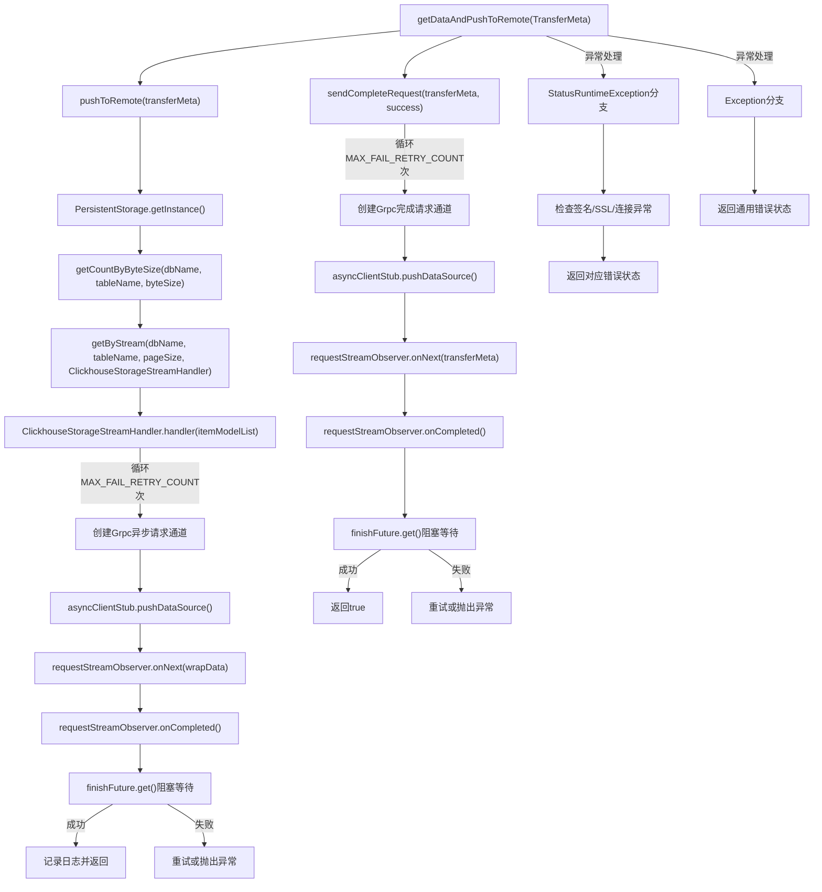

# 基础信息

|      |      |
|------|------|
| 名称 | TransferMetaDataSourceStream |
| 编码语言 | .java |
| 代码路径 | WeFe/gateway/src/main/java/com/welab/wefe/gateway/service/TransferMetaDataSourceStream.java |
| 包名 | com.welab.wefe.gateway.service |
| 依赖项 | ['com.google.common.util.concurrent.SettableFuture', 'com.welab.wefe.common.data.storage.model.DataItemModel', 'com.welab.wefe.common.data.storage.service.persistent.PersistentStorage', 'com.welab.wefe.common.data.storage.service.persistent.PersistentStorageStreamHandler', 'com.welab.wefe.common.util.ThreadUtil', 'com.welab.wefe.gateway.api.meta.basic.BasicMetaProto', 'com.welab.wefe.gateway.api.meta.basic.GatewayMetaProto', 'com.welab.wefe.gateway.api.service.proto.NetworkDataTransferProxyServiceGrpc', 'com.welab.wefe.gateway.api.streammessage.PushDataSourceResponseStreamObserver', 'com.welab.wefe.gateway.cache.GrpcChannelCache', 'com.welab.wefe.gateway.common.EndpointBuilder', 'com.welab.wefe.gateway.common.KeyValueDataBuilder', 'com.welab.wefe.gateway.common.ReturnStatusBuilder', 'com.welab.wefe.gateway.config.ConfigProperties', 'com.welab.wefe.gateway.interceptor.ClientCallCredentials', 'com.welab.wefe.gateway.interceptor.SignVerifyMetadataBuilder', 'com.welab.wefe.gateway.interceptor.SystemTimestampMetadataBuilder', 'com.welab.wefe.gateway.service.base.AbstractTransferMetaDataSource', 'com.welab.wefe.gateway.util.GrpcUtil', 'com.welab.wefe.gateway.util.TlsUtil', 'com.welab.wefe.gateway.util.TransferMetaUtil', 'io.grpc.ManagedChannel', 'io.grpc.StatusRuntimeException', 'io.grpc.stub.StreamObserver', 'org.apache.commons.collections4.CollectionUtils', 'org.slf4j.Logger', 'org.slf4j.LoggerFactory', 'org.springframework.beans.factory.annotation.Autowired', 'org.springframework.stereotype.Service', 'java.util.ArrayList', 'java.util.List'] |
| 概述说明 | TransferMetaDataSourceStream类实现数据流式传输，支持失败重试和SSL验证，包含数据推送、完成请求发送及异常处理功能。 |

# 说明

TransferMetaDataSourceStream类是一个服务类，继承自AbstractTransferMetaDataSource，用于将数据传输到远程目标。主要功能包括：通过pushToRemote方法将数据分批发送到远程，支持失败重试（最多50次），记录发送日志和耗时；通过ClickhouseStorageStreamHandler内部类处理数据流，使用gRPC异步通信发送数据，支持TLS加密和签名验证；sendCompleteRequest方法发送完成请求标志；wrapData方法封装数据。异常处理包括网络连接、SSL证书、签名验证等问题，并返回相应的错误状态。整个过程涉及数据库名、表名、会话ID等关键信息的记录和传递。

# 类列表 Class Summary

| 名称   | 类型  | 说明 |
|-------|------|-------------|
| TransferMetaDataSourceStream | class | TransferMetaDataSourceStream类实现数据流式传输，包含失败重试、日志记录、异常处理和SSL验证等功能，支持分片发送和完成标识通知。 |

## 类 TransferMetaDataSourceStream

|      |      |
|------|------|
| 访问范围 | @Service;public |
| 类型 | class |
| 名称 | TransferMetaDataSourceStream |
| 说明 | TransferMetaDataSourceStream类实现数据流式传输，包含失败重试、日志记录、异常处理和SSL验证等功能，支持分片发送和完成标识通知。 |

### UML类图

该图展示了数据传输服务的核心类结构。TransferMetaDataSourceStream继承自抽象类AbstractTransferMetaDataSource，负责元数据传输的核心逻辑，包含数据推送、完成请求发送和数据处理包装等方法。内部类ClickhouseStorageStreamHandler实现了PersistentStorageStreamHandler接口，处理ClickHouse数据流的分片传输和完成回调。类间通过依赖和实现关系协作，共同完成分布式环境下的数据同步任务，具有完善的错误处理和重试机制。

### 内部方法调用关系图

流程图描述：该流程图展示了TransferMetaDataSourceStream类的核心方法getDataAndPushToRemote的执行流程。主要分为数据推送(pushToRemote)和完成请求发送(sendCompleteRequest)两个主要分支，均采用Grpc异步通信机制。数据推送过程包含分页查询、流式处理和重试机制，完成请求则负责状态同步。异常处理分支会区分不同错误类型（签名验证、SSL连接、网络问题等）返回对应错误码。整个过程具有完善的日志记录和重试机制，确保数据传输可靠性。

### 字段列表 Field List

| 名称  | 类型  | 说明 |
|-------|-------|------|
| configProperties | ConfigProperties | 自动注入配置属性对象。 |
| LOG = LoggerFactory.getLogger(TransferMetaDataSourceStream.class) | Logger | 定义TransferMetaDataSourceStream类的静态日志对象LOG，用于记录日志信息。 |
| MAX_FAIL_RETRY_COUNT = 50 | int | 定义最大失败重试次数常量为50。 |

### 方法列表

| 名称  | 类型  | 说明 |
|-------|-------|------|
| getDataAndPushToRemote | BasicMetaProto.ReturnStatus | 方法getDataAndPushToRemote处理数据推送至远程，记录耗时和状态。失败时返回错误信息，包括网络、签名、SSL等问题。成功返回OK状态。异常时记录日志并返回具体错误。 |
| pushToRemote | boolean | 方法pushToRemote尝试将数据传输到远程ClickHouse。计算批量大小后，获取存储实例和表名，按字节大小分页读取数据并流式传输。成功返回true，失败记录日志并返回false。 |
| sendCompleteRequest | boolean | 方法通过gRPC发送传输完成请求，支持失败重试和TLS加密，成功返回true，失败或异常返回false或抛出异常。 |
| wrapData | GatewayMetaProto.TransferMeta | 该方法将数据项列表封装为传输元数据，设置序列号、状态为处理中，并添加键值数据列表。 |

