# 基础信息

|      |      |
|------|------|
| 名称 | service |
| 编码语言 | .java |
| 代码路径 | WeFe/gateway/src/main/java/com/welab/wefe/gateway/service |
| 包名 | docs.gateway.src.main.java.com.welab.wefe.gateway.service |
| 概述说明 | 分布式系统健康管理框架，含网关检测、微服务状态检查，支持本地预检和远程验证。提供数据传输元数据持久化、缓存管理和跨节点通信，含多种处理器和检查点机制，依赖多种基础设施。 |

# 说明

## 概述  
该模块是分布式系统的核心通信与健康管理框架，兼具服务状态监测（如网关连通性检测、MySQL健康检查）和跨节点数据传输（如元数据同步、流式推送）双重职责，类似分布式神经系统。采用分层接口规范：健康管理侧基于Processor抽象类（beforeSendToRemote/remoteProcess）与Checkpoint机制（doCheck/desc），数据传输侧围绕TransferMeta对象实现CRUD、推送（getDataAndPushToRemote）和状态检查（checkStatusNow）。关键数据结构包括传输元数据URI、ReturnStatusBuilder响应体、AsyncResponseCollector异步收集器和多类型检查点（如MySQL/Storage）。依赖项涵盖网关网络、函数计算、MySQL、ClickHouse、JNI/POSIX协议等基础设施，例如FileSystemCheckpoint验证目录权限，TransferMetaDataSourceStream通过gRPC实现加密传输。

## 主要业务场景  
模块支持两大核心场景：健康管理采用"本地预检→远程验证"分层策略，例如GatewayAvailableProcessor先校验会话合法性再扫描多检查点；数据传输遵循"持久化→推送→状态同步"流程，如AbstractSendTransferMetaService校验参数后通过并行流（TransferMetaDataSourceParallelStream）分片推送。典型交互模式包括：SM4加密通信（BoardHttpProcessor）、CA证书同步（CaCertificateService）、基于TransferMeta的缓存更新（TransferMetaDataSink）。异常处理贯穿全流程，如BlacklistService拦截非法请求，MessageService通过ExpiringMap实现消息去重。整体构成类似自愈型数据管道，支撑从网络拓扑验证到存储系统状态的全链路监控与数据传输。

### 包内部结构视图

```mermaid
graph TD
    service --> processors
    service --> base
    service --> FlowActionQueueService.java
    service --> RecvTransferMetaCachePersistentService.java
    service --> GlobalConfigService.java
    service --> AbstractService.java
    service --> MessageQueueService.java
    service --> PartnerConfigService.java
    service --> MessageService.java
    service --> ServerCertService.java
    service --> TransferMetaDataSourceStream.java
    service --> BlacklistService.java
    service --> SendTransferMetaService.java
    service --> TransferMetaDataSource.java
    service --> TransferMetaDataSourceParallelStream.java
    service --> MemberService.java
    service --> CaCertificateService.java
    service --> RecvTransferMetaService.java
    service --> TransferMetaDataAsyncSaveService.java
    service --> SendTransferMetaCachePersistentService.java
    service --> TransferMetaDataSink.java
    processors --> available
    processors --> RefreshFcStorageProcessor.java
    processors --> RefreshMemberBlacklistCacheProcessor.java
    processors --> DbFlowTableProcessor.java
    processors --> BoardHttpProcessor.java
    processors --> DbChatTableProcessor.java
    processors --> RefreshMemberCacheProcessor.java
    processors --> RefreshSystemConfigCacheProcessor.java
    processors --> ResidentMemoryProcessor.java
    processors --> RemoteCallbackProcessor.java
    processors --> AbstractProcessor.java
    processors --> RestartExternalGrpcServerProcessor.java
    processors --> RefreshPartnerConfigCacheProcessor.java
    processors --> RefreshPersistentStorageProcessor.java
    processors --> DsourceProcessor.java
    processors --> AvailableCheckBeforeStartJobProcessor.java
    processors --> ProcessorContext.java
    available --> checkpoint
    available --> GatewayAliveProcessor.java
    available --> GatewayAvailableProcessor.java
    checkpoint --> FcCheckpoint.java
    checkpoint --> MysqlCheckpoint.java
    checkpoint --> FileSystemCheckpoint.java
    checkpoint --> StorageCheckpoint.java
    checkpoint --> BoardCheckpoint.java
    checkpoint --> UnionCheckpoint.java
    base --> AbstractRecvTransferMetaCachePersistentService.java
    base --> AbstractTransferMetaDataSource.java
    base --> AbstractTransferMetaDataSink.java
    base --> AbstractSendTransferMetaService.java
    base --> AbstractSendTransferMetaCachePersistentService.java
    base --> AbstractFlowActionQueueService.java
    base --> AbstractRecvTransferMetaService.java
    base --> AbstractMemberService.java
```

该流程图展示了WeFe网关服务的完整文件结构，从顶层service目录开始，向下分为processors、base和多个服务类文件。processors目录进一步细分为available子目录和多个处理器类，available下又包含checkpoint目录和两个处理器类。checkpoint目录包含多种检查点实现类。base目录则包含多个抽象基类。整个结构层次清晰，展现了网关服务的模块化设计。

# 文件列表

| 名称   | 类型  | 说明 |
|-------|------|-------------|
| [base](base/_module.md) | package | 抽象类集合，定义传输元数据持久化、推送、接收及成员管理核心方法，包括save、delete、get、findAll等操作，需子类实现具体逻辑。 |
| [FlowActionQueueService.java](FlowActionQueueService.md) | file | FlowActionQueueService继承AbstractFlowActionQueueService，通过FlowActionQueueRepository保存FlowActionQueueEntity实体。 |
| [RecvTransferMetaCachePersistentService.java](RecvTransferMetaCachePersistentService.md) | file | 接收传输元数据缓存持久化服务，基于本地文件系统存储，提供保存、查询、删除和查找全部元数据功能，处理序列化和反序列化操作，确保目录权限和路径正确。 |
| [GlobalConfigService.java](GlobalConfigService.md) | file | GlobalConfigService提供配置管理功能，通过group查询配置项列表，并将配置项转换为指定类型的模型对象。核心方法包括getModel获取配置模型、list按组查询配置项、toModel将配置项转为实体对象。 |
| [AbstractService.java](AbstractService.md) | file | 抽象服务类提供日志记录功能，包含一个受保护的日志对象和异常日志方法。 |
| [MessageQueueService.java](MessageQueueService.md) | file | MessageQueueService类使用@Autowired注入MessageQueueRepository，提供save方法保存MessageQueueEntity实体。 |
| [PartnerConfigService.java](PartnerConfigService.md) | file | PartnerConfigService类通过PartnerConfigRepository获取所有PartnerConfigEntity数据。 |
| [MessageService.java](MessageService.md) | file | MessageService类使用ExpiringMap缓存60秒内消息哈希避免重复存储，提供多个saveError方法记录网关错误信息到数据库，异常时记录日志。 |
| [ServerCertService.java](ServerCertService.md) | file | ServerCertService类通过查询VALID状态的证书信息，关联获取密钥和请求数据，解密后返回ServerCertInfoModel对象。 |
| [TransferMetaDataSourceStream.java](TransferMetaDataSourceStream.md) | file | TransferMetaDataSourceStream类实现数据流式传输，支持失败重试和SSL验证，包含数据推送、完成请求发送及异常处理功能。 |
| [BlacklistService.java](BlacklistService.md) | file | 黑名单服务类，自动注入仓库，提供查询所有黑名单方法。 |
| [SendTransferMetaService.java](SendTransferMetaService.md) | file | SendTransferMetaService处理消息传输，包含远程发送和缓存处理逻辑，记录日志并调用相关服务。 |
| [TransferMetaDataSource.java](TransferMetaDataSource.md) | file | TransferMetaDataSource类实现数据分页传输功能，通过线程局部变量管理分页参数，支持失败重试机制，使用gRPC异步通信将数据块发送至远程服务，处理签名验证、SSL连接等异常，并记录传输日志。 |
| [TransferMetaDataSourceParallelStream.java](TransferMetaDataSourceParallelStream.md) | file | 并行传输数据服务类，支持失败重试和分片处理，通过GRPC异步推送数据到远程，包含日志记录和异常处理。 |
| [MemberService.java](MemberService.md) | file | MemberService类继承AbstractMemberService，提供查找成员列表和自身信息功能，处理成员实体数据包括ID、名称、密钥及网关配置，支持TLS设置检查。 |
| [CaCertificateService.java](CaCertificateService.md) | file | CaCertificateService类提供findAll方法，从联合服务获取CA证书数据并解析为列表返回，包含序列号、主题名和证书内容。 |
| [RecvTransferMetaService.java](RecvTransferMetaService.md) | file | RecvTransferMetaService处理接收传输元数据，检查状态并执行业务逻辑。包含缓存管理、状态检查和黑名单验证功能。 |
| [TransferMetaDataAsyncSaveService.java](TransferMetaDataAsyncSaveService.md) | file | 异步保存传输元数据服务，支持反序列化数据并检查存储配置，根据类型（OTS/OSS/COS/ClickHouse）存储数据，失败重试3次，处理成功或失败状态。 |
| [SendTransferMetaCachePersistentService.java](SendTransferMetaCachePersistentService.md) | file | SendTransferMetaCachePersistentService类基于条件注解实现本地文件系统持久化，提供保存、删除和查询传输元数据功能，处理异常并记录日志。 |
| [TransferMetaDataSink.java](TransferMetaDataSink.md) | file | TransferMetaDataSink类处理元数据传输，包含缓存管理、状态检查线程、序列化数据加载和临时存储功能，支持处理中、成功和失败三种状态。 |
| [processors](processors/_module.md) | package | 分布式服务可用性检查框架，含网关连接验证和后端健康检查，支持多层级探针和双轨模式，覆盖网络到存储全链路验证，含多种处理器实现如MySQL检查、缓存刷新等。 |

