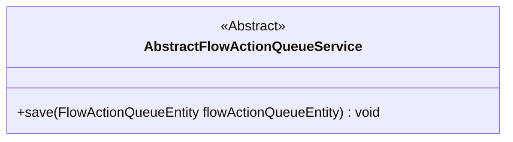
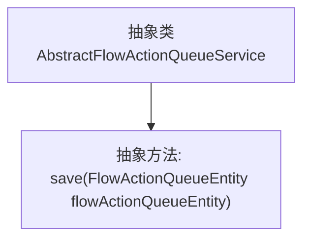

# 基础信息

|      |      |
|------|------|
| 名称 | AbstractFlowActionQueueService |
| 编码语言 | .java |
| 代码路径 | WeFe/gateway/src/main/java/com/welab/wefe/gateway/service/base/AbstractFlowActionQueueService.java |
| 包名 | com.welab.wefe.gateway.service.base |
| 依赖项 | ['com.welab.wefe.gateway.entity.FlowActionQueueEntity'] |
| 概述说明 | 抽象类AbstractFlowActionQueueService定义了一个保存FlowActionQueueEntity实体的抽象方法save。 |

# 说明

这是一个名为AbstractFlowActionQueueService的抽象类，定义了一个抽象方法save，用于保存FlowActionQueueEntity类型的实体对象。该抽象类提供了基础框架，具体实现需由子类完成。

# 类列表 Class Summary

| 名称   | 类型  | 说明 |
|-------|------|-------------|
| AbstractFlowActionQueueService | class | 抽象类AbstractFlowActionQueueService定义了一个保存FlowActionQueueEntity实体的抽象方法save。 |

## 类 AbstractFlowActionQueueService

|      |      |
|------|------|
| 访问范围 | public abstract |
| 类型 | class |
| 名称 | AbstractFlowActionQueueService |
| 说明 | 抽象类AbstractFlowActionQueueService定义了一个保存FlowActionQueueEntity实体的抽象方法save。 |

### UML类图

这段类图展示了一个名为AbstractFlowActionQueueService的抽象类，其中定义了一个抽象方法save，用于保存FlowActionQueueEntity类型的实体对象。该类的抽象性质表明它需要由具体子类实现核心功能，为后续具体队列服务实现提供了基础模板和规范接口。类图清晰地反映了该服务的核心职责和扩展点设计。

### 内部方法调用关系图

这段代码定义了一个名为AbstractFlowActionQueueService的抽象类，其中包含一个抽象方法save，该方法接收FlowActionQueueEntity类型的参数。由于是抽象类，它不能被直接实例化，必须由子类实现具体的save方法逻辑。流程图清晰地展示了类与抽象方法之间的继承关系，为后续具体实现类提供了模板规范。

### 字段列表 Field List

| 名称  | 类型  | 说明 |
|-------|-------|------|

### 方法列表

| 名称  | 类型  | 说明 |
|-------|-------|------|
| save | void | 抽象方法，用于保存流程动作队列实体对象。 |

