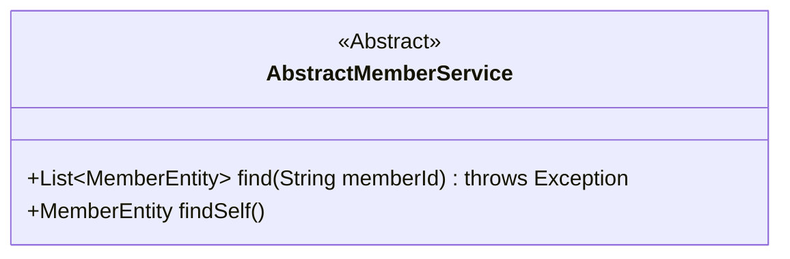
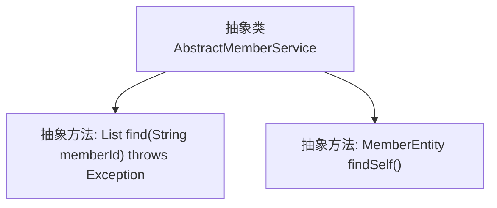

# 基础信息

|      |      |
|------|------|
| 名称 | AbstractMemberService |
| 编码语言 | .java |
| 代码路径 | WeFe/gateway/src/main/java/com/welab/wefe/gateway/service/base/AbstractMemberService.java |
| 包名 | com.welab.wefe.gateway.service.base |
| 依赖项 | ['com.welab.wefe.gateway.entity.MemberEntity', 'java.util.List'] |
| 概述说明 | 抽象类AbstractMemberService定义了两个抽象方法：find通过memberId查询会员列表可能抛出异常，findSelf查询当前会员实体。 |

# 说明

这是一个名为AbstractMemberService的抽象类，定义了两个抽象方法。第一个方法find接收一个memberId字符串参数，返回MemberEntity对象的列表，可能抛出异常。第二个方法findSelf无参数，返回单个MemberEntity对象。该类作为基础模板，具体实现需由子类完成。

# 类列表 Class Summary

| 名称   | 类型  | 说明 |
|-------|------|-------------|
| AbstractMemberService | class | 抽象类AbstractMemberService定义了两个抽象方法：find通过memberId查询成员列表可能抛出异常，findSelf查询当前成员实体。 |

## 类 AbstractMemberService

|      |      |
|------|------|
| 访问范围 | public abstract |
| 类型 | class |
| 名称 | AbstractMemberService |
| 说明 | 抽象类AbstractMemberService定义了两个抽象方法：find通过memberId查询成员列表可能抛出异常，findSelf查询当前成员实体。 |

### UML类图

这段类图描述了一个名为AbstractMemberService的抽象类，其中定义了两个抽象方法：find()和findSelf()。find()方法接收一个String类型的memberId参数，返回一个MemberEntity类型的列表，并可能抛出Exception异常；findSelf()方法则直接返回单个MemberEntity对象。该类用<<Abstract>>标记表明它是一个抽象类，不能被直接实例化，需要由具体子类实现这些抽象方法。类图清晰地展示了该抽象服务的核心接口定义。

### 内部方法调用关系图

该流程图展示了AbstractMemberService抽象类的结构，包含两个核心抽象方法：find()用于根据memberId查询成员列表（可能抛出异常），findSelf()用于获取当前成员实体。抽象类用虚线边框表示，强调需要子类实现具体逻辑。箭头表示类与方法间的从属关系，符合面向对象设计中抽象类定义方法的规范。

### 字段列表 Field List

| 名称  | 类型  | 说明 |
|-------|-------|------|

### 方法列表

| 名称  | 类型  | 说明 |
|-------|-------|------|
| findSelf | MemberEntity | 抽象方法：查找自身成员实体。 |
| find | List<MemberEntity> | 抽象方法find通过memberId查询MemberEntity列表，可能抛出异常。 |

