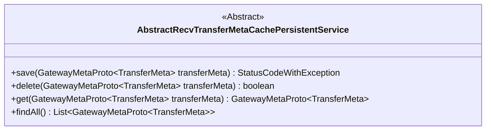
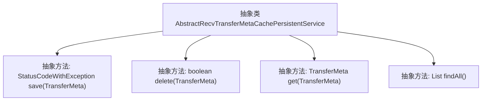

# 基础信息

|      |      |
|------|------|
| 名称 | AbstractRecvTransferMetaCachePersistentService |
| 编码语言 | .java |
| 代码路径 | WeFe/gateway/src/main/java/com/welab/wefe/gateway/service/base/AbstractRecvTransferMetaCachePersistentService.java |
| 包名 | com.welab.wefe.gateway.service.base |
| 依赖项 | ['com.welab.wefe.common.exception.StatusCodeWithException', 'com.welab.wefe.gateway.api.meta.basic.GatewayMetaProto', 'java.util.List'] |
| 概述说明 | 抽象类定义传输元数据持久化服务，包含保存、删除、获取单个及查询全部元数据的方法。 |

# 说明

这是一个名为AbstractRecvTransferMetaCachePersistentService的抽象类，定义了四个核心方法用于处理传输元数据的持久化操作。包含保存传输元数据的方法save，返回状态码和异常；删除指定传输元数据的方法delete，返回布尔值；获取单个传输元数据的方法get；以及获取所有传输元数据列表的方法findAll。所有方法都基于GatewayMetaProto.TransferMeta类型参数进行操作。

# 类列表 Class Summary

| 名称   | 类型  | 说明 |
|-------|------|-------------|
| AbstractRecvTransferMetaCachePersistentService | class | 抽象类AbstractRecvTransferMetaCachePersistentService定义了四个方法：保存、删除、获取和查询全部传输元数据，均基于GatewayMetaProto.TransferMeta操作。 |

## 类 AbstractRecvTransferMetaCachePersistentService

|      |      |
|------|------|
| 访问范围 | public abstract |
| 类型 | class |
| 名称 | AbstractRecvTransferMetaCachePersistentService |
| 说明 | 抽象类AbstractRecvTransferMetaCachePersistentService定义了四个方法：保存、删除、获取和查询全部传输元数据，均基于GatewayMetaProto.TransferMeta操作。 |

### UML类图

这段类图描述了一个名为AbstractRecvTransferMetaCachePersistentService的抽象类，它定义了四个核心方法用于处理网关元数据的持久化操作。该类提供了保存(save)、删除(delete)、获取(get)和查询所有(findAll)TransferMeta对象的方法，其中save方法返回包含状态码和异常的复合对象，delete返回布尔结果，get返回单个元数据对象，findAll返回元数据列表。所有方法都接收或返回GatewayMetaProto.TransferMeta泛型类型，表明该类专注于网关传输元数据的缓存持久化服务。

### 内部方法调用关系图

该流程图展示了一个抽象类及其四个抽象方法的结构。AbstractRecvTransferMetaCachePersistentService作为基类，定义了数据持久化的核心操作接口：save用于保存传输元数据并返回状态码，delete用于删除指定元数据，get用于获取单个元数据，findAll用于获取所有元数据列表。所有方法均为抽象方法，需由具体子类实现具体逻辑。

### 字段列表 Field List

| 名称  | 类型  | 说明 |
|-------|-------|------|

### 方法列表

| 名称  | 类型  | 说明 |
|-------|-------|------|
| save | StatusCodeWithException | 抽象方法，保存传输元数据，返回状态码和异常。 |
| delete | boolean | 抽象方法delete，参数为TransferMeta对象，返回布尔值表示删除操作是否成功。 |
| get | GatewayMetaProto.TransferMeta | 抽象方法，获取传输元数据，参数为TransferMeta对象。 |
| findAll | List<GatewayMetaProto.TransferMeta> | 抽象方法findAll，返回GatewayMetaProto.TransferMeta类型的列表。 |

