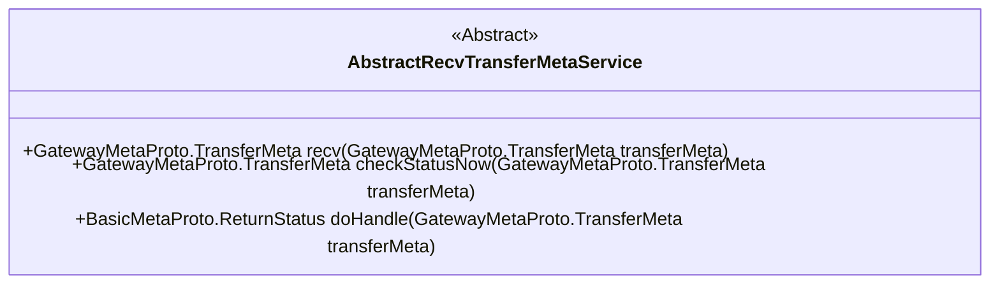
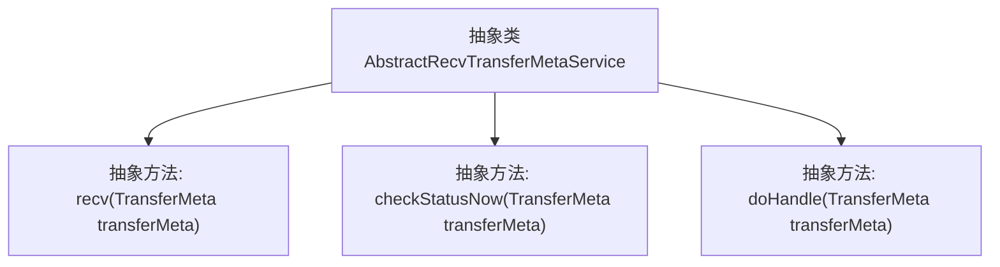

# 基础信息

|      |      |
|------|------|
| 名称 | AbstractRecvTransferMetaService |
| 编码语言 | .java |
| 代码路径 | WeFe/gateway/src/main/java/com/welab/wefe/gateway/service/base/AbstractRecvTransferMetaService.java |
| 包名 | com.welab.wefe.gateway.service.base |
| 依赖项 | ['com.welab.wefe.gateway.api.meta.basic.BasicMetaProto', 'com.welab.wefe.gateway.api.meta.basic.GatewayMetaProto'] |
| 概述说明 | 抽象类AbstractRecvTransferMetaService提供三个方法：recv阻塞式拉取远程网关数据，checkStatusNow非阻塞查询数据状态，doHandle处理远程网关消息并返回结果。 |

# 说明

AbstractRecvTransferMetaService是一个抽象类，定义了三个核心方法。recv方法用于从本地数据缓存中拉取远程网关提交的数据，该方法会阻塞直到超时。checkStatusNow方法用于查询远程网关提交的数据状态，该方法是非阻塞的。doHandle方法用于处理远程网关提交的消息，并返回处理结果。所有方法均以TransferMeta对象作为参数，部分方法返回TransferMeta或ReturnStatus对象。

# 类列表 Class Summary

| 名称   | 类型  | 说明 |
|-------|------|-------------|
| AbstractRecvTransferMetaService | class | 抽象类AbstractRecvTransferMetaService定义了三个方法：recv阻塞接收远程网关数据，checkStatusNow非阻塞查询数据状态，doHandle处理远程网关消息并返回结果。 |

## 类 AbstractRecvTransferMetaService

|      |      |
|------|------|
| 访问范围 | public abstract |
| 类型 | class |
| 名称 | AbstractRecvTransferMetaService |
| 说明 | 抽象类AbstractRecvTransferMetaService定义了三个方法：recv阻塞接收远程网关数据，checkStatusNow非阻塞查询数据状态，doHandle处理远程网关消息并返回结果。 |

### UML类图

这段代码定义了一个名为AbstractRecvTransferMetaService的抽象类，主要用于处理远程网关提交的数据传输元数据。该类包含三个核心抽象方法：recv()用于从本地缓存中拉取远程网关提交的数据（阻塞式操作），checkStatusNow()用于非阻塞地查询远程网关提交的数据状态，doHandle()用于处理远程网关提交的消息并返回处理结果。这些方法都接收GatewayMetaProto.TransferMeta类型的参数，分别返回不同协议类型的响应结果，体现了网关间数据传输和状态检查的核心功能。

### 内部方法调用关系图

该流程图展示了一个抽象类`AbstractRecvTransferMetaService`的结构，包含三个核心抽象方法。`recv()`方法用于从本地缓存中拉取远程网关提交的数据（阻塞式操作），`checkStatusNow()`用于非阻塞查询远程网关提交的数据状态，`doHandle()`负责处理远程网关提交的消息并返回处理结果。这些方法均以`GatewayMetaProto.TransferMeta`为参数，体现了统一的数据传输协议设计。

### 字段列表 Field List

| 名称  | 类型  | 说明 |
|-------|-------|------|

### 方法列表

| 名称  | 类型  | 说明 |
|-------|-------|------|
| doHandle | BasicMetaProto.ReturnStatus | 抽象方法doHandle处理传输元数据，返回基础元数据状态。 |
| checkStatusNow | GatewayMetaProto.TransferMeta | 抽象方法checkStatusNow，接收TransferMeta参数，返回TransferMeta状态检查结果。 |
| recv | GatewayMetaProto.TransferMeta | 抽象方法recv接收TransferMeta参数，返回TransferMeta对象。 |

