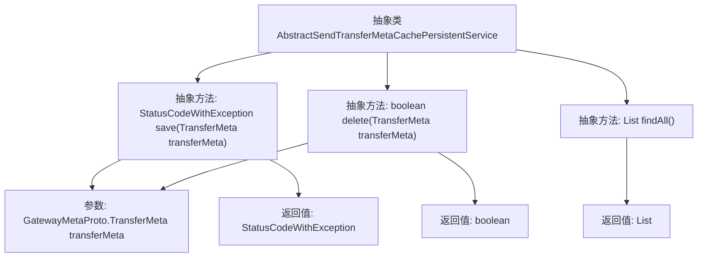

# 基础信息

|      |      |
|------|------|
| 名称 | AbstractSendTransferMetaCachePersistentService |
| 编码语言 | .java |
| 代码路径 | WeFe/gateway/src/main/java/com/welab/wefe/gateway/service/base/AbstractSendTransferMetaCachePersistentService.java |
| 包名 | com.welab.wefe.gateway.service.base |
| 依赖项 | ['com.welab.wefe.common.exception.StatusCodeWithException', 'com.welab.wefe.gateway.api.meta.basic.GatewayMetaProto', 'java.util.List'] |
| 概述说明 | 抽象类AbstractSendTransferMetaCachePersistentService定义持久化消息操作：save保存消息返回状态码，delete删除消息返回布尔值，findAll加载所有消息返回列表。 |

# 说明

这是一个名为AbstractSendTransferMetaCachePersistentService的抽象类，定义了持久化传输元数据的核心方法。包含三个抽象方法：save方法用于持久化传输元数据，返回包含状态码和异常的复合结果；delete方法用于删除持久化的元数据，返回布尔值表示操作结果；findAll方法用于加载所有持久化的元数据到内存，返回元数据列表。该类提供了消息持久化、删除和查询的基础接口，具体实现需由子类完成。

# 类列表 Class Summary

| 名称   | 类型  | 说明 |
|-------|------|-------------|
| AbstractSendTransferMetaCachePersistentService | class | 抽象类AbstractSendTransferMetaCachePersistentService定义了持久化消息的抽象方法：保存（返回状态码）、删除（返回布尔值）和查询全部消息（返回列表）。 |

## 类 AbstractSendTransferMetaCachePersistentService

|      |      |
|------|------|
| 访问范围 | public abstract |
| 类型 | class |
| 名称 | AbstractSendTransferMetaCachePersistentService |
| 说明 | 抽象类AbstractSendTransferMetaCachePersistentService定义了持久化消息的抽象方法：保存（返回状态码）、删除（返回布尔值）和查询全部消息（返回列表）。 |

### UML类图

这段类图描述了一个抽象类`AbstractSendTransferMetaCachePersistentService`，它定义了三个核心方法用于网关元数据的持久化操作。`save`方法用于保存传输元数据并返回包含状态码和异常的结果对象，`delete`方法用于删除指定元数据并返回布尔结果，`findAll`方法则加载所有持久化的元数据到内存中。该类作为抽象基类，需要子类实现具体的存储逻辑（如数据库或文件系统），适用于需要可靠持久化消息传输元数据的网关系统场景。

### 内部方法调用关系图

该流程图展示了抽象类`AbstractSendTransferMetaCachePersistentService`的结构，包含三个核心抽象方法：`save()`用于持久化消息并返回状态码和异常，`delete()`用于删除持久化消息并返回布尔结果，`findAll()`用于加载所有持久化消息。每个方法都明确标注了参数类型和返回值类型，箭头清晰表达了类与方法之间的从属关系以及方法与其输入输出的关联性。

### 字段列表 Field List

| 名称  | 类型  | 说明 |
|-------|-------|------|

### 方法列表

| 名称  | 类型  | 说明 |
|-------|-------|------|
| delete | boolean | 抽象方法delete，参数为TransferMeta对象，返回布尔值表示删除操作是否成功。 |
| save | StatusCodeWithException | 抽象方法声明，用于保存传输元数据，返回状态码和异常信息。 |
| findAll | List<GatewayMetaProto.TransferMeta> | 抽象方法，返回GatewayMetaProto.TransferMeta类型的列表。 |

