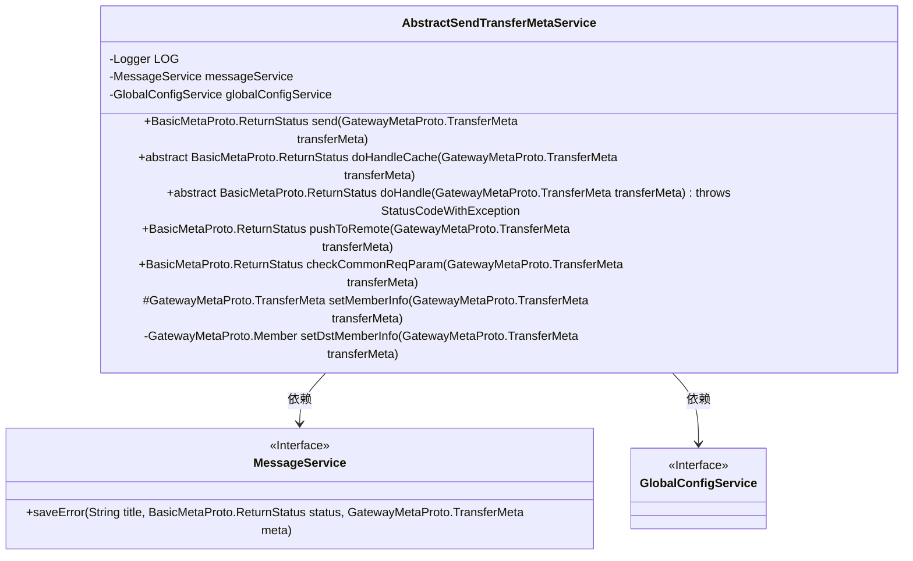
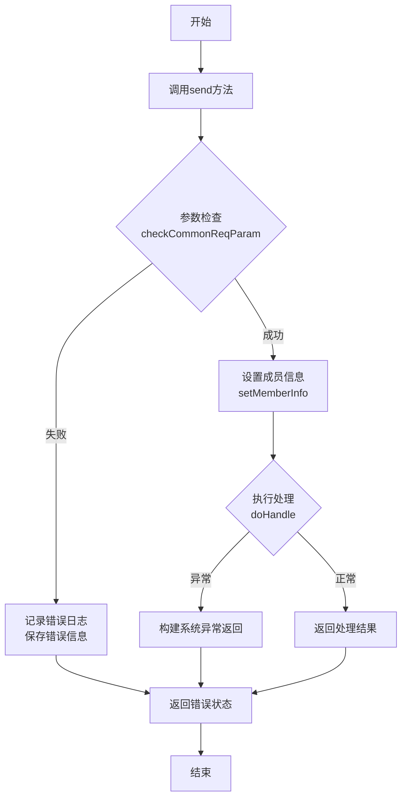
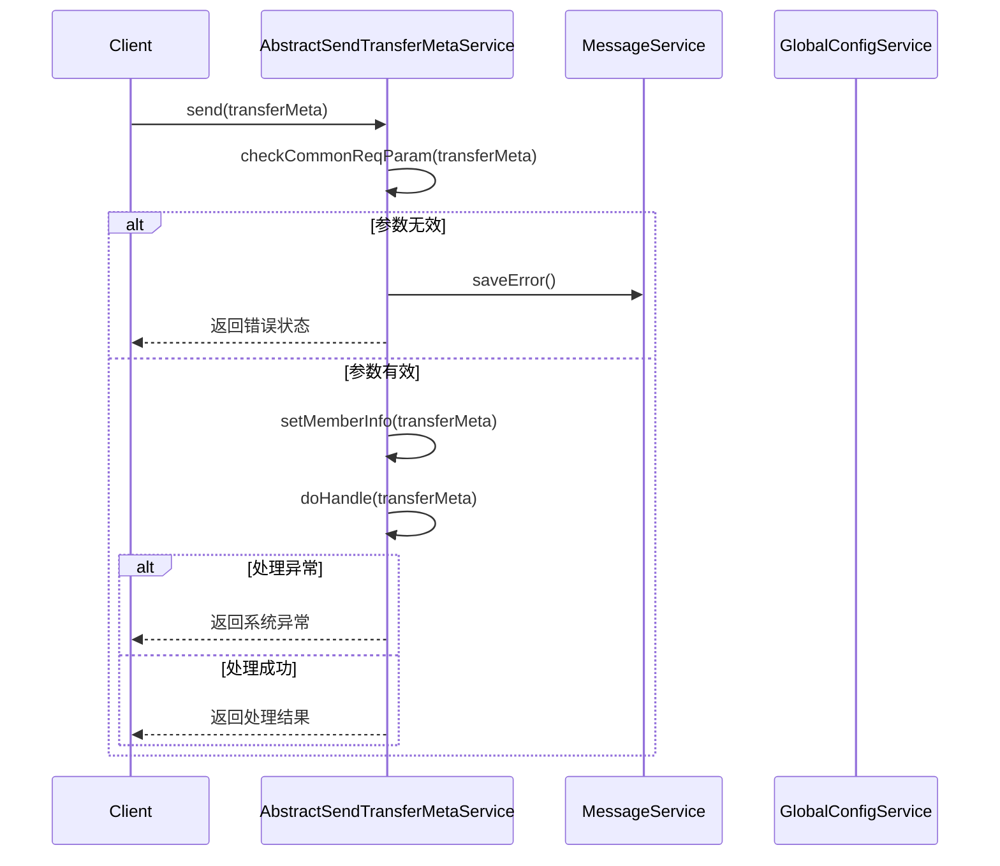
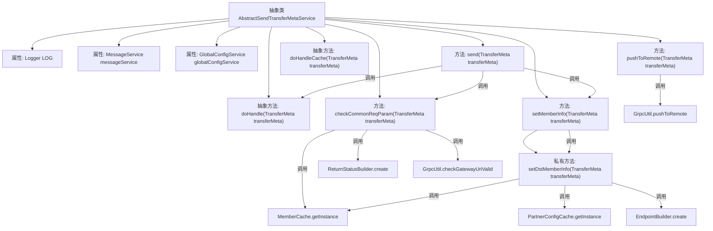

# 基础信息

|      |      |
|------|------|
| 名称 | AbstractSendTransferMetaService |
| 编码语言 | .java |
| 代码路径 | WeFe/gateway/src/main/java/com/welab/wefe/gateway/service/base/AbstractSendTransferMetaService.java |
| 包名 | com.welab.wefe.gateway.service.base |
| 依赖项 | ['com.welab.wefe.common.exception.StatusCodeWithException', 'com.welab.wefe.common.util.StringUtil', 'com.welab.wefe.common.wefe.dto.global_config.GatewayConfigModel', 'com.welab.wefe.gateway.api.meta.basic.BasicMetaProto', 'com.welab.wefe.gateway.api.meta.basic.GatewayMetaProto', 'com.welab.wefe.gateway.cache.MemberCache', 'com.welab.wefe.gateway.cache.PartnerConfigCache', 'com.welab.wefe.gateway.common.EndpointBuilder', 'com.welab.wefe.gateway.common.ReturnStatusBuilder', 'com.welab.wefe.gateway.common.ReturnStatusEnum', 'com.welab.wefe.gateway.entity.MemberEntity', 'com.welab.wefe.gateway.entity.PartnerConfigEntity', 'com.welab.wefe.gateway.service.GlobalConfigService', 'com.welab.wefe.gateway.service.MessageService', 'com.welab.wefe.gateway.util.GrpcUtil', 'com.welab.wefe.gateway.util.ReturnStatusUtil', 'com.welab.wefe.gateway.util.TransferMetaUtil', 'org.slf4j.Logger', 'org.slf4j.LoggerFactory', 'org.springframework.beans.factory.annotation.Autowired'] |
| 概述说明 | 抽象类AbstractSendTransferMetaService提供消息转发功能，包含参数校验、成员信息设置、远程推送等方法，支持缓存处理和异常捕获。 |

# 说明

AbstractSendTransferMetaService是一个抽象类，用于处理元数据消息的转发。它包含日志记录器和自动注入的MessageService与GlobalConfigService。主要方法send负责检查参数有效性，设置消息收发方信息，并调用抽象方法doHandle处理消息。pushToRemote方法将消息推送到远程节点。checkCommonReqParam方法验证请求参数，包括会话ID、处理器字段、目标成员ID和网关地址等。setMemberInfo方法设置消息的收发方信息，包括成员ID、名称和端点地址。抽象方法doHandle和doHandleCache需由子类实现，分别处理普通消息和缓存消息。

# 类列表 Class Summary

| 名称   | 类型  | 说明 |
|-------|------|-------------|
| AbstractSendTransferMetaService | class | 抽象类AbstractSendTransferMetaService提供消息转发功能，包含参数校验、成员信息设置及远程推送方法，支持缓存处理和异常捕获。 |

## 类 AbstractSendTransferMetaService

|      |      |
|------|------|
| 访问范围 | public abstract |
| 类型 | class |
| 名称 | AbstractSendTransferMetaService |
| 说明 | 抽象类AbstractSendTransferMetaService提供消息转发功能，包含参数校验、成员信息设置及远程推送方法，支持缓存处理和异常捕获。 |

### UML类图

这段代码展示了一个抽象消息转发服务类的设计，该类负责处理网关元数据的转发逻辑。类图中包含核心抽象类AbstractSendTransferMetaService及其依赖的两个服务接口MessageService和GlobalConfigService，展现了参数校验、消息处理和远程推送等核心功能。流程图清晰描述了消息发送的处理流程，而时序图则展示了客户端调用时的交互过程。该设计采用了模板方法模式，将具体处理逻辑留给子类实现，同时提供了完善的参数校验和错误处理机制。

### 内部方法调用关系图

这段代码展示了一个抽象类AbstractSendTransferMetaService，主要用于处理消息转发相关的元数据操作。类中包含参数校验、成员信息设置、远程推送等核心功能，通过抽象方法doHandle和doHandleCache实现具体业务逻辑的扩展。流程图清晰展现了类属性、方法间的调用关系，特别是参数校验和成员信息设置的复杂逻辑流程，体现了消息转发过程中对安全性和可靠性的严格要求。

### 字段列表 Field List

| 名称  | 类型  | 说明 |
|-------|-------|------|
| messageService | MessageService | 自动注入MessageService实例。 |
| globalConfigService | GlobalConfigService | 使用@Autowired自动注入GlobalConfigService实例。 |
| LOG = LoggerFactory.getLogger(this.getClass()) | Logger | 类中定义私有静态日志对象LOG，用于记录当前类的日志信息。 |

### 方法列表

| 名称  | 类型  | 说明 |
|-------|-------|------|
| pushToRemote | BasicMetaProto.ReturnStatus | 方法pushToRemote通过gRPC推送消息到远程，成功记录日志，失败则记录错误并保存失败信息，最后返回状态。 |
| doHandle | BasicMetaProto.ReturnStatus | 抽象方法doHandle处理传输元数据，返回状态或抛出异常。 |
| setMemberInfo | GatewayMetaProto.TransferMeta | 方法setMemberInfo用于设置传输元数据的成员信息，包括源成员ID和名称，并更新目标成员信息后返回新元数据。 |
| doHandleCache | BasicMetaProto.ReturnStatus | 抽象方法处理缓存，参数为TransferMeta，返回ReturnStatus状态。 |
| checkCommonReqParam | BasicMetaProto.ReturnStatus | 检查传输元数据参数有效性，包括会话ID、处理器、目标成员ID和网关地址，确保非空且格式正确，否则返回错误状态。 |
| send | BasicMetaProto.ReturnStatus | 方法send处理消息传输：先检查参数有效性，失败则记录错误；然后设置收发方信息；最后尝试处理消息，异常时返回系统错误状态。 |
| setDstMemberInfo | GatewayMetaProto.Member | 方法设置目标成员信息：根据传输元数据获取目标成员，若IP未指定则判断是否自访问（使用内网地址）或通过配置获取专线地址，否则使用外部地址，最终返回更新后的目标成员信息。 |

