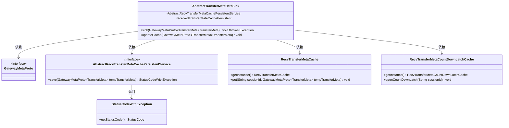
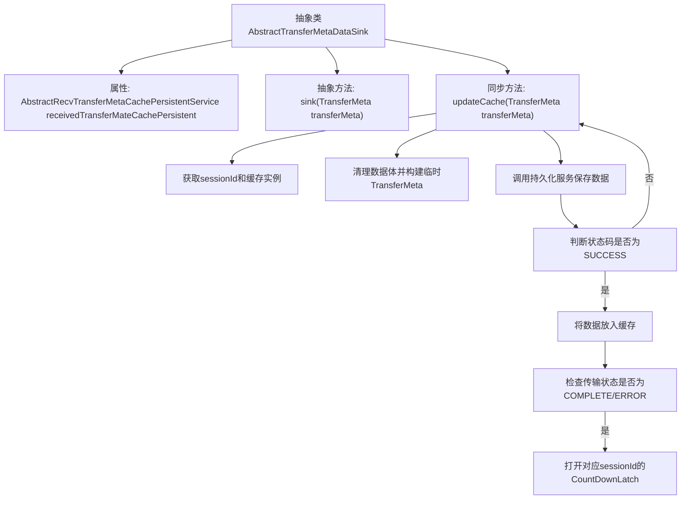

# 基础信息

|      |      |
|------|------|
| 名称 | AbstractTransferMetaDataSink |
| 编码语言 | .java |
| 代码路径 | WeFe/gateway/src/main/java/com/welab/wefe/gateway/service/base/AbstractTransferMetaDataSink.java |
| 包名 | com.welab.wefe.gateway.service.base |
| 依赖项 | ['com.welab.wefe.common.StatusCode', 'com.welab.wefe.common.exception.StatusCodeWithException', 'com.welab.wefe.gateway.api.meta.basic.GatewayMetaProto', 'com.welab.wefe.gateway.cache.RecvTransferMetaCache', 'com.welab.wefe.gateway.cache.RecvTransferMetaCountDownLatchCache', 'org.springframework.beans.factory.annotation.Autowired'] |
| 概述说明 | 抽象类AbstractTransferMetaDataSink提供元数据存储功能，包含sink抽象方法和updateCache同步方法，后者处理缓存更新、持久化及状态通知。 |

# 说明

这是一个抽象类AbstractTransferMetaDataSink，用于处理传输元数据的持久化和缓存更新。它包含一个自动装配的持久化服务receivedTransferMateCachePersistent。类中定义了一个抽象方法sink用于保存数据，以及一个同步方法updateCache用于更新缓存。updateCache方法会清理元数据中的内容体以减少内存占用，然后通过持久化服务保存处理后的数据。如果状态为COMPLETE或ERROR，会通过RecvTransferMetaCountDownLatchCache通知客户端数据接收完成。

# 类列表 Class Summary

| 名称   | 类型  | 说明 |
|-------|------|-------------|
| AbstractTransferMetaDataSink | class | 抽象类AbstractTransferMetaDataSink定义元数据传输接收逻辑，包含保存数据的抽象方法sink和同步更新缓存方法updateCache，后者处理数据持久化并通知客户端接收状态。 |

## 类 AbstractTransferMetaDataSink

|      |      |
|------|------|
| 访问范围 | public abstract |
| 类型 | class |
| 名称 | AbstractTransferMetaDataSink |
| 说明 | 抽象类AbstractTransferMetaDataSink定义元数据传输接收逻辑，包含保存数据的抽象方法sink和同步更新缓存方法updateCache，后者处理数据持久化并通知客户端接收状态。 |

### UML类图

该类图展示了AbstractTransferMetaDataSink抽象类及其关联组件。核心功能是通过updateCache方法处理传输元数据：先清理数据体减少内存占用，持久化存储后更新缓存，当传输状态为COMPLETE/ERROR时通过CountDownLatch通知客户端。涉及5个关键协作类，包括元数据原型、缓存服务、持久化接口和状态通知机制，形成完整的数据接收处理链。

### 内部方法调用关系图

这段代码描述了一个抽象类AbstractTransferMetaDataSink，主要用于处理传输元数据的缓存更新和持久化操作。流程图展示了从updateCache方法开始的处理流程：首先获取会话ID和缓存实例，然后清理数据体构建临时对象，接着进行持久化保存并根据返回状态码决定是否更新缓存。当传输状态为完成或错误时，会触发CountDownLatch通知机制。整个过程采用同步方法确保线程安全，体现了对内存占用和状态通知的精细控制。

### 字段列表 Field List

| 名称  | 类型  | 说明 |
|-------|-------|------|
| receivedTransferMateCachePersistent | AbstractRecvTransferMetaCachePersistentService | 使用@Autowired自动注入AbstractRecvTransferMetaCachePersistentService实例receivedTransferMateCachePersistent。 |

### 方法列表

| 名称  | 类型  | 说明 |
|-------|-------|------|
| sink | void | 抽象方法sink，接收TransferMeta参数，可能抛出异常。 |
| updateCache | void | 同步方法updateCache更新缓存：清空传输元数据内容体后持久化存储，成功则缓存并检查状态，完成或错误时释放对应倒计时锁。 |

