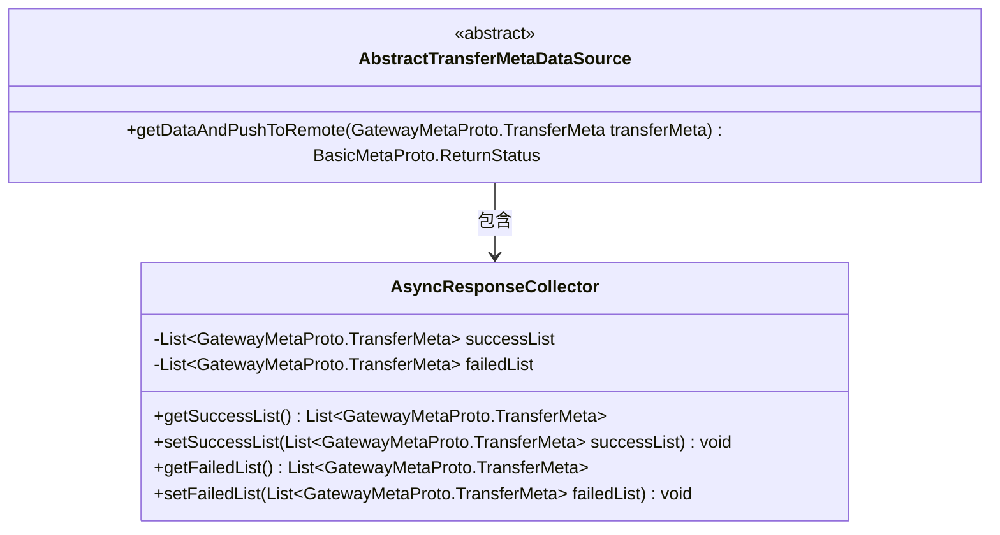
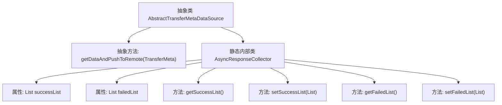

# 基础信息

|      |      |
|------|------|
| 名称 | AbstractTransferMetaDataSource |
| 编码语言 | .java |
| 代码路径 | WeFe/gateway/src/main/java/com/welab/wefe/gateway/service/base/AbstractTransferMetaDataSource.java |
| 包名 | com.welab.wefe.gateway.service.base |
| 依赖项 | ['com.welab.wefe.gateway.api.meta.basic.BasicMetaProto', 'com.welab.wefe.gateway.api.meta.basic.GatewayMetaProto', 'java.util.ArrayList', 'java.util.List'] |
| 概述说明 | 抽象类AbstractTransferMetaDataSource定义获取数据推送远程的接口，包含异步响应收集器类，记录成功和失败的数据片段列表。 |

# 说明

抽象类AbstractTransferMetaDataSource定义了一个抽象方法getDataAndPushToRemote，用于获取数据并推送到远程，接收TransferMeta参数并返回ReturnStatus结果。内部静态类AsyncResponseCollector包含两个列表：successList存储推送成功的元数据片段，failedList存储失败的片段，提供对应的getter和setter方法。

# 类列表 Class Summary

| 名称   | 类型  | 说明 |
|-------|------|-------------|
| AbstractTransferMetaDataSource | class | 抽象类AbstractTransferMetaDataSource定义了获取数据并推送至远程的抽象方法，包含内部类AsyncResponseCollector用于收集成功和失败的传输片段列表。 |

## 类 AbstractTransferMetaDataSource

|      |      |
|------|------|
| 访问范围 | public abstract |
| 类型 | class |
| 名称 | AbstractTransferMetaDataSource |
| 说明 | 抽象类AbstractTransferMetaDataSource定义了获取数据并推送至远程的抽象方法，包含内部类AsyncResponseCollector用于收集成功和失败的传输片段列表。 |

### UML类图

类图描述：该图展示了一个抽象类AbstractTransferMetaDataSource及其内部静态类AsyncResponseCollector的结构。抽象类定义了核心抽象方法getDataAndPushToRemote用于数据传输，内部类则作为响应收集器，维护成功和失败的传输元数据列表。两者构成组合关系，体现了数据传输过程中状态收集的职责分离设计模式。

### 内部方法调用关系图

该流程图展示了抽象类AbstractTransferMetaDataSource的结构，包含一个抽象方法和一个静态内部类。抽象方法getDataAndPushToRemote用于获取数据并推送到远程，内部类AsyncResponseCollector负责收集响应结果，包含成功和失败两个列表及其对应的getter/setter方法。整体设计实现了数据传输和状态管理的分离，符合单一职责原则。

### 字段列表 Field List

| 名称  | 类型  | 说明 |
|-------|-------|------|

### 方法列表

| 名称  | 类型  | 说明 |
|-------|-------|------|
| getDataAndPushToRemote | BasicMetaProto.ReturnStatus | 抽象方法：通过传输元数据获取数据并推送至远程，返回基本状态信息。 |

