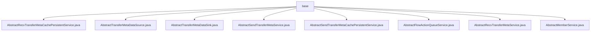

# 基础信息

|      |      |
|------|------|
| 名称 | base |
| 编码语言 | .java |
| 代码路径 | WeFe/gateway/src/main/java/com/welab/wefe/gateway/service/base |
| 包名 | docs.gateway.src.main.java.com.welab.wefe.gateway.service.base |
| 概述说明 | 抽象类集合，定义传输元数据持久化、推送、接收及成员管理核心方法，包括save、delete、get、findAll等操作，需子类实现具体逻辑。 |

# 说明

## 概述  
该模块核心职责是提供数据传输元数据的持久化、缓存管理和跨节点通信的基础框架，类似消息中继站模式。接口规范包含CRUD操作（如save/delete/findAll）、数据推送（getDataAndPushToRemote）和状态检查（checkStatusNow）等，均围绕GatewayMetaProto.TransferMeta类型展开。关键数据结构包括TransferMeta（传输元数据）、AsyncResponseCollector（异步响应收集器）和FlowActionQueueEntity（流程动作队列实体）。外部依赖涉及MessageService（消息服务）、GlobalConfigService（全局配置）和JNI/POSIX等底层协议。例如AbstractSendTransferMetaService通过doHandle抽象方法支持不同消息处理策略。

## 主要业务场景  
模块支持跨网关数据同步全流程，包含元数据持久化（如AbstractRecvTransferMetaCachePersistentService）、远程推送（如AbstractTransferMetaDataSource）和缓存更新（如AbstractTransferMetaDataSink的updateCache）。典型交互模式为：发送方通过AbstractSendTransferMetaService校验参数并转发消息，接收方通过AbstractRecvTransferMetaService拉取数据并更新状态。例如AbstractMemberService提供成员信息查询支撑路由决策。所有场景均基于TransferMeta对象流转，异常时通过failedList收集失败片段。

### 包内部结构视图

该流程图展示了WeFe网关项目中service/base目录下的8个抽象服务类文件。所有文件都直接隶属于base目录，没有更深层级的子目录结构。这些服务类涵盖了传输元数据缓存持久化、数据源、数据接收、队列处理等网关核心功能模块的基础抽象实现。

# 文件列表

| 名称   | 类型  | 说明 |
|-------|------|-------------|
| [AbstractRecvTransferMetaCachePersistentService.java](AbstractRecvTransferMetaCachePersistentService.md) | file | 抽象类定义传输元数据持久化服务，包含保存、删除、获取单个及查询全部元数据的方法。 |
| [AbstractTransferMetaDataSource.java](AbstractTransferMetaDataSource.md) | file | 抽象类AbstractTransferMetaDataSource定义获取数据推送远程的接口，包含异步响应收集器类，记录成功和失败的数据片段列表。 |
| [AbstractTransferMetaDataSink.java](AbstractTransferMetaDataSink.md) | file | 抽象类AbstractTransferMetaDataSink提供元数据存储功能，包含sink抽象方法和updateCache同步方法，后者处理缓存更新、持久化及状态通知。 |
| [AbstractSendTransferMetaService.java](AbstractSendTransferMetaService.md) | file | 抽象类AbstractSendTransferMetaService提供消息转发功能，包含参数校验、成员信息设置、远程推送等方法，支持缓存处理和异常捕获。 |
| [AbstractSendTransferMetaCachePersistentService.java](AbstractSendTransferMetaCachePersistentService.md) | file | 抽象类AbstractSendTransferMetaCachePersistentService定义持久化消息操作：save保存消息返回状态码，delete删除消息返回布尔值，findAll加载所有消息返回列表。 |
| [AbstractFlowActionQueueService.java](AbstractFlowActionQueueService.md) | file | 抽象类AbstractFlowActionQueueService定义了一个保存FlowActionQueueEntity实体的抽象方法save。 |
| [AbstractRecvTransferMetaService.java](AbstractRecvTransferMetaService.md) | file | 抽象类AbstractRecvTransferMetaService提供三个方法：recv阻塞式拉取远程网关数据，checkStatusNow非阻塞查询数据状态，doHandle处理远程网关消息并返回结果。 |
| [AbstractMemberService.java](AbstractMemberService.md) | file | 抽象类AbstractMemberService定义了两个抽象方法：find通过memberId查询会员列表可能抛出异常，findSelf查询当前会员实体。 |

